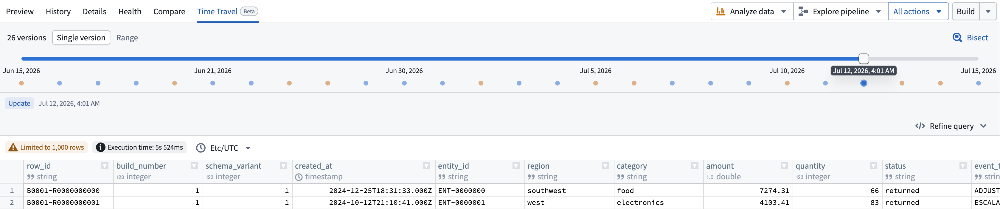
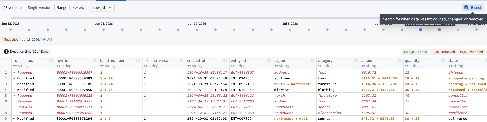
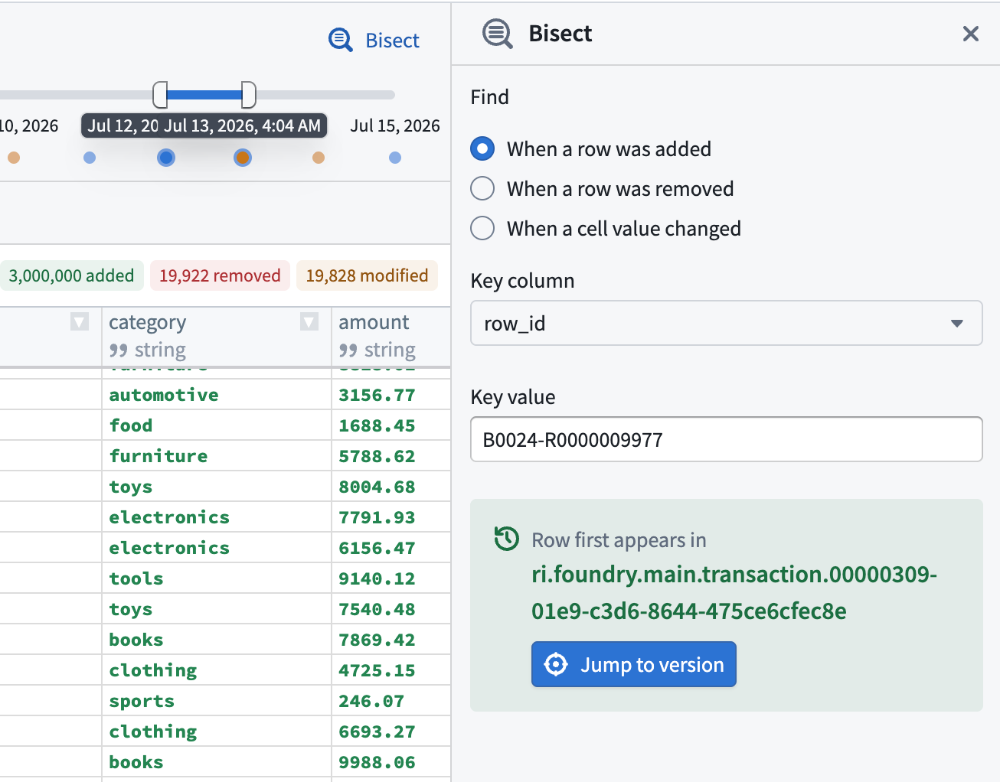

<!-- source: https://palantir.com/docs/foundry/dataset-preview/time-travel/ · mirrored 2026-08-06 from Palantir Foundry docs -->

# Time Travel \[Beta]

:::callout{theme="info" title="Beta"}
Time Travel is in the [beta](/docs/foundry/platform-overview/development-life-cycle/) phase of development. Functionality may change during active development.
:::

**Time Travel** in [Dataset Preview](/docs/foundry/dataset-preview/overview/) lets you inspect how a [dataset](/docs/foundry/data-integration/datasets/) or [Iceberg table](/docs/foundry/data-integration/iceberg-tables/) changed across its committed versions. You can view the data and schema at an earlier point in time, view changes across a range of versions, and find the specific version where a row or value changed.

Time Travel builds its timeline from committed Catalog dataset transactions or Iceberg table snapshots. Each point on the timeline represents a committed version, in chronological order.

## Open Time Travel

To use Time Travel, open a dataset or Iceberg table in Dataset Preview, then select the **Time Travel** tab. Time Travel provides two views: **Single version** and **Range**.

## Explore a single version

Use the **Single version** view in Time Travel to see the data and schema for one committed version. As you move through the timeline, the preview updates to that version so you can see how the dataset looked at that point in time.

When relevant versions are loaded, you can also use the Left and Right arrow keys to move through them.

## View changes across a time range

Use the **Range** view to see how data changed between an older baseline and a newer version in the selected time range.

Results can show:

* **Added** rows
* **Removed** rows
* **Modified** rows and cells, when a key column is available

A **Key column** allows Time Travel to match the same row across versions. With a stable, unique key, edits appear as modifications. Without one, changes to an existing row appear as a removal and an addition.

If the schema changed in the selected range, Time Travel also summarizes the columns that were added, removed, or changed.

## Follow a SQL query through time

Select the **Refine query** option on the right to expose the SQL query behind a single-version preview. This is useful if you want to focus on a specific subset of rows, selected columns, a sort order, or an aggregate result.

After the query runs, Time Travel carries the query forward as you move through the timeline by updating its version reference automatically. This lets you follow the same analysis across earlier or later versions without rebuilding the SQL query.

## Find when data changed

Select the **Bisect** option in the top right to search version history for the first time a change occurred. Bisect can be used to determine:

* When a row was added
* When a row was removed
* When a cell value changed

Bisect searches by a key column and, for cell-value changes, by a specific column and target value. When a matching version is found, you can navigate directly to it.

You can also right-click on a table cell to start a row or value bisect with the current context pre-filled.

:::callout{theme="neutral"}
Bisect only searches across the versions currently loaded on the page.
:::

:::callout{theme="neutral"}
You can only inspect versions where data is still available under the applicable [retention policy](/docs/foundry/retention/overview/).
:::
