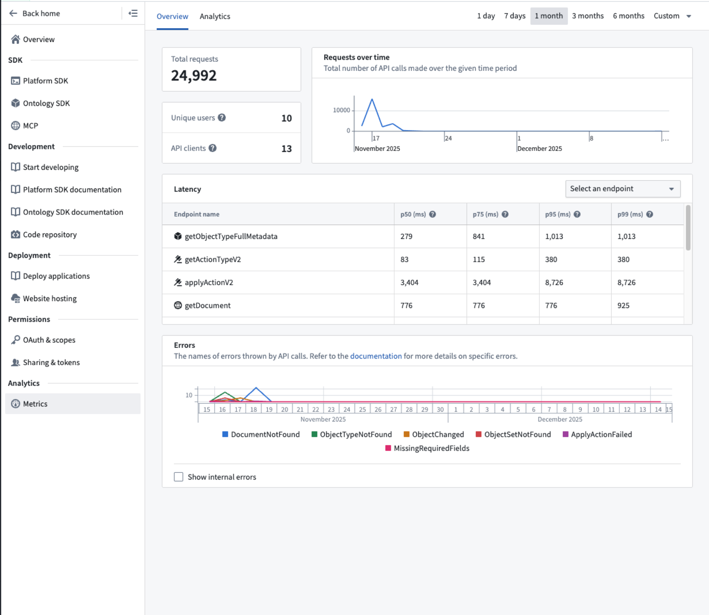
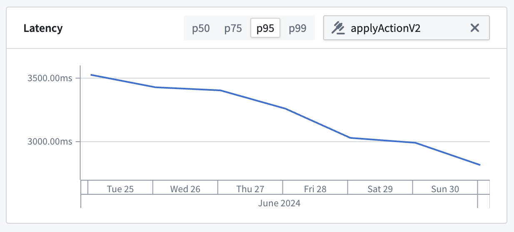

<!-- source: https://palantir.com/docs/foundry/developer-console/application-metrics/ · mirrored 2026-08-14 from Palantir Foundry docs -->

# Application metrics \[Beta]

:::callout{theme="neutral" title="Beta"}
Application metrics are in the [beta](/docs/foundry/platform-overview/development-life-cycle/) phase of development and may not be available on your enrollment. Functionality may change during active development.
:::

Application metrics use a set of charts to provide insights on how your application performs over time. These charts include the number of requests made over time, the success rate of requests, and the latency associated with the API endpoints you are calling.

Navigate to the **Metrics** page from the left menu in Developer Console to view metrics on the usage of your OSDK.

Metrics are currently served with around 24 hours of latency and a historical view up to the last 30 days.

You must use one of the [supported OAuth flows](/docs/foundry/developer-console/permissions/#permission-types) in your application for metrics to be collected. API calls made with an API token generated outside this OAuth flow will not be collected in metrics for your application. For example, if you connect using `UserTokenAuth` in TypeScript or Python the calls you make through this client will not show up in the metrics application. However, if you connect with `PublicClientAuth` or `ConfidentialClientAuth`, your calls will appear in Developer Console.

## Configure time periods

You can configure the time period for which metrics are shown using the time range selectors in the top navigation bar. Available preset options include one day, two days, seven days, 14 days, and 30 days. You can also select the **Custom** dropdown menu to pick any time period within the last 30 days.

When viewing metrics for a time period of five days or less, data points are presented in hourly buckets. For a time period longer than five days, data points are presented in daily buckets.

## API latency

The **Latency** card allows you to view the 50th, 75th, 95th, and 99th percentiles for latency associated with API calls made by your OSDK.

To view the change in latency for a specific endpoint over a given time period, you can select the endpoint and the percentile for which you want to view data:

