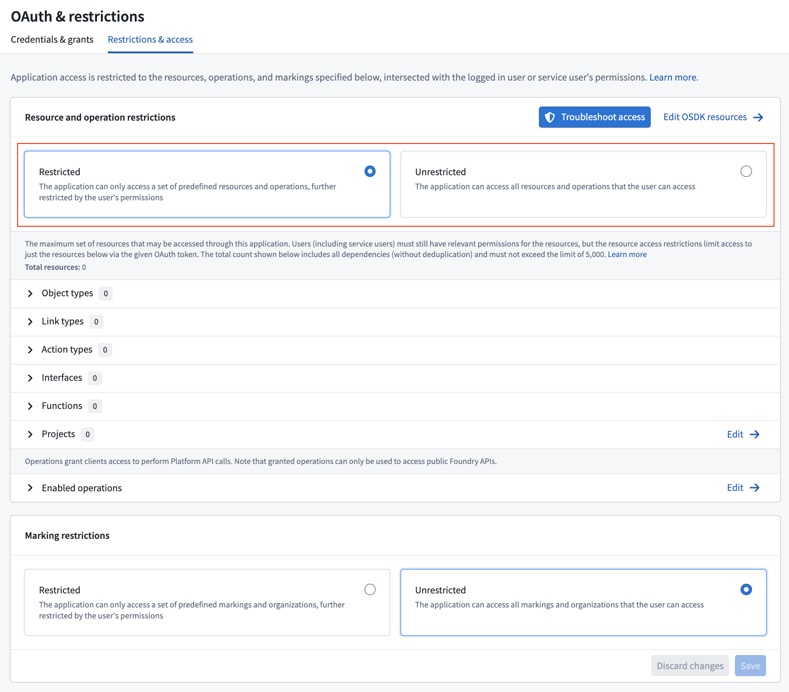
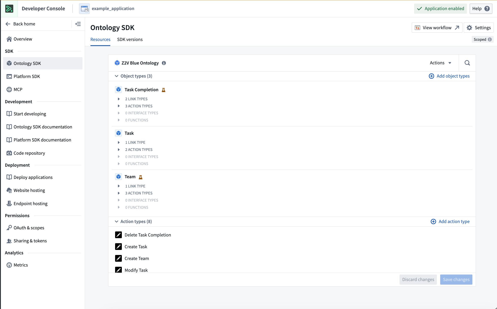
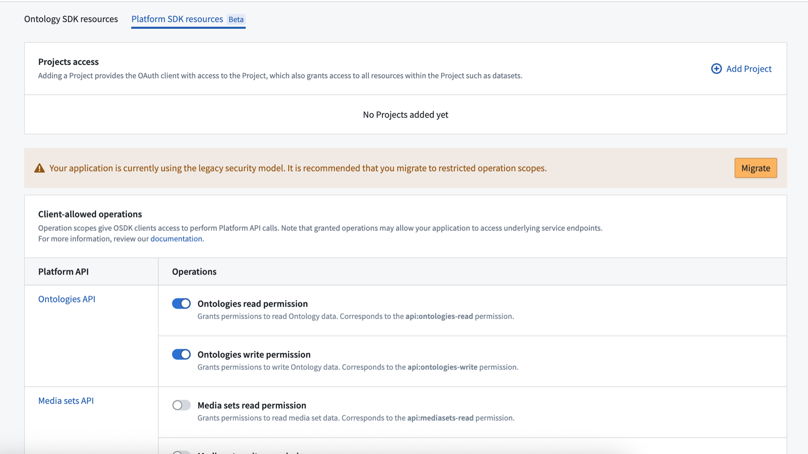
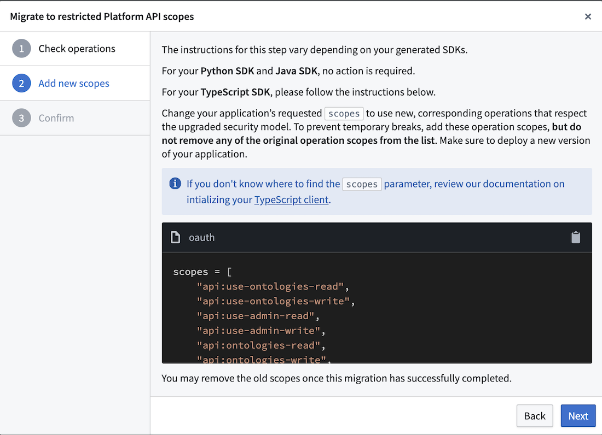
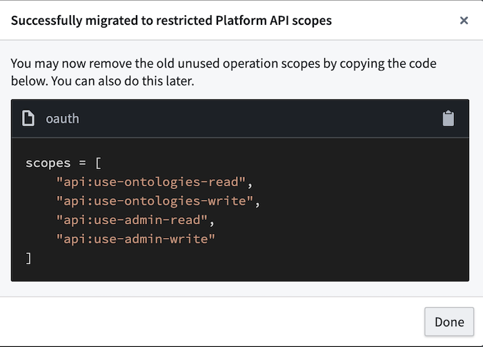

<!-- source: https://palantir.com/docs/foundry/developer-console/application-restrictions/ · mirrored 2026-08-14 from Palantir Foundry docs -->

# Application restrictions

Every Developer Console application corresponds to an OAuth client that is responsible for handling Foundry authorization. During OAuth authorization, third-party applications are granted tokens that are restricted by **scopes** to only permit certain operations and resources. The scope of a given token is the intersection of the following:

1. The permissions of the specific application user (for authorization code grants) or service user (for client credentials grants) in Foundry. Review the [authentication grant types documentation](/docs/foundry/api/v2/general/overview/authentication/#authentication-for-production-apps) for further details.
2. The maximum **restrictions** set for the given Developer Console application. An application can also be left [unrestricted](#unrestricted-applications).
3. The operation scope requested by the third-party application as part of a [token request](/docs/foundry/platform-security-third-party/authorizing-3pa-access/), also known as "authorization time". Token requests that do not request a scope will default to allowing all of the user's permissions that are allowed by the OAuth client's restrictions. No additional limits will be applied at authorization time.

:::callout{theme="neutral" title="Restrictions versus scopes"}
**Restrictions** are configured in Developer Console and define the maximum scope an application can ever have. A **token scope**, determined at runtime, is the intersection of the application's restrictions, the logged in user or service user's access permissions, and the operation scope the application requests in code.
:::

:::callout{theme="warning"}
All tokens must have scopes restricted either at the OAuth client level (through application restrictions) or at authorization time (through the token request). Attempting to request a token with no scope restrictions will generate a token with no permissions.
:::

## Configure application restrictions

An application can be set as [restricted](#restricted-applications) or [unrestricted](#unrestricted-applications).

1. **Restricted applications** are created by default. This means that Developer Console controls the [resources](#resource-restrictions) and [operations](#operation-restrictions) an application may use in Foundry.
2. **Unrestricted applications** have no maximum allowed resource or operation controls. Only the user permissions and the operations [requested at authorization time](#request-a-scope-at-authorization-time) are used to determine access.

You can switch between a restricted and unrestricted application from the **OAuth & restrictions** page under **Application restrictions**. Note that switching to an unrestricted application removes your current project access and operation restriction configuration.

When switching from an unrestricted to a restricted application, you will need to configure project access and platform API operations. Your application may break if it uses resources not added during this configuration.



### Restricted applications

Restricted applications control the maximum resources and operations that an application's OAuth client is allowed to request. For example, consider a user who has permission to read a certain Foundry dataset and is querying that dataset via a restricted, third-party application that requests `api:use-datasets-read`. The user will not have access until two things are added to the application's restrictions:

1. The project containing that dataset is added to the application's [resource restrictions](#resource-restrictions)
2. `api:use-datasets-read` is added to the application's [operation restrictions](#operation-restrictions).

Restricted applications provide increased legibility up front by defining, at build time, everything an application may do on behalf of its user. This minimizes cases of privilege escalation where application code uses the access of its user to take an action that the application builder did not have access to. Restrictions also serve as a guaranteed limit on the data Foundry can send to a specific device or system. For example, restrictions can guarantee that an application displayed in a control room will never show sensitive content, regardless of the user logged into the application.

#### Resource restrictions

Resource restrictions define which Foundry resources an application can access. Configure resource restrictions in the following locations in Developer Console, accessible from the left navigation panel.

* **Ontology SDK tab:** If your application interacts with the Ontology (typically using the [OSDK](/docs/foundry/developer-console/create-application/)), use this tab to add object types, interfaces, actions, and functions to the list of application resources. Adding Ontology resources will change a Developer Console application in two ways:
  1. The application's resource restrictions will allow access to the listed resources.
  2. Any new SDKs generated for the application will include the listed resources.



* **Platform SDK tab:** If your application interacts with platform APIs (typically using [platform SDKs](/docs/foundry/api/v2/general/overview/sdks/#platform-sdk-vs-ontology-sdk)), use this tab to add Foundry projects to the resource restrictions. Restricted applications may only read or write to resources inside these projects. If an application must interact with a Foundry resource that is *not* inside a project, consider using an [unrestricted application](#unrestricted-applications).

#### Operation restrictions

Operation restrictions define which API operations an application can perform. Unlike resource restrictions, you can only configure operation restrictions in the **Platform SDK** tab.

From here, add allowed operations via API namespaces. Choose the methods an application may use to interact with the selected project resources. Operations are grouped by API namespace, which corresponds to the path of the endpoint; for example, the `/admin/` API namespace includes all endpoints with the path `/api/{version}/admin/`. More details on API namespaces can be found in the [API documentation](/docs/foundry/api/v2/general/overview/introduction/).


##### API-level security for client-allowed operations

Developer Console applications enforce API-level security for restricted applications, ensuring that every endpoint called by these applications must be explicitly added to the operation restrictions list in the **Platform SDK** panel. [Unrestricted applications](#unrestricted-applications) are not affected by these changes and will continue to be able to call endpoints that the user has the necessary permissions to access. Note that unrestricted applications should generally only be used for programmatic, platform-wide workflows.

### Unrestricted applications

*Unrestricted* applications only consider the application user's permissions when determining access, rather than restricting access to a predefined set of resources.

By default, custom applications are restricted to encourage stricter security guarantees. Use unrestricted applications in the following situations:

* Resources cannot be defined at deployment time (for example, projects that do not yet exist).
* Your application must access administrative primitives outside of projects (for example, spaces, organizations, or enrollments).
* You need to work with endpoints not yet released in the platform API.

:::callout{theme="warning"}
Unrestricted applications can interact with any resource the application user has access to. Only use unrestricted applications with trusted code.
:::

## Request a scope at authorization time

In addition to the [restrictions configured in Developer Console](#configure-application-restrictions), a third-party application can also request an operation scope as part of authentication. As described [above](#application-restrictions), the requested scope is intersected with the application's restrictions and the user's underlying permissions when determining access. Note that a Foundry third-party application can only request *operations* at authorization time. *Resource* access is determined only by the application's resource restrictions and user permissions and does not require a request.

Foundry endpoints document their required scopes in the [API documentation](/docs/foundry/api/v2/). The following example shows a TypeScript OAuth client scope request to read ontology data and Foundry datasets:

```typescript
const scopes = ["api:use-ontologies-read", "api:use-datasets-read"];

export const auth: PublicOauthClient = createPublicOauthClient(
    clientId,
    foundryUrl,
    redirectUrl,
    { scopes },
);

/**
 * Initialize the client to interact with the Ontology and Platform SDKs
 */
export const client: Client = createClient(foundryUrl, ontologyRid, auth);
```

An empty (`[]`) requested operation scope will default to the application's operation restrictions. [Unrestricted applications](#unrestricted-applications) have no maximum allowed restrictions and behave differently depending on the type of [authentication grant](/docs/foundry/api/v2/general/overview/authentication/#authentication-for-production-apps) requested:

1. **Client Credentials grant:** A scope request is not required. An application with no requested scope will be granted all operations that the service user has access to.
2. **Authorization Code grant:** Applications must request a scope. During Authorization Code flow, a human user consents to a set of requested operations. Application builders must therefore define what operations the application needs. This helps minimize attack vectors related to privilege escalation.

## Migrate to API security

As explained [above](#api-level-security-for-client-allowed-operations), Developer Console applications created after June 1, 2025 enforce API-level security to ensure that every endpoint called by a restricted third-party application must be individually added to the list of client-allowed operations. Follow the [migration steps](#migration-steps) below for applications created before June 1, 2025.

Any new or migrated applications will now restrict two types of application access that were previously allowed: [underlying service endpoints](#no-access-to-underlying-service-endpoints) and [implicit operation grants](#no-implicit-operation-grants).

### No access to underlying service endpoints

Restricted applications are not allowed to call underlying service APIs, which are endpoints that are not explicitly documented or exposed to users.

The scopes used by Developer Console application clients now contain the prefix `use-`; for example: `api:use-ontologies-read` instead of `api:ontologies-read`. These new permissions only allow you to call Foundry platform APIs and are blocked from calling underlying service endpoints.

An important exception to API security is a set of [administrative](/docs/foundry/security/overview/) endpoints designed to always be accessible to users for the purpose of identification, authorization, or access debugging. These endpoints are not designed for broad public usage and are therefore not included in the public Foundry API documentation or the **Platform SDK resources** panel. Such endpoints include the following:

* **OAuth2:** `/multipass/api/oauth2/...`
* **User information:** `/multipass/api/me/...`
* **Resource access information:** `/multipass/api/authz/...`
* **Token TTL:** `/multipass/api/token/...`
* **Organizations:** `/multipass/api/organizations/...`

These endpoints may always be called by restricted applications.

### No implicit operation grants

With the addition of advanced API-level security, each API namespace is strictly isolated. Prior to these changes, granting an API namespace scope gave an application access to endpoints in that namespace as well as any *dependent endpoints* within other namespaces. The new, more secure API scopes (with the prefix `use-`) provide access only to the directly granted API namespaces. This ensures that application administrators can firmly control the actions applications may take within their organization.

For example, a legacy application that is granted `/ontologies/` API namespace permissions (`api:use-ontologies-read`) may query the basic user identity information with the [`/api/v2/admin/users/getCurrent`](/docs/foundry/api/v2/admin-v2-resources/users/get-current-user/) endpoint in the `/admin/` namespace, since several Ontology endpoints require these operations for authentication purposes. Once migrated to the improved security protocols, if an application is only granted the `api:use-ontologies-read` and `api:use-ontologies-write` scopes, the application will be prevented from accessing this user information and will receive an `ApiUsageDenied` error.

By default, all Developer Console applications created after the security update or migrated to use the advanced API-level protection will be configured with the `api:use-ontologies-read` and `api:use-ontologies-write` scopes.

### Migration steps

Follow the steps below to migrate your Developer Console application to use advanced API security:

1. Navigate to the **Platform SDK resources** tab and select **Migrate**.



2. Follow the instructions in the dialog to update your application code. If you are using the TypeScript SDK, change the requested operation scopes to use new scopes that respect the upgraded security model. To prevent temporary breaks, *do not* remove any of the original operation scopes while adding the new scopes.



3. Once the application is successfully migrated, you can remove the original, outdated scopes from your application code.



### Scope prefixes

Foundry uses two scope prefixes for API permissions:

| Scope pattern          | Example                   | Use case                                                                                                                                                  |
| ---------------------- | ------------------------- | --------------------------------------------------------------------------------------------------------------------------------------------------------- |
| `api:use-*-read/write` | `api:use-ontologies-read` | New restricted Developer Console applications. Allows public API calls only.                                                                              |
| `api:*-read/write`     | `api:ontologies-read`     | [Standalone OAuth client](#standalone-oauth-clients-legacy) and certain unrestricted applications. Allows public API calls and internal service endpoints. |

When choosing which scope to use:

* **Restricted applications** should use `api:use-*` scopes (for example, `api:use-ontologies-read`).
* **[Standalone OAuth clients](#standalone-oauth-clients-legacy)** should use `api:*` scopes (for example, `api:ontologies-read`) since they call Foundry directly, as described above. Note: standalone OAuth clients are a legacy primitive being replaced by unrestricted applications.
* **Unrestricted applications** should use `api:use-*` scopes unless they are querying underlying Foundry service endpoints.

This pattern applies across all API namespaces, including `admin`, `ontologies`, `datasets`, `streams`, and others.

## Standalone OAuth clients \[Legacy]

:::callout{theme="neutral"}
Standalone OAuth clients can no longer be created from Developer Console. Instead, we recommend creating [unrestricted Developer Console applications](#unrestricted-applications).
:::

Standalone OAuth clients are a legacy, lightweight alternative to custom applications. Beyond the auth client itself, standalone OAuth clients do not provide application building capabilities such as restrictions, metrics, or SDK generation.

Unrestricted applications replace standalone OAuth clients by providing equivalent access flexibility inside a fully featured custom application.

Migration steps to convert standalone OAuth clients into unrestricted custom applications will be available in a future release.

## See also

* **[Permissions](/docs/foundry/developer-console/permissions/):** Learn more about user and application permission types as well as resource access restrictions.
* **[OAuth clients](/docs/foundry/developer-console/oauth-clients/):** Learn how to create and manage OAuth clients.
