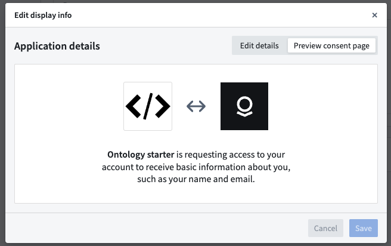
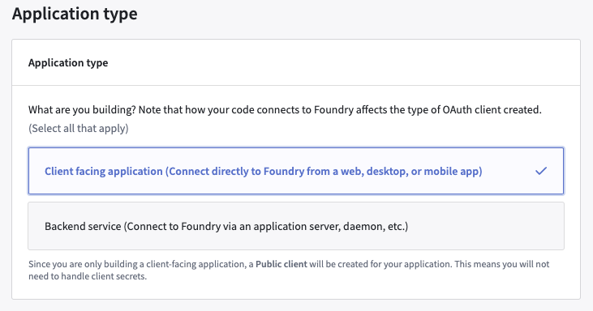
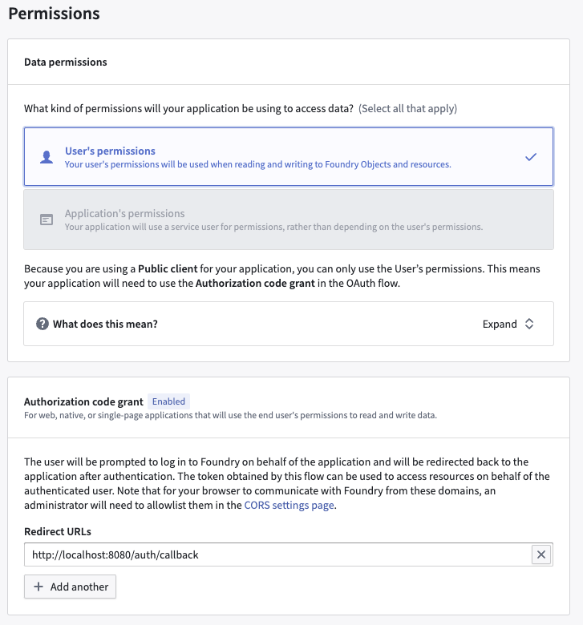
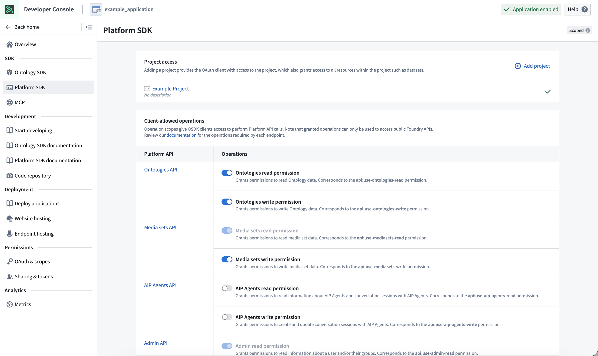
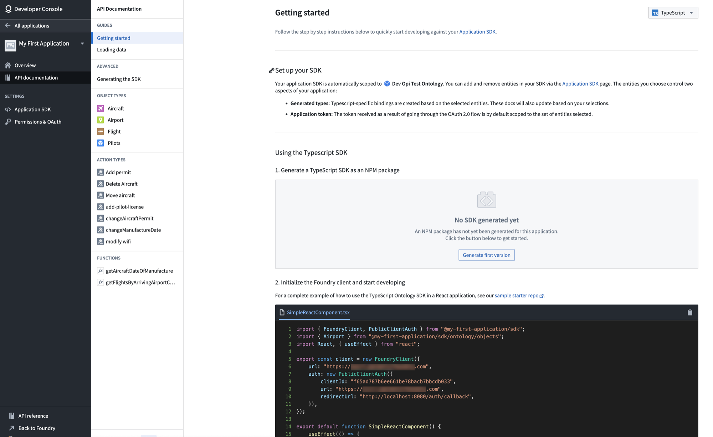
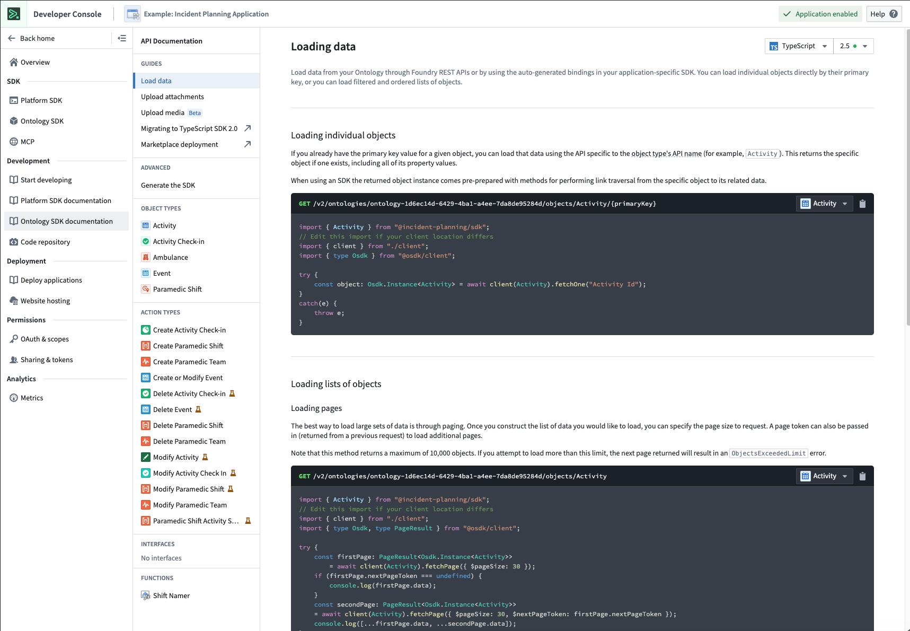

<!-- source: https://palantir.com/docs/foundry/developer-console/create-application/ · mirrored 2026-08-14 from Palantir Foundry docs -->

# Create a new Developer Console application

On this page, we will walk through the following processes of creating a new Developer Console application:

* Adding object types, Action types, and other Ontology resources to the SDK application.
* Adding operations and resources for Platform API access.
* Generating packages in any of the supported languages.
* Using custom documentation generated for your application-specific SDK.

## Create an application using Developer Console

[Navigate to Developer Console](/docs/foundry/developer-console/overview/) in your Foundry instance, then select **+ New application**.

:::callout{theme="neutral"}
If you do not see the **+ New application** button, you may require additional permissions. See the [permissions documentation](/docs/foundry/developer-console/permissions/#user-permissions) for more details.
:::

Next, follow the steps in the creation wizard that appears and add the following details:

* On the **Basic information** page, add an icon to your application; the icon will be used to identify the application when the user is presented with a consent screen.

* On the **Application type** page, choose [**Client-facing application**](/docs/foundry/developer-console/permissions/).

* On the **Authorization code grant** section of the **Permissions** page, set the redirect URL to `http://localhost:8080/auth/callback`.

:::callout{theme="neutral"}
Follow the instructions in [Configure CORS](/docs/foundry/administration/configure-cors/) to add `http://localhost:8080` to your CORS policy in Control Panel.
If you do not have permission to configure CORS and your Foundry administrator is unable to configure CORS for you, set the redirect URL to `https://localhost:8080/auth/callback`.
:::

### Resources

* On the **Resources** page, select **Yes, generate an Ontology SDK**.

* Select an Ontology to use.

:::callout{theme="warning"}
Note that once the Ontology SDK has been generated, the Ontology associated with it cannot be changed.
:::

* Select the object types and action types that you want the OSDK package to include. For this exercise, pick any object type available to you.

:::callout{theme="neutral"}
The data entities that you choose control two aspects of your application:

* **Generated types:** Language-specific bindings are created based on the selected entities. Additionally, the integrated API docs will be generated based on your selections.
* **Application token:** The token received as a result of going through the OAuth 2.0 flow is by default restricted to the set of entities selected. For more details, see [Resource access restrictions](/docs/foundry/developer-console/permissions/#resource-access-restrictions).
:::

* If you need to make [Platform API requests](/docs/foundry/api/general/overview/introduction/) using your application, be sure to add the appropriate resources and operations through the **Platform SDK** tab.

:::callout{theme="warning"}
The operations granted in the **Client allowed operations** table may allow applications to access underlying service endpoints.
:::

* Review and confirm the information you entered, then select **Create application** to create the application.
* Finally, you must select **Generate first version** to get the first version of the created package.

## Ontology-specific documentation

The Developer Console generates documentation based on the Ontology entities you selected. This documentation is available for TypeScript, Python, and cURL; you can switch between the different languages using the dropdown menu in the upper right corner of the Console.

In the example above, each object type, action type, and function is documented. The documentation includes code examples of how specific properties are returned or how parameters can be used; you can copy and paste these examples directly into your code.
