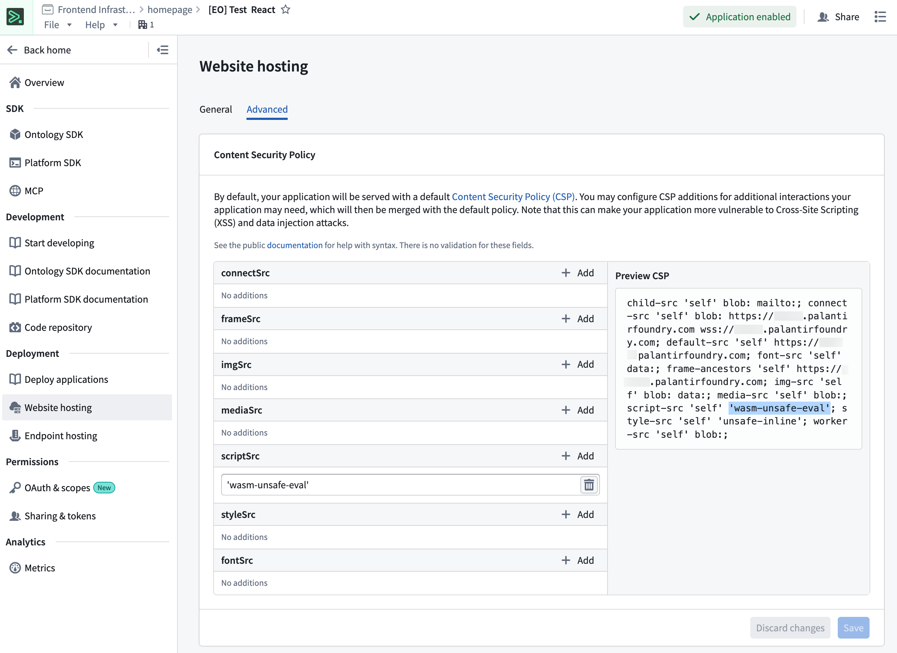
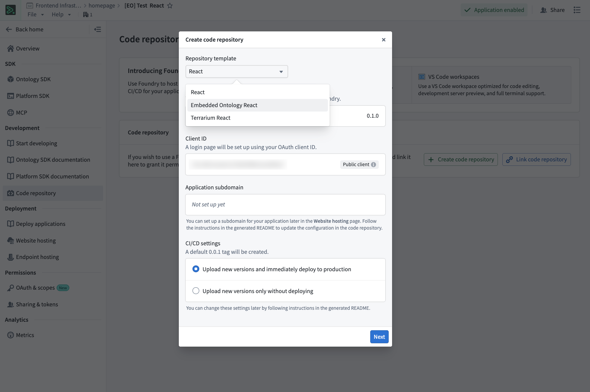
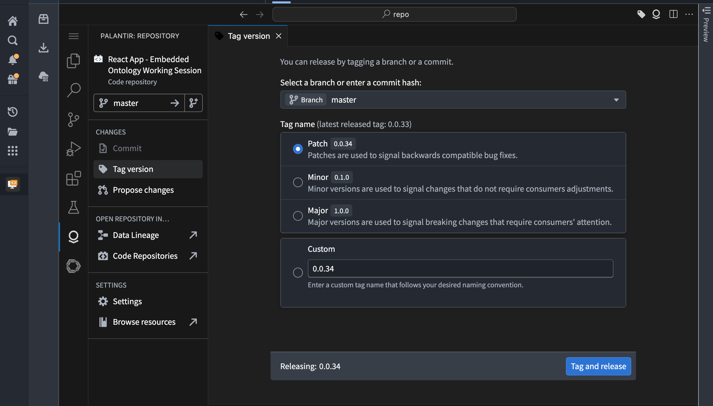
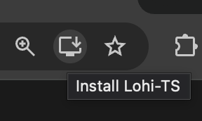
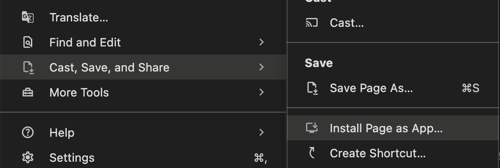
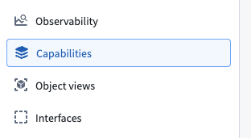
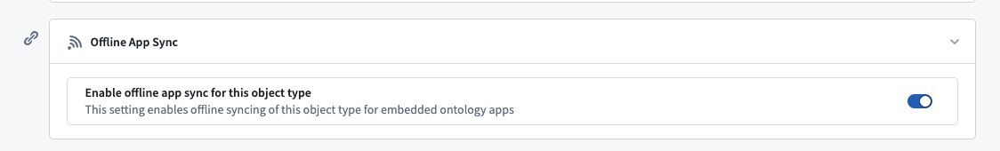
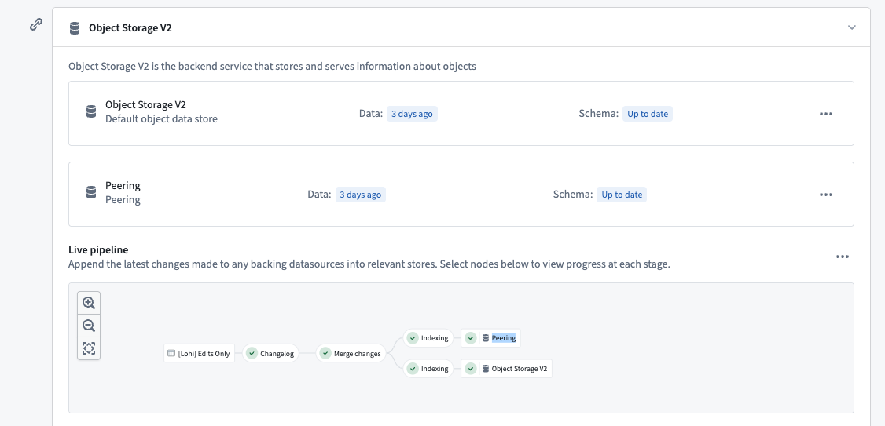

<!-- source: https://palantir.com/docs/foundry/developer-console/create-embedded-ontology-application/ · mirrored 2026-08-14 from Palantir Foundry docs -->

# Create an offline-capable application with the embedded Ontology

The embedded Ontology enables applications to sync Ontology data locally, allowing users to interact with data without network connectivity and install applications as [progressive web apps ↗](https://developer.mozilla.org/en-US/docs/Web/Progressive_web_apps) (PWAs). This guide offers a walkthrough for creating a Foundry application with offline support using the `@palantir/lohi-ts` library in the "Embedded Ontology React" template.

## Prerequisites

Before starting, complete standard application setup with the steps below.

1. **Create a client-facing application** in Developer Console. See [Create an application using Developer Console](/docs/foundry/developer-console/create-application/) for detailed instructions. On the **Application type** page, select **Client-facing application**.
2. **Select your Ontology** and the object types you want to include.
3. **Generate the SDK** for your application.
4. **Configure website hosting**, including subdomain and redirect URLs. Refer to [Deploy a custom application on Foundry](/docs/foundry/developer-console/deploy-custom-application-on-foundry/) for more information.

## 1. Enable WebAssembly execution in the content security policy

To support offline functionality, your application will use WebAssembly (Wasm). You must configure the [content security policy](/docs/foundry/developer-console/deploy-custom-application-on-foundry/#content-security-policy) to allow Wasm execution.

1. In Developer Console, navigate to **Website Hosting** and open the **Advanced** tab.
2. Under the **scriptSrc** section, add: `'wasm-unsafe-eval'`, including the single quotes.
3. Verify that the configuration appears in the preview panel on the right.



:::callout{theme="warning"}
Without this CSP configuration, your deployed application will fail to initialize. This must be configured before deploying.
:::

## 2. Bootstrap a repository with the embedded Ontology React template

Use the repository bootstrapper to create your repository with the Ontology React template.

1. In Developer Console, navigate to **Start developing > Bootstrap in Foundry**.
2. From the template dropdown, select **Embedded Ontology React**.
3. Select **Generate repo**.



The template will be configured with the following backing repositories:

* **`osdk-templates-bundle`:** Provides the embedded Ontology (`lohi-ts`) application template.
* **`lohi-asset-bundle`:** Contains the `lohi-ts` library and dependencies.
* **`nodejs-bundle`:** Node.js runtime for CI/CD.

## 3. Configure your application

### Verify environment configuration

The bootstrapper populates `.env.development` and `.env.production` with the following variables. Only `VITE_FOUNDRY_REDIRECT_URL` in `.env.production` requires manual editing after the repository is created.

| Variable | Purpose |
| --- | --- |
| `VITE_FOUNDRY_API_URL` | URL of your Foundry enrollment. |
| `VITE_FOUNDRY_CLIENT_ID` | OAuth client ID for your application. |
| `VITE_FOUNDRY_REDIRECT_URL` | OAuth callback URL. |
| `VITE_FOUNDRY_ONTOLOGY_RID` | Resource identifier of the Ontology to sync. |
| `VITE_FOUNDRY_ONTOLOGY_API_NAME` | Ontology API name required by `lohi-ts` for offline sync. |

At build time, Vite injects these values into `index.html` as `<meta>` tags, and `src/infra/config.ts` reads them back at runtime. You configure values through the `.env` files; you do not need to edit `src/infra/config.ts`.

1. Open `.env.production` in your repository.
2. Update `VITE_FOUNDRY_REDIRECT_URL` with your website subdomain, substituting `your-enrollment` with your enrollment name.

```plaintext
VITE_FOUNDRY_REDIRECT_URL=https://your-subdomain.your-enrollment.palantirfoundry.com/auth/callback
```

:::callout{theme="neutral"}
Ensure that your Developer Console OAuth configuration includes this redirect URL.
:::

### Configure objects to be synced

The template ships with an `src/syncConfig.ts` file that exports an empty `syncedObjectTypes` array. This is the only file you need to edit to choose what is available offline.

1. Open `src/syncConfig.ts`.
2. Import the object types from your generated SDK and add them to the `syncedObjectTypes` array:

```typescript
import { Employee, Task } from "@your-app/sdk";
import { type SyncConfigParam } from "@palantir/lohi-ts";

export const syncedObjectTypes: SyncConfigParam[] = [Employee, Task];
```

Entries use `lohi-ts`'s `SyncConfigParam` type. Alongside plain object types, you can pass an object type API name string or an `ObjectSetQuery` to sync a filtered subset of a type. You can also set per-type options such as peer-to-peer sync. Refer to the `@palantir/lohi-ts` documentation for details.

:::callout{theme="neutral"}
Only include the objects that users need offline access to. Syncing too many objects can impact initial load time and storage usage.
:::

This list feeds `createAppLohiClient` in `src/main.tsx`, which tells Lohi which object types to sync. The `<SyncProvider>` in `src/router.tsx` does not need the list, because it invalidates the entire OSDK cache after each sync.

The template performs background syncs automatically. The `SyncProvider` runs an initial sync on mount and invalidates the OSDK cache after each successful sync. In the template, its `syncInterval` property is set to `10_000` milliseconds (10 seconds) to enable periodic background syncing. Remove the property to sync only on mount and on demand, such as when a user selects the sync status pill. The `<SyncGate>` component in `src/Home.tsx` holds the interface until the first sync completes.

To run a sync directly, use the `useLohiClient` hook from `src/infra/lohi/LohiContext.tsx`. For an action that must reach live Foundry rather than being applied optimistically, wrap the subtree in `<StandardClientScope>` and use the `useOnlineAction` hook from `src/infra/lohi/useOnlineAction.ts`. This hook re-syncs and invalidates the cache after the action succeeds.

For more details on using an embedded Ontology in your application, refer to the `README.md` in your generated repository.

## 4. Develop your application

With the template configured, you can now develop your application logic offline, or in a VS Code workspace.

1. Use the embedded Ontology client to query and load objects.
2. Apply actions and edits as needed.
3. The template handles offline sync automatically.

The template is pre-configured with the following features:

* Preinstalled `@palantir/lohi-ts` dependency.
* The `lohi-ts` Vite plugin wired into `vite.config.ts` for Wasm optimization.
* A Lohi client factory in `src/infra/lohi/client.ts` and a standard OSDK client factory in `src/infra/osdk/client.ts`, both sharing a single OAuth client from `src/infra/auth/oauth.ts`. Lohi is the default client, so reads and writes from `@osdk/react` hooks pass through the local cache, with writes applied optimistically.
* A `SyncProvider` that runs an initial sync on mount, invalidates the OSDK cache after each successful sync, and can sync periodically in the background, paired with a `<SyncGate>` component that withholds the interface until the first sync completes.
* A dual-client escape hatch for online-only actions: `<StandardClientScope>` and the `useOnlineAction` hook run an action against the standard client, then re-sync and invalidate the cache.

## 5. Deploy your application

You can use the tag version feature in a Foundry VS Code workspace or code repository to create a version tag for your application’s release.



You can also deploy your application using git tags if you are working offline:

```shell
git tag 1.0.0
git push origin tag 1.0.0
```

Code Repositories will automatically build and deploy your application to the configured subdomain. For more details on deployment options, refer to [Deploy a custom application on Foundry.](/docs/foundry/developer-console/deploy-custom-application-on-foundry/)

## 6. Install as a progressive web app

Once your application is deployed, users can install it as a progressive web app for offline access and a native-like experience.

### Install the application

1. Navigate to your deployed application in a supported browser. This includes Chrome, Edge, Safari, or other Chromium-based browsers.
2. Look for the **Install** or **Add to Home Screen** prompt:

   * **Desktop browsers:** An install icon typically appears in the address bar as shown below: <br><br>
      <br><br>
     You can also navigate to **Cast, Save, and Share > Install Page as App...** from the menu button to the right of the address bar. <br><br>
      <br><br>
   * **Mobile browsers:** An **Add to Home Screen** option appears in the browser menu.
3. Select **Install** and follow the browser's prompts.
4. The application will be installed and can be launched from your device like a native application.

### Use the application offline

After installation, you can launch the application from your installed apps or home screen. The application will work offline using synced Ontology data. When connectivity is restored, the application will automatically sync the latest data. Users can continue working with local data even without network access.

:::callout{theme="neutral"}
Only the Ontology objects configured in `syncedObjectTypes` will be available offline. Ensure that you have configured the appropriate objects before users install the application.
:::

## Enable peering (optional)

By default, every time the embedded Ontology syncs data (via `lohi-ts`) from remote Foundry, it will load all objects for the configured object types. This can be very slow, depending on the amount of data loading. You can turn on peering mode for your object types, which will only sync diffs from the previous sync and significantly speed up periodic data syncs.

In Ontology Manager, enable **Offline App Sync** for each configured object type:

1. Navigate to the **Capabilities** tab.

   

2. Enable **Offline App Sync** mode.

   

3. In the **Datasources** tab, wait until the **Peering** objects database successfully indexes your object type. This database is the backend service for the Ontology to which you are connected through peering.

   

4. In `src/syncConfig.ts`, set the per-type peering option on the relevant entries in `syncedObjectTypes`. Entries already use the `lohi-ts` `SyncConfigParam` type, which supports enabling peering per object type. See `lohi-ts`'s documentation for more details.

## Common issues

### CORS errors

Ensure that your Foundry enrollment allows CORS for the following:

* **Development:** `http://localhost:8080`
* **Production:** Your website subdomain

Configure CORS in Control Panel if you have permission, or contact your Foundry administrator.

### Build failures with dev-dist

If you see build errors related to the `dev-dist` directory, delete the directory. This directory is automatically generated and is already included in the `.gitignore`.

## Next steps

* Explore the template README for advanced usage patterns.
* Test your application offline by disabling network connectivity.
* Configure additional PWA features like custom icons and splash screens.
* Share your PWA install link with users.
