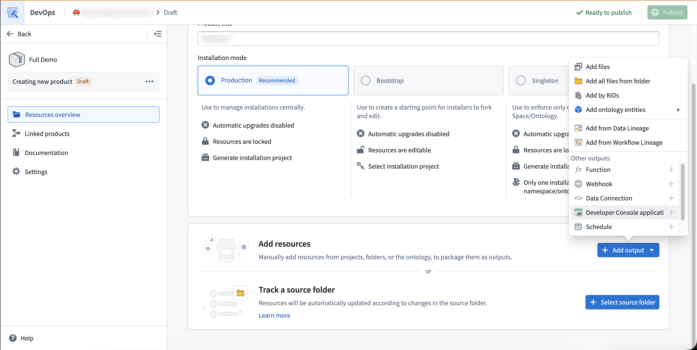
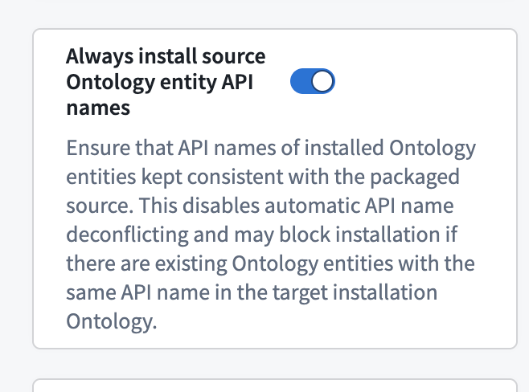
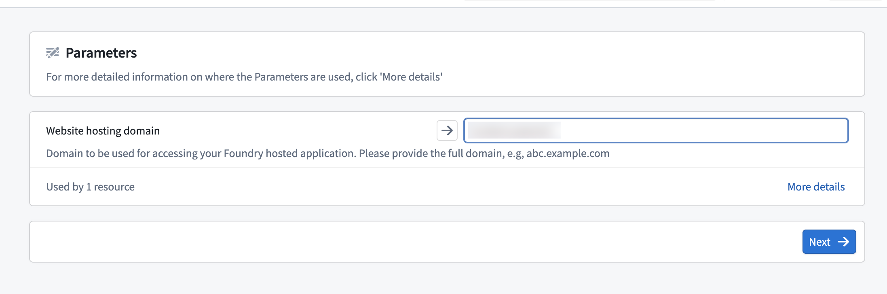
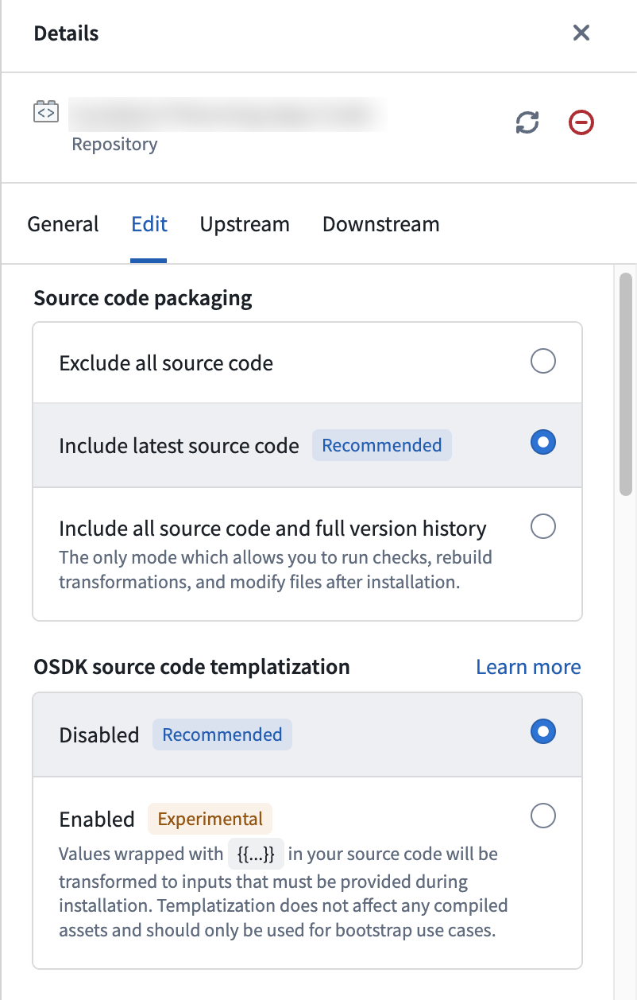

<!-- source: https://palantir.com/docs/foundry/developer-console/marketplace-installation/ · mirrored 2026-08-14 from Palantir Foundry docs -->

# Install a Developer Console application with Marketplace

Use [Marketplace](/docs/foundry/marketplace/overview/) to package and install [Developer Console applications](/docs/foundry/developer-console/overview/) across Foundry environments. You can package an application or its code repository:

1. **Application packaging:** Package a developer console application together with its metadata and OAuth client. This is the recommended approach for shipping deployed websites using [Production and Singleton](/docs/foundry/foundry-devops/create-products/#installation-mode) products. Note that for cases where a website asset doesn't exist, you can still ship the OAuth client using this approach. See [Packaging and installing a Developer Console application](#packaging-and-installing-a-developer-console-application) for details.
2. **Source code packaging:** Package a website code repository without a Developer Console application. This is the recommended approach for templatized applications and when creating a different Developer Console application on the destination environment. See [Packaging and templating Developer Console associated source code](#packaging-and-templating-developer-console-associated-source-code) for details.

Packaging both an application and its source code may be useful when [bootstrapping](/docs/foundry/foundry-devops/create-products/#installation-mode) an OAuth client without an existing website. In this case, you may want to modify the application code post-installation and publish a website that uses the installed OAuth client. This workflow is uncommon for [production](/docs/foundry/foundry-devops/create-products/#installation-mode) applications because the installed application always matches the latest website assets (if they exist), so the source code is effectively ignored.

:::callout{theme="warning"}
Ontology entity API names are not automatically remapped during installation. This applies to both application and source code installations. This means that an installed application may break if it uses API names that don't exist in the destination ontology. See [Handling API name changes](#handling-api-name-changes) for strategies to manage API name consistency across environments.
:::

## Packaging and installing a Developer Console application

A packaged application includes:

* **Website assets:** The static files and content security policies for applications with generated website assets (see [website hosting](/docs/foundry/developer-console/deploy-custom-application-on-foundry/)). DevOps packages the latest deployed version of the website asset by default and falls back to the latest undeployed asset version if no deployed assets exist on the source.
* **Application metadata:** Name, description, and configuration.
* **OAuth client:** [Client type, grant types, redirect URLs](/docs/foundry/developer-console/application-restrictions/#configure-application-restrictions).
* **Resource restrictions:** [Ontology SDK and Platform SDK](/docs/foundry/developer-console/application-restrictions/#resource-restrictions) resources.

### Packaging an application in DevOps

In **[Foundry DevOps](/docs/foundry/foundry-devops/overview/)**, add a Developer Console application as an output of a product. Developer Console applications have two types of dependencies:

1. Ontology entities (and their dependencies) and Compass projects in the application's restrictions.
2. Parameter inputs that need to be defined as part of the installation. These include subdomains for website hosting and security markings.



### Installing an application

Installing an application from [Marketplace](/docs/foundry/marketplace/overview/) automatically creates the Developer Console resource and configures OAuth. Learn more about [installing products](/docs/foundry/marketplace/install-product/). In some cases, you will need to take manual steps during installation:

* In [Bootstrap mode](/docs/foundry/foundry-devops/create-products/#installation-mode), Marketplace may automatically rewrite Ontology API names to avoid collisions within the same Ontology. For example, if installing an object type `API_NAME=Truck` and there already exists an object type `API_NAME=Truck` in the destination Ontology, Marketplace may rename the installed object type `Truck_1`. This has the potential to break installed applications that reference objects by API names. When installing Ontology entities alongside an application, select **Always install source Ontology API names** during installation. This preserves the original API names rather than prefixing or modifying them, ensuring application code continues to work.



* When the packaged application uses subdomain hosting, a new subdomain is defined as part of Marketplace installation. This generally requires an additional approval, often from an Information Security Officer. Post installation to approve the subdomain, navigate to the **Website hosting** page in Developer Console. The website will not be accessible until this approval is granted.



### Upgrading an application

To update an installed application as part of a Marketplace product:

1. Update the application in the source environment.
2. If updating website assets, [deploy in Developer Console](/docs/foundry/developer-console/deploy-custom-application-on-foundry/) first. DevOps will package the most recent deployed website asset.
3. Create a new product version in [Foundry DevOps](/docs/foundry/foundry-devops/manage-products/).

### Application parameters remapping

For applications with built website assets, Marketplace automatically maps application parameters during installation. The following values are replaced with target environment equivalents:

* Foundry URL
* [OAuth client ID](/docs/foundry/developer-console/oauth-clients/)
* OAuth Redirect URL
* [Ontology RID](/docs/foundry/ontologies/ontologies-overview/)
* Ontology API name

For automatic mapping to work, an application must read these values from meta tags in `index.html` rather than the application packaged code itself. Applications created with [@osdk/create-app ↗](https://www.npmjs.com/package/@osdk/create-app) v2.1.3+ or [VS Code workspaces in Foundry](/docs/foundry/developer-console/how-to-bootstrapping-typescript/) are configured this way by default.

:::callout{theme="warning"}
Unlike website parameters, Ontology API names are not automatically remapped during installation. See [Handling API name changes](#handling-api-name-changes) for strategies to manage API name consistency across environments.
:::

#### Updating existing applications

Applications created before [@osdk/create-app ↗](https://www.npmjs.com/package/@osdk/create-app) v2.1.3 require code changes to enable automatic configuration replacement. Add the following meta tags to `index.html`:

```html
<meta name="osdk-clientId" content="%VITE_FOUNDRY_CLIENT_ID%" />
<meta name="osdk-redirectUrl" content="%VITE_FOUNDRY_REDIRECT_URL%" />
<meta name="osdk-foundryUrl" content="%VITE_FOUNDRY_API_URL%" />
<meta name="osdk-ontologyRid" content="%VITE_FOUNDRY_ONTOLOGY_RID%" />
```

Then update the client initialization to read from these meta tags:

```typescript
import { createClient, type Client } from "@osdk/client";
import { createPublicOauthClient, type PublicOauthClient } from "@osdk/oauth";

function getMetaTagContent(tagName: string): string {
    const elements = document.querySelectorAll(`meta[name="${tagName}"]`);
    const element = elements.item(elements.length - 1);
    const value = element ? element.getAttribute("content") : null;
    if (value == null || value === "") {
        throw new Error(`Meta tag ${tagName} not found or empty`);
    }
    if (value.match(/%.+%/)) {
        throw new Error(
            `Meta tag ${tagName} contains placeholder value. Add ${value.replace(/%/g, "")} to your .env files`,
        );
    }
    return value;
}

const foundryUrl = getMetaTagContent("osdk-foundryUrl");
const clientId = getMetaTagContent("osdk-clientId");
const redirectUrl = getMetaTagContent("osdk-redirectUrl");
const ontologyRid = getMetaTagContent("osdk-ontologyRid");

export const auth: PublicOauthClient = createPublicOauthClient(
    clientId,
    foundryUrl,
    redirectUrl,
);

export const client: Client = createClient(foundryUrl, ontologyRid, auth);
```

Add the Ontology RID to the `.env` files:

```
VITE_FOUNDRY_ONTOLOGY_RID=<ri.ontology.main.ontology.your-ontology-rid>
```

:::callout{theme="warning"}
These code changes are specific to [TypeScript OSDK](/docs/foundry/ontology-sdk/overview/) 2.0. If you are using OSDK 1.x, first [migrate to OSDK 2.0](/docs/foundry/ontology-sdk/typescript-osdk-migration/).
:::

### Custom workshop widget integration

[Custom workshop widgets](/docs/foundry/custom-widgets/overview/) deploy similarly to Developer Console applications. See [Add a widget set to a Marketplace product](/docs/foundry/custom-widgets/marketplace/).

### Limitations

* **Confidential client secrets:** [Confidential clients](/docs/foundry/developer-console/how-to-bootstrapping-server-side-typescript/) can be packaged, but require manual intervention in the destination environment to generate a new secret. You can generate a new secret in Developer Console by navigating to **OAuth & restrictions** and selecting **Rotate secret**.
* **No standalone OAuth clients:** Standalone OAuth clients cannot be packaged and deployed with Marketplace. Use [unrestricted applications](/docs/foundry/developer-console/application-restrictions/#unrestricted-applications) instead.
* **No version-pinned functions:** All [functions](/docs/foundry/functions/overview/) in an application's OSDK must use the latest version to be packaged. Applications with pinned function versions are not currently Marketplace compatible. This limitation is likely to change in a future release.

## Packaging and templating Developer Console associated source code

You can package application source code as you would any other code repository. Unlike with [application packaging](#application-parameters-remapping), configuration parameters like Ontology RID and Redirect URL are not remapped in the source code. This means that when source code is shipped together with an application, the application website will function correctly on the destination environment but the source code files still contain the original environment's parameters.

### Templatization (Beta)

:::callout{theme="warning"}
Templatization is experimental and treats any `{{}}` syntax as a template variable, including patterns already present in the code. For example, JSX inline styles like `style={{color: 'red'}}` will be incorrectly interpreted as template inputs. Review the codebase for existing double-brace patterns before enabling templatization.
:::

For source code only installations, you can templatize your application so that parameters are rewritten automatically on install. Templating typically makes sense in [Bootstrap mode](/docs/foundry/foundry-devops/create-products/#installation-mode) when:

* Running a bootcamp or workshop in which all developers need to bootstrap their code with a preconfigured OSDK application.
* Providing an example for users to kickstart their work.
* Enforcing a set of UI standards for all React projects.
* Providing a React template that uses a shared set of Ontology resources.

To templatize an application:

1. Add handlebars to variables in code (for example, `{{my_variable}}`) that will need to be rewritten during install.
2. In DevOps, add the relevant code repository and enable **source code templating** in the repository configuration menu.



3. For custom parameters, Marketplace will prompt the user to provide values for these parameters and will resolve them during installation. [Reserved parameters](#reserved-parameters) will be automatically replaced on install.
4. When installing the template from Marketplace, a new repository and a linked Developer Console application will be automatically created for the user. When using this package for bootstrapping, the **Bootstrap** option must be selected during installation.

When using handlebar parameters, the application will fail CI checks due to type checks. This means that you cannot package website assets – which deploy after CI checks pass - together with templatized code.

:::callout{theme="warning"}
We recommend not using parameters for Ontology API name mappings. Applications with many templatized API names become difficult to maintain and debug. For complex deployments, define Ontology resources as [inputs](/docs/foundry/foundry-devops/create-products/#add-inputs) so installers provide matching resources. Templates work best for simpler variable substitutions. See [Handling API name changes](#handling-api-name-changes) for recommended strategies.
:::

#### Reserved parameters

In addition to custom parameters, TypeScript OSDK applications have the following reserved parameters which automatically resolve to their respective values during installation:

| Variable                       | Example value                                                                       | Files that may reference these parameters          |
| ------------------------------ | ----------------------------------------------------------------------------------- | -------------------------------------------------- |
| `{{FOUNDRY_HOSTNAME}}`         | `yourdomain.palantirfoundry.com`                                                    | `.env`, `.npmrc`, `foundry.config.json`            |
| `{{APPLICATION_CLIENT_ID}}`    | `1564cead075af0e23eb1799ac0f6381f`                                                  | `.env`                                             |
| `{{APPLICATION_PACKAGE_NAME}}` | `osdk-sample-app-20`                                                                | `package.json`, code files referencing the package |
| `{{APPLICATION_RID}}`          | `ri.third-party-applications.main.application.7ebc94b7-bad3-45a9-a063-d7fc0ccd2873` | `foundry.config.json`                              |
| `{{REPOSITORY_RID}}`           | `ri.stemma.main.repository.35d25ea4-973d-4112-a7d3-04c31efa1875`                    | `.npmrc`, `settings.sh`                            |
| `{{ONTOLOGY_RID}}`             | `ri.ontology.main.ontology.00000000-0000-0000-0000-000000000000`                    | `.env`                                             |

Note the following constraints for reserved parameters:

* Your application package name must not include `@` or a trailing `/sdk`.
* The OSDK version in `package.json` must be set to `latest` or `0.1.0` for the template to work out of the box when installed.

## Handling API name changes

[OSDK](/docs/foundry/ontology-sdk/overview/) references Ontology entities by API name. This means that the entities used by an installed Developer Console application (or application code) must have identical API names between the source and destination Ontologies for the application to work.

This behavior is different than most Foundry applications which reference resources using non-human-readable RIDs that are mapped between enrollments. For example, a [Workshop](/docs/foundry/workshop/overview/) application that references an object type with `rid=X` may be rewritten, on deployment, to reference an object type with `rid=y`. In contrast, compiled OSDK application assets and raw OSDK code are intended to be human readable and identical between source and destination repositories.

To ensure entity API name consistency, where possible, you should package and install both Ontology resources and the application. Ontology resources should be product outputs together with the Developer Console application (or outputs to a second product deployed alongside the first). That way, Marketplace creates resources in the destination Ontology with the same API names as the source, preventing breaks. When installing Ontology entities, select **Always install source Ontology API names** to preserve the original names.

There are four strategies for handling API name conflicts, divided into two categories:

**When packaging Ontology with the application:** If an object type already exists in the destination Ontology with the same API name, Marketplace will apply an [installation prefix](/docs/foundry/marketplace/install-product/#ontology-install-prefix), which risks breaking OSDK code. To avoid this, use [fully qualified names](#fully-qualified-names) or [separate spaces](#use-separate-spaces).

**When not packaging Ontology with the application:** If the destination environment already has the required Ontology resources, reference them directly. Use [interfaces](#interfaces) when the source and destination object types are intentionally different but share a common structure. If the objects are identical but have different names, [modify API names manually](#modify-api-names-manually) to match across environments.

### Fully qualified names

To prevent conflicts when packaging the Ontology, use fully qualified API names when defining Ontology entities on a source environment. Fully qualified API names include a namespace prefix that makes them globally unique across Ontologies. As long as an application is deployed once per Ontology, that is, a [Singleton](/docs/foundry/foundry-devops/create-products/#installation-mode) product, fully qualified names guarantee no API name conflicts.

Configure fully qualified names in [Ontology Manager](/docs/foundry/ontology/overview/).

### Use separate spaces

For multi-organization or development lifecycle workflows, using distinct [spaces](/docs/foundry/devops-release-management/use-devops-for-release-management/) is another way to remove API name conflicts. API name uniqueness is only enforced at the space level. Each space maps one-to-one with an Ontology, so users can think of this as Ontology-level uniqueness.

### Interfaces

Sometimes, conflicting API names actually represent two implementations of the same [interface](/docs/foundry/interfaces/interface-overview/). In these cases, consider rewriting application code to use interfaces rather than concrete object types.

For example, consider an application that uses the `medicine` object type in the source Ontology, but the destination environment has a `vaccine` object type instead. This can be simplified by representing `medicine` as an interface rather than an object type. The `medicine` interface would then be deployed as part of the Marketplace product, and, in the destination Ontology, `vaccine` would implement `medicine`. This approach has the advantage of human-readable code, clarity about the abstraction at build time, and sensible ontological classification on the destination environment.

In other words, building applications on interfaces rather than object types guarantees that application code is legible and often eliminates the need to map objects altogether.

### Modify API names manually

When the source and destination have identical objects with different API names, you will need to manually edit API names to match between environments. Changing API names has the potential to break other applications or functions that reference those entities, so proceed carefully.
