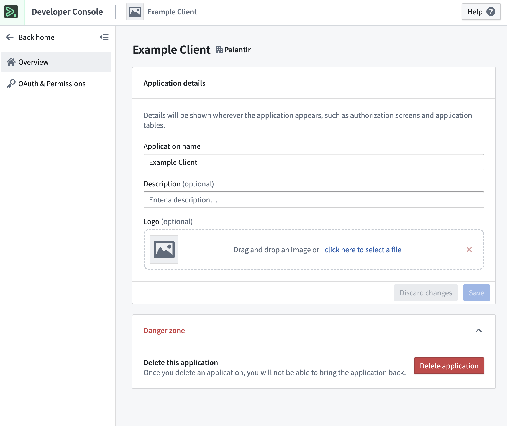
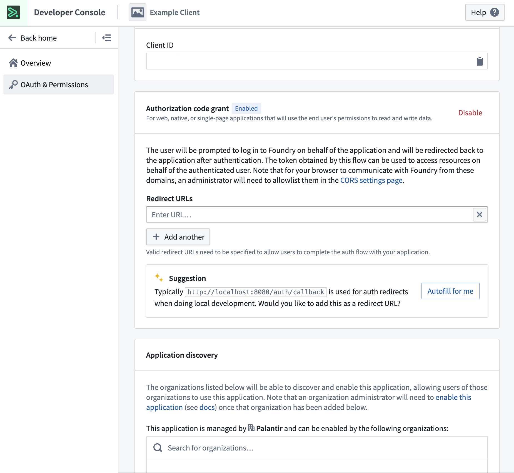

<!-- source: https://palantir.com/docs/foundry/developer-console/oauth-clients/ · mirrored 2026-08-14 from Palantir Foundry docs -->

# Standalone OAuth clients \[Legacy]

:::callout{theme="neutral"}
Standalone OAuth clients are now legacy. Use an [unrestricted custom application](/docs/foundry/developer-console/application-restrictions/#unrestricted-applications) instead.
:::

Standalone OAuth clients are a legacy, lightweight alternative to custom applications. Consider replacing a standalone OAuth client with an [unrestricted custom application](/docs/foundry/developer-console/application-restrictions/#unrestricted-applications), which provides new features like restrictions, metrics, and SDK generation.

As of January 2026, users can no longer create standalone OAuth clients. Migration steps to convert standalone OAuth clients into unrestricted custom applications will be available in a future release.

## Manage a standalone OAuth client in Developer Console

[Navigate to the OAuth clients list](/docs/foundry/developer-console/overview/#developer-console-landing-page) and select the client you want to manage. Note that you must have the **Manage OAuth 2.0 clients** permission in the OAuth client's owning organization to manage the OAuth client.

You will now see the **Overview** page, where you can edit application details such as application name, description, and logo. You may also choose to delete the application if you expand the **Danger zone**.

From here, you can navigate to the **OAuth & Permissions** page, where you can view and manage client details. You may also choose to share the application with other organizations, which will allow them to enable the application for their own users.

