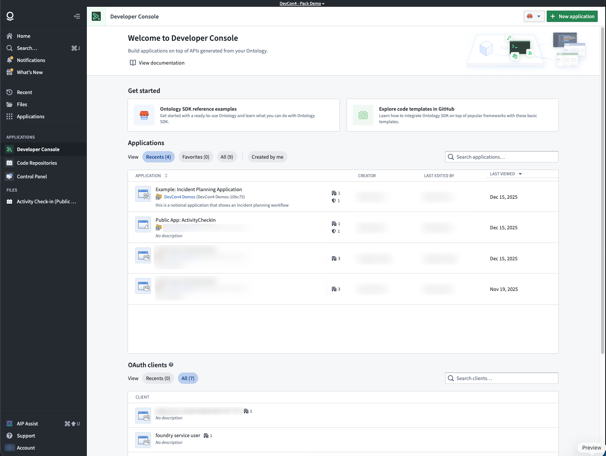
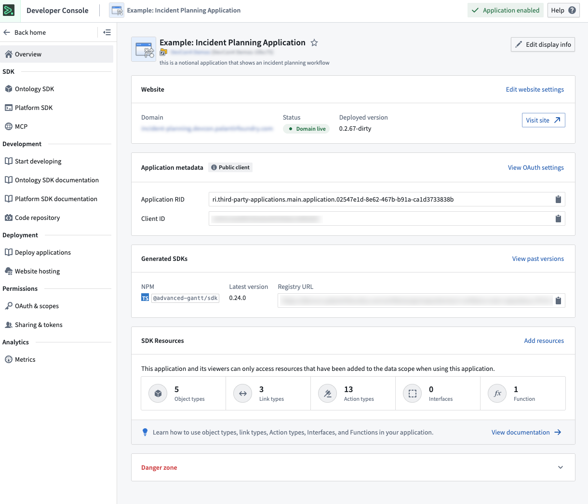
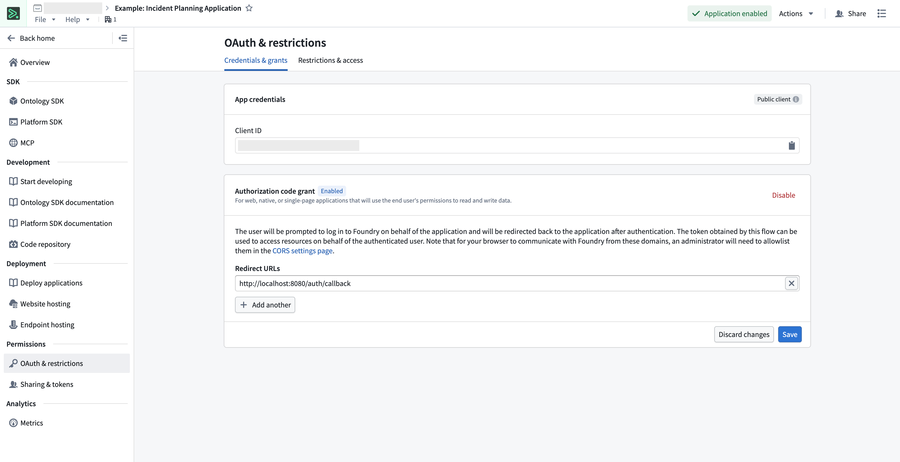
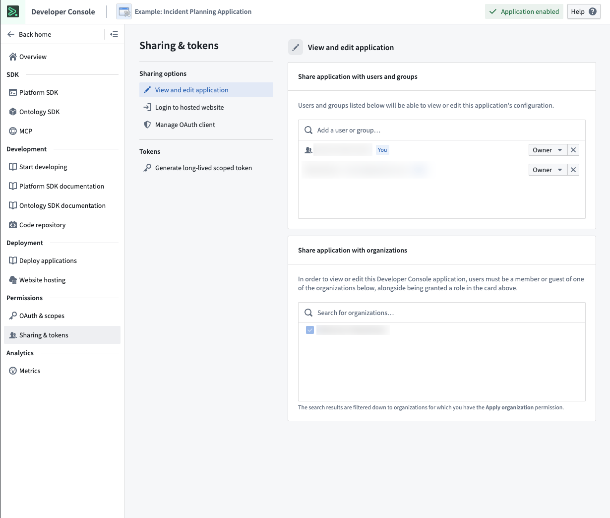
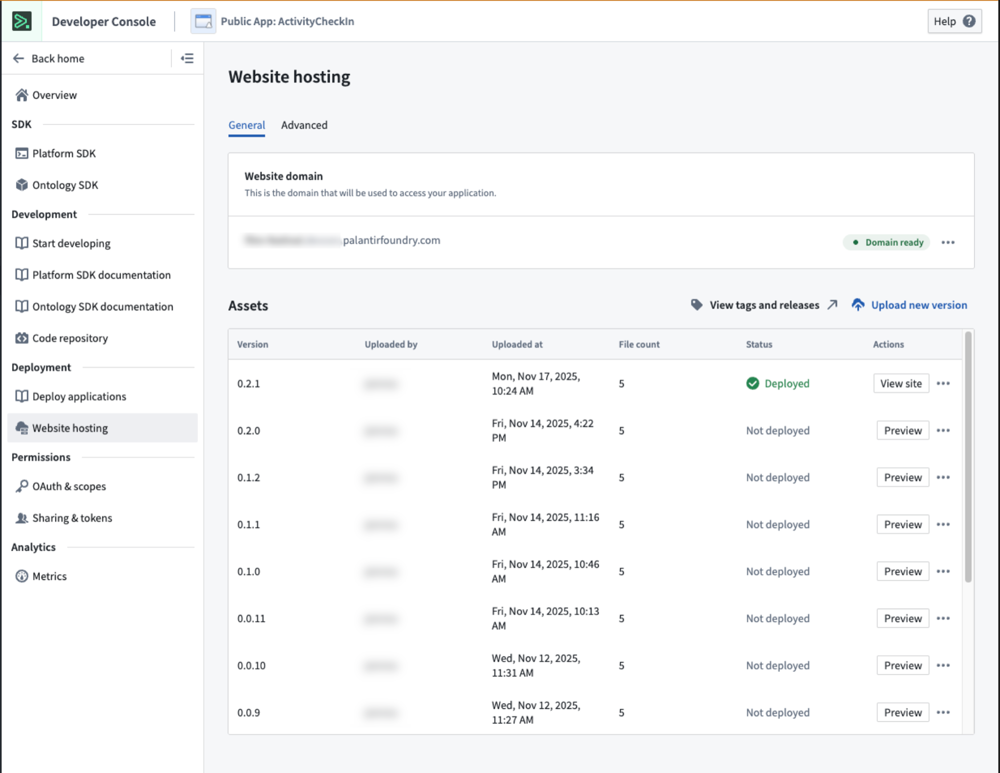

<!-- source: https://palantir.com/docs/foundry/developer-console/overview/ · mirrored 2026-08-14 from Palantir Foundry docs -->

# Developer Console

Use Developer Console to build and manage **Custom Applications** and their associated authorization clients and SDKs. A custom application allows developers to extend Foundry capabilities with custom logic hosted in or outside of Foundry. Legacy Oauth clients are also managed in Developer Console.

:::callout{theme="neutral" title="Developer Console or SuperRepo?"}
Developer Console is the UI-first way to configure a custom application: you assemble it here, and Foundry generates and publishes the SDK for the resources you add. If you would rather define the application in code, review [SuperRepo](/docs/foundry/superrepo/overview/). A SuperRepo is a pro-code monorepo that holds your Ontology definitions, [functions](/docs/foundry/functions/overview/), and frontend together. It generates the SDK locally as you edit, and ships as a [Marketplace product](/docs/foundry/marketplace/foundry-products/) that you can deploy to multiple enrollments from your own CI system.
:::

## Custom applications

The primary components of a custom application are as follows:

1. **Authorization client:** An [OAuth client](/docs/foundry/developer-console/oauth-clients/) that allows human and service users programmatic access to Foundry.
2. **SDKs:** One or more SDKs generated from resources added to an application. See [Application restrictions](/docs/foundry/developer-console/application-restrictions/).
3. **SDK documentation:** Auto-generated API documentation and code snippets tailored to your application's SDK.
4. **Permissions:** User and application-level access controls. See [Permissions](/docs/foundry/developer-console/permissions/).
5. **Metrics:** Usage and performance insights for your application. See [Application metrics](/docs/foundry/developer-console/application-metrics/).
6. **Web hosting (optional):** Host a custom frontend on a Foundry subdomain.
7. **Code repository (optional):** A linked code repository resource for application code.

## OAuth clients

OAuth clients are a legacy primitive similar to custom applications, but contain only an authorization client and none of the other capabilities listed [above](#custom-applications). OAuth clients have typically been used to grant unrestricted access to programmatic users. It is recommended that [unrestricted applications](/docs/foundry/developer-console/application-restrictions/#unrestricted-applications) be used instead of an OAuth client.

## Developer Console landing page

The Developer Console landing page lists the custom applications and OAuth clients that you have access to.

For more information on access requirements, review the [permissions documentation](/docs/foundry/developer-console/permissions/#user-permissions).

## Application pages

### Application overview

From the application overview page, you can:

* View website hosting status and generated SDK versions.
* See the ontology resources included in your application's OSDK.
* Edit the application metadata or delete the application.

For OAuth clients, see [Managing an OAuth client in Developer Console](/docs/foundry/developer-console/oauth-clients/#manage-a-standalone-oauth-client-in-developer-console).

### OAuth and restrictions

Configure the authentication flow and resource access restrictions for your application. The restrictions ensure tokens only grant access to resources approved for the application.

Learn more about [configuring permissions](/docs/foundry/developer-console/permissions/) and [application restrictions](/docs/foundry/developer-console/application-restrictions/).

### SDK documentation

Each application includes auto-generated API documentation tailored to its SDK content. You can access it by selecting **API documentation** from the left panel.

The API documentation includes:

* Installation guides for your application-specific SDK.
* Code examples for loading individual objects and fetching pages of data.
* Reference materials for each ontology object type, action type, and function.

Use the language dropdown menu to switch between TypeScript, Python, and other supported languages.

### Sharing and tokens

Share your application with users, groups, and organizations. Generate long-lived scoped tokens for programmatic access.

### Web hosting

Host frontend-only applications, such as React SPAs, directly on Foundry, eliminating the need for external hosting infrastructure.

For more detail, review the documentation on [hosting an OSDK application on Foundry](/docs/foundry/developer-console/deploy-custom-application-on-foundry/).

### Metrics

Monitor application performance including request volume, success rates, and API latency.

[Learn more about application metrics.](/docs/foundry/developer-console/application-metrics/)

## Limits

By default, each Developer Console application is limited to a total of 1000 data resources and resource access restrictions. Reach out to a Palantir administrator if you encounter this limitation.
