<!-- source: https://palantir.com/docs/foundry/developer-console/permissions/ · mirrored 2026-08-14 from Palantir Foundry docs -->

# Permissions

This section explains the different permissions required to use the Developer Console and the OSDK. These roles and permissions can be managed in the **Roles** section of [Foundry Settings](/docs/foundry/platform-security-management/manage-roles/).

## User permissions

:::callout{theme="neutral" title="Beta"}
Compass-managed user permissions are in the [beta](/docs/foundry/platform-overview/development-life-cycle/) phase of development and may not be available for your enrollment.   
See [User permissions \[Legacy\]](#user-permissions-legacy) if Compass-managed user permissions are not available on your enrollment.
:::

Applications you create in Developer Console automatically inherit permissions, such as those enforced by [roles](/docs/foundry/security/projects-and-roles/#roles), [markings](/docs/foundry/security/markings/), or [organizations](/docs/foundry/security/orgs-and-spaces/), from their parent [project or folder](/docs/foundry/getting-started/projects-and-resources/).

If your project uses the default role set, then a Developer Console application user could have one of the following roles below, which are fully configurable:

* **Viewer:** Can view the application details, the hosted website if the application is [hosted on Foundry](#website-hosting), and use the generated OSDK to develop the application. A `Viewer` cannot edit the application information, add or modify entities, or generate new versions of the OSDK.
* **Editor:** Can edit the application information and OAuth parameters, add or modify entities, and generate new versions of the OSDK.
* **Owner:** Same permissions as an `Editor`, and can share the application with other developers.

:::callout{theme="neutral"}
An application will appear in the Developer Console home page list only if the user has at least the **View application configuration** (`third-party-application:view-application-config`) operation on it, granted through the `Viewer` role by default.
:::

### Linked OAuth client

Developer Console always links a custom application to an [OAuth client](/docs/foundry/platform-security-third-party/third-party-apps-overview/), which you can manage at the organization level in [Control Panel](/docs/foundry/administration/enrollments-and-organizations-permissions/). To change the OAuth client's authentication settings, you must have access to workflows such as [**Enable third-party applications**](/docs/foundry/platform-security-third-party/enabling-3pa-access/) and **Manage third-party application secret**, typically granted under the `Third-party application administrator` role in Control Panel's **Organization permissions** extension.  This role also grants you the ability to create linked OAuth clients, which is required to [create custom applications in Developer Console](#create-applications).

You can also manage OAuth clients on a per-client basis in the **Sharing & tokens** section of your Developer Console application using the `OAuth2 client` role context. For example, you can configure a custom role with only the **Rotate third-party application client secret** (`multipass:rotate-client-secret`) operation, and grant it to users who should only have the ability to rotate the client secret for a specific application.

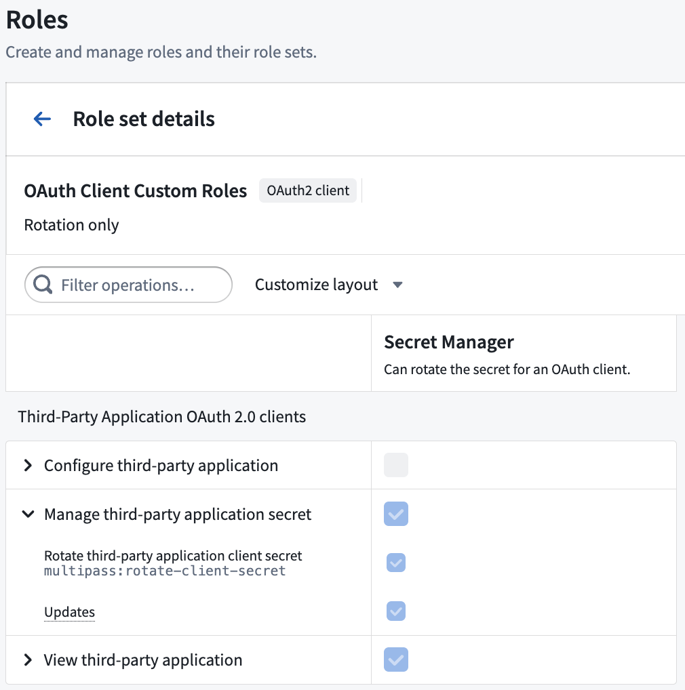

Use the **Manage OAuth client** tab of the **Sharing & tokens** section when editing your application to share the client with organizations, users, and groups.

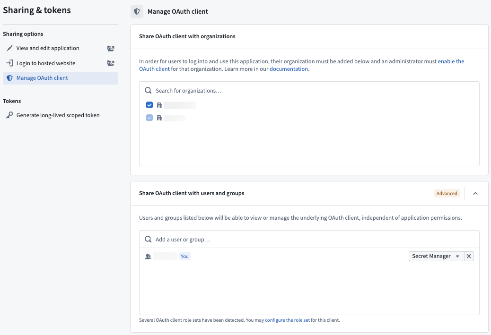

:::callout{theme="neutral"}
Linked OAuth client permissions may be converged with application permissions in the future.
:::

### Create applications

To create a new application, you need the:

* **Create application** (`third-party-application:create-application`) operation on the selected folder, granted through `Owner` or `Editor` roles by default.
* **Create third-party applications** workflow on the selected organization, typically granted through the `Third-party application administrator` role in Control Panel [as outlined above](#linked-oauth-client).

### Website hosting

* To view a website hosted on Foundry, you must have the **View application website** (`third-party-application:view-application-website`) operation on the Developer Console application, granted through the `Viewer` role by default. If you want users to view the website without being able to access the application configuration in Developer Console, you can create a custom project role that only grants this operation.

* To deploy a website on Foundry, you must have the **Deploy application website** (`third-party-application:deploy-application-website`) operation on the Developer Console application, granted through the `Editor` role by default.

* A Foundry user with the `Information Security Officer` role may approve or decline a domain creation request.

[Learn more about hosting an OSDK application on Foundry](/docs/foundry/developer-console/deploy-custom-application-on-foundry/).

## Application permissions

The Developer Console supports two types of applications:

* **Client-facing:** Frontend services, including web, desktop, or mobile applications. These applications must not be used to store client credentials.
* **Backend service:** An application to support a backend workflow, such as an application service or daemon. The applications may be used to securely store client credentials.

The same application could include both a client-facing and backend type. The type of application you create will determine which permission type and OAuth workflow may be used, as explained below.

### Permission types

When creating an application, you must choose the permission type used to access the application data. Two permissions types are available:

* **User permissions:** A user's permissions will determine what they can read and write to the Foundry Ontology. This permission type will use the `Authorization code grant` OAuth workflow.
* **Application permissions:** Your application will use a generated service user for permissions rather than applying user permissions. This permission type will use the `Client credentials grant` OAuth workflow.

:::callout{theme="warning"}
Client-facing applications must use the user permissions option and the `Authorization code grant` OAuth workflow.
:::

### Example

Let’s say you are building an application that displays vehicle data.

If you want users to only view `Cars` they have permission to access, choose to apply **User permissions**. If you want users to be able to view all `Bikes`, regardless of user permissions, choose to apply **Application permissions** to grant separate permissions for the application using a generated service user.

If you want users to view all `Cars` they have access to view **AND** all `Bikes`, choose to use both permissions options.

## Resource access restrictions

As you add resources to your application's SDK, those resources and their dependents will be automatically added to the application's resource access restrictions. While users must have relevant permissions for the resources, the resource access restrictions ensure that users can only access the resources that are approved for this application through the given OAuth token.

For example, when adding new object types, link types, action types, or functions to your SDK configuration, any required underlying datasets or related resources will be added to the resource access restrictions.

For your application to function correctly, you may need to manually manage the restrictions [when dependencies change](#when-dependencies-change) or [when removing resources](#when-removing-resources).

### When dependencies change

If the required dependencies for the resources in your application's SDK change after you added them, you should update your application's resource access restrictions to include the changed dependencies. You can do this via the Developer Console where you can view a warning if an application's restrictions are outdated and a guided workflow for correcting them. For example, this may be required if a new backing dataset is configured for an object type that is already included in your application SDK.

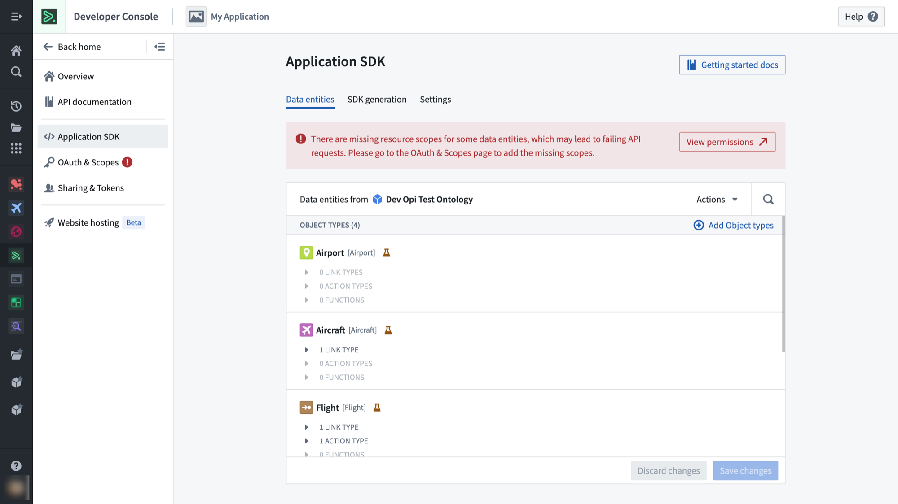

*Example warning shown on the Application SDK page when outdated dependencies are detected.*

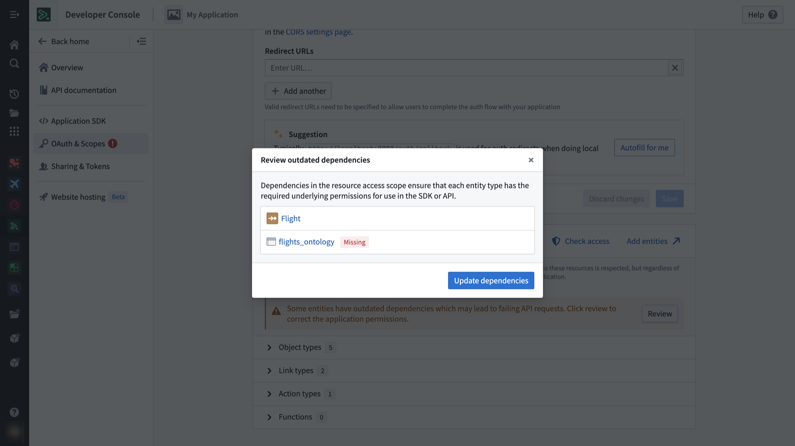

*Example correction workflow for outdated dependencies, in this case showing a missing dataset for an object type.*

### When removing resources

If you create a new version of your application SDK that removes previously included resources, usage of the current version of your application will break if these resources are immediately removed from the resource access restrictions. To prevent this from happening, you must remove previously included resources from the SDK but keep these resources in the resource access restrictions until you have upgraded all your clients to the new version of the application, after which it will be safe to remove the previously included resources from the restrictions as well.

When you remove a resource from the SDK, the Developer Console application will display a warning confirming whether you also want to remove them from the restrictions or keep them in. You can clean up old resources later from the **OAuth & restrictions** page.

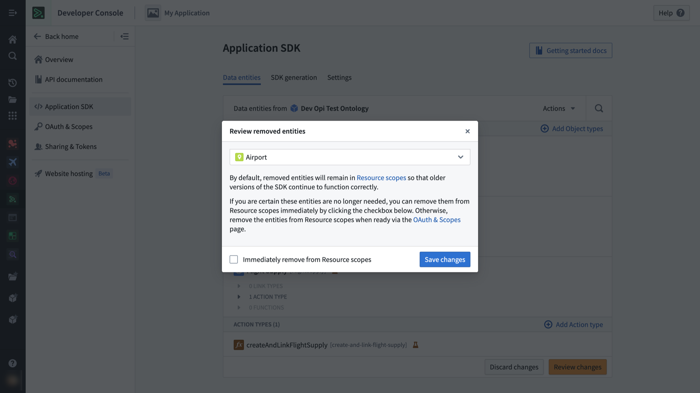

*Example warning shown on the Application SDK page when a resource is being removed.*

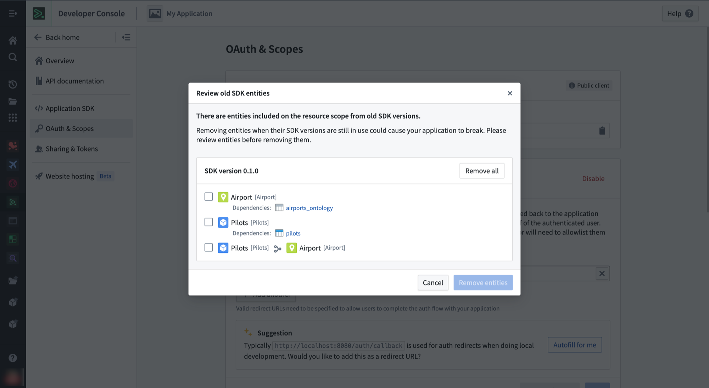

*Example clean-up workflow for old resources present on the resource access restrictions from previous SDK versions.*

## Migrate to Compass-managed user permissions

:::callout{theme="warning"}
As of February 2026, Compass-managed user permissions are in the [beta](/docs/foundry/platform-overview/development-life-cycle/) phase of development. If your enrollment does not have this feature enabled, then you can refer to the legacy [user permissions section below](#user-permissions-legacy). As Compass-managed user permissions progress toward general availability, you should refer to the [migration steps below](#migration-steps) to migrate to Compass-managed user permissions.
:::

### User permissions \[Legacy]

Instead of applications inheriting project permissions, Developer Console users are automatically set as the `Owner` of the applications they create. The application owner must then share the application with other developers and grant permissions to given users from the **Sharing & tokens** section of their application.

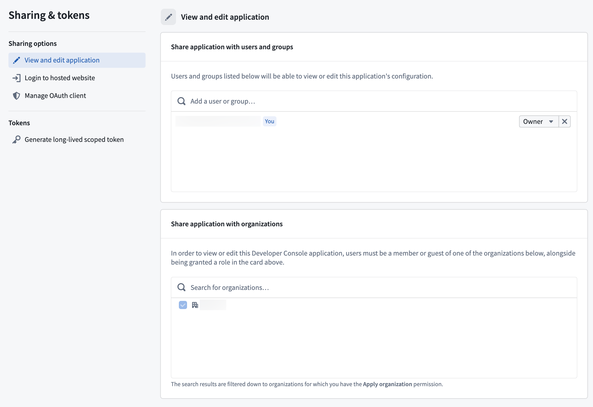

You can delete Developer Console applications in the **Danger zone** panel of the **Overview** section of a given application. Unlike a Compass resource's trashing workflow, deleted applications cannot be restored.

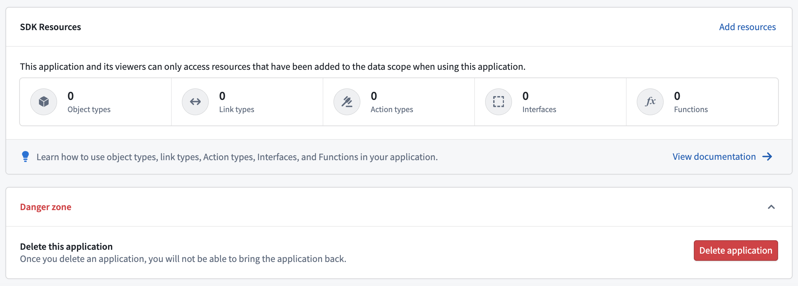

Follow the migration steps below to ensure your Developer Console applications are managed by Compass.

### Migration steps

The **Migrate legacy application to Compass** (`third-party-application:migrate-application-to-compass`) operation is required to migrate an application, granted through the `Owner` role by default.

1. Open your application and select **Migrate application to project**.

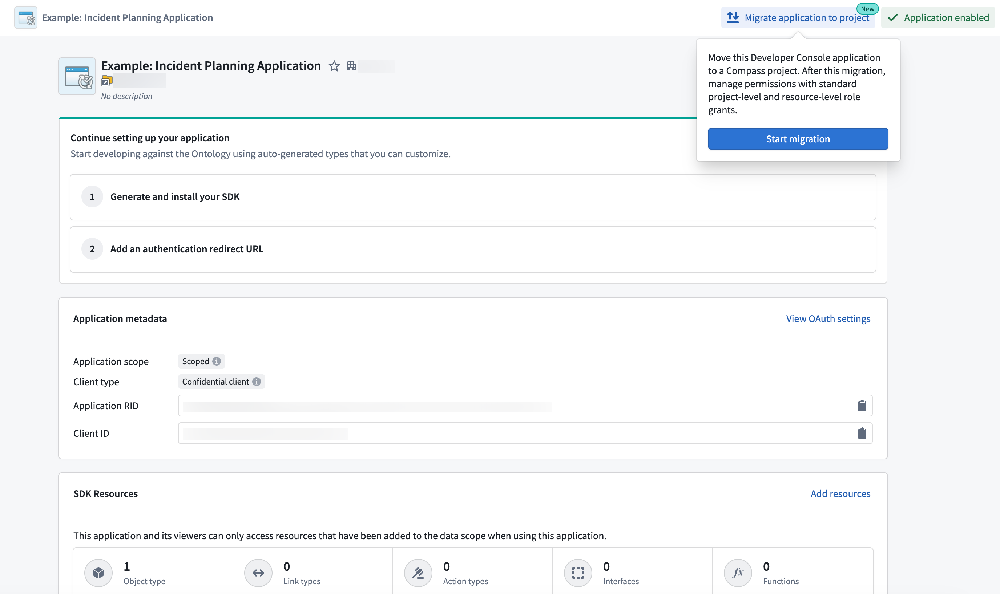

2. Follow the instructions in the **Migration to Compass resource** pop-up modal to select a location.

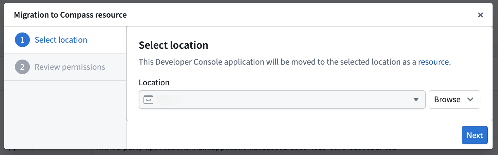

3. Review the permission changes and select **Submit** to confirm.

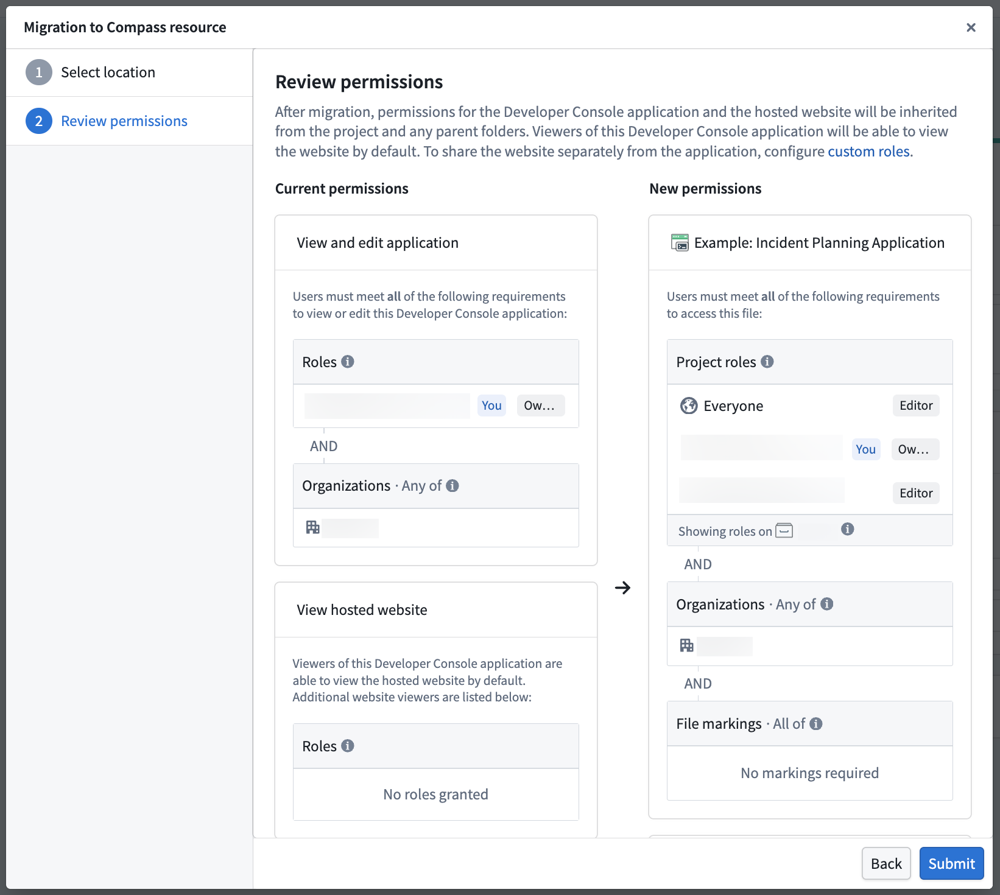

After migration, your application will appear in the selected location. You can now perform actions on the application like those on any other Compass resource, such as [moving, sharing, and trashing](/docs/foundry/getting-started/projects-and-resources/).

### Website viewer permissions

Previously, you could use the **Sharing & tokens** section of the application to grant users permission to view the hosted website, but not view the application's configuration.

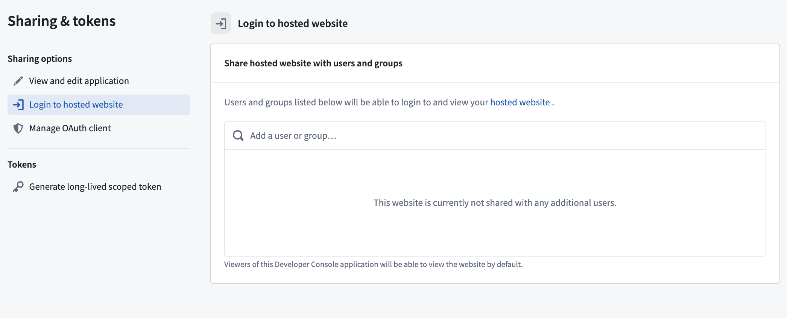

While this is no longer available by default for Compass-managed applications, you can [create a custom project role](#website-hosting) to maintain separate viewing permissions. To prevent breaks to existing workflows, assign this role on the project or folder prior to migration. This ensures the desired group of users can access the website but not view the application's configuration in Developer Console.

### Marketplace applications

Developer Console applications deployed through [Marketplace](/docs/foundry/marketplace/overview/) were previously not created in the same location as other installation resources. With the migration to Compass-managed user permissions, new applications that are installed through Marketplace will also be created in the [location you provide](/docs/foundry/marketplace/install-product/).

Migrating a packaged application from a Marketplace product will not automatically migrate its previously deployed installations. Each installation must also be migrated independently using the [migration steps](#migration-steps). If the installation is locked, you may be prompted to unlock it beforehand so that you can move the application to that location.

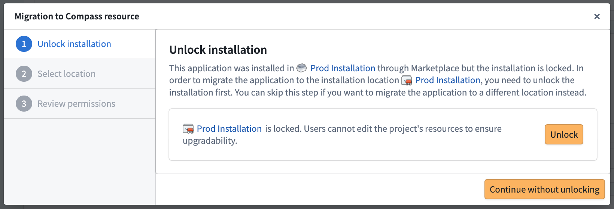
