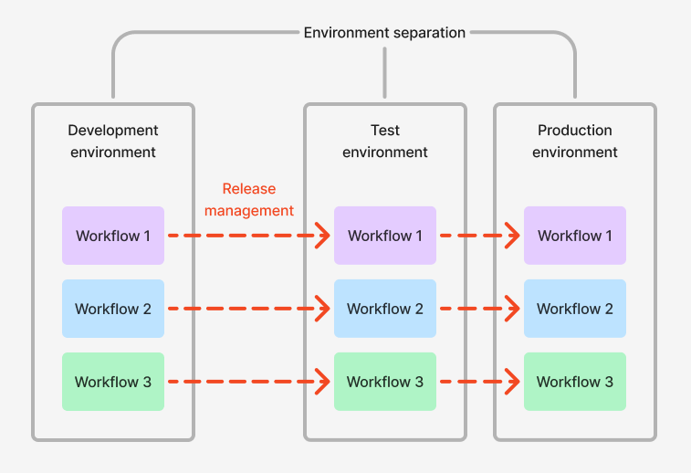

<!-- source: https://palantir.com/docs/foundry/devops-release-management/overview/ · mirrored 2026-08-07 from Palantir Foundry docs -->

# Release management

Release management is the process of managing multiple versions of resources across distinct environments that serve different purposes, also known as the principle of environment separation. Typically, the environments serve as isolated locations for resources at different stages of being released, such as: feature development, feature testing, and feature deployment to production.

For example, developers at your organization can collaborate in the development environment on new features, while user acceptance testers and automated testing scripts can test developed features yet to be validated for production that are in the testing environment, ahead of releasing them to production. This can happen while the existing functionality running in production remains available for users and is unaffected by the ongoing development and testing in the other environments.

The separation of resources into environments allows changes to be tested and validated in a controlled environment that does not affect the functionality running in production. When the resources have been tested, they can then be promoted to production if ready, or further developed if required.

:::callout{theme="neutral"}
Using DevOps and Marketplace is one way to implement a release management process. There are other ways to do this in the Palantir platform, such as using [Global Branching](/docs/foundry/global-branching/overview/).
:::

## Environment separation in DevOps and Marketplace

[Spaces](/docs/foundry/security/orgs-and-spaces/#spaces) are a flexible primitive in the Palantir platform that allow for environment separation in Foundry. Environment separation is the practice of maintaining distinct spaces for different stages of development and deployment, such as development, testing, and production. This separation ensures that changes can be tested and validated in a controlled environment before being promoted to production, thereby minimizing the risk of introducing errors or issues into production workflows.

You can create as many environments as necessary for a workflow, allowing for custom release management models.

A typical environment setup consists of the following three environments, each represented as a “space” in the Palantir platform:

* Development: Environment for developing new features
* Test: Environment for manual or automated testing of features once the features have been developed in the previous environment.
* Production: Environment for features that have been developed and tested in the previous environments by end users.

Generally, as products are promoted through your environments, the functionality within those products will become available in the given environment/space. You can configure the following differences across your environments:

* **Environment-specific data:** For example, the development environment may use notional data, while the test environment may use a subset of real data, and the production environment uses the full scale of real data.
* **Environment-specific behavior:** The behavior in non-productions environments may differ to the behavior in the production environment. For example, email notifications sent to the relevant users within the production environment may be sent to a different group in other environments. Similarly, approval workflows in non-production environments may allow a different set of users, such as testers and developers, to provide approval where in the production environment it would be the true approvers.
* **Environment-specific integrations:** For example, the development environment may connect to development-level databases and call out to APIs of other development-level systems. The production environment will typically connect to production databases and call out to other production-level systems.

## Global Branching vs. release management

[Global Branching](/docs/foundry/global-branching/overview/) enables development and testing of workflow changes on an isolated branch, and is ideal for managing changes within an environment by allowing multiple developers to work in isolation. Changes are only merged to the main branch when the feature is complete and by users with the right level of permissions.

Global Branching is ideal for rapid iteration, providing the ability to easily test newly developed features. However, due to the short-lived nature of branches and limited coverage of resource types, it does not always fulfill all of the needs of release management.

Benefits of using DevOps and Marketplace for release management include the abilities to:

* Integrate with different source systems in different environments
* Maintain different security policies across environments
* Roll back to a previous release
* Configure release channels
* Support long-lived environments

Benefits of using Global Branching for release management include the abilities to:

* Rapidly iterate on new features and easily release them to end users
* Easily create and release a hotfix into an environment
* Lower the cost of infrastructure due to branches being automatically deleted when not used

[Learn more about how to use DevOps for release management.](/docs/foundry/devops-release-management/use-devops-for-release-management/)
