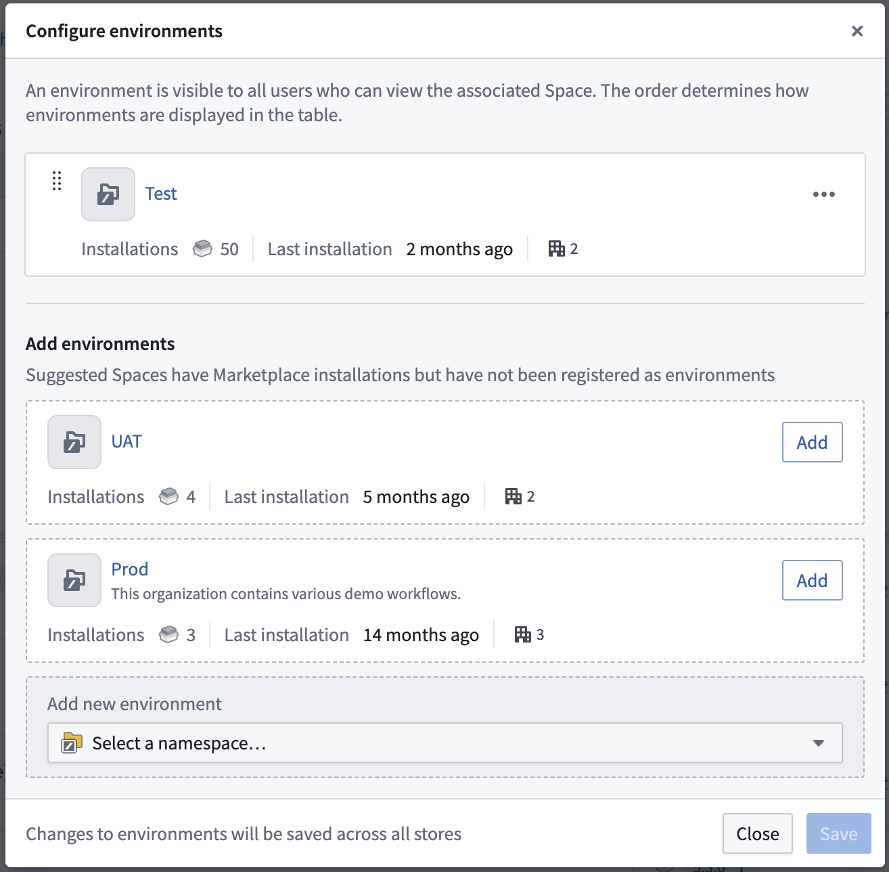
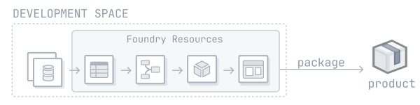
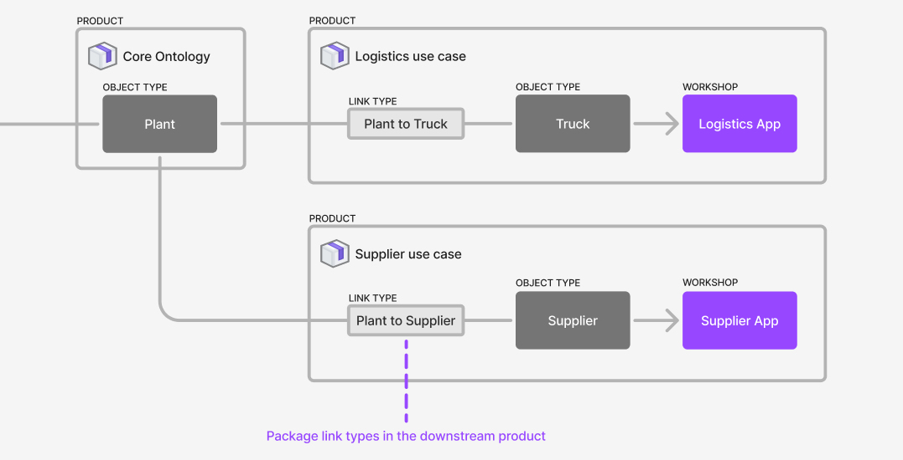
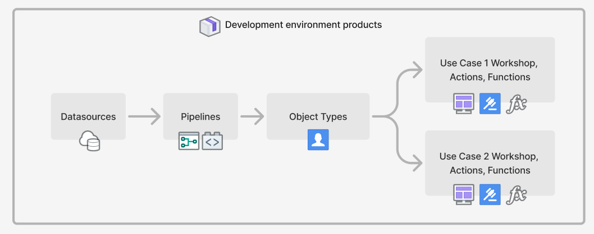
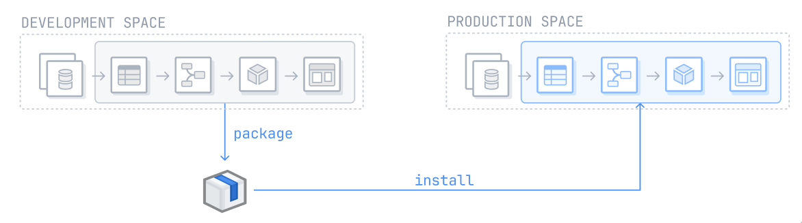
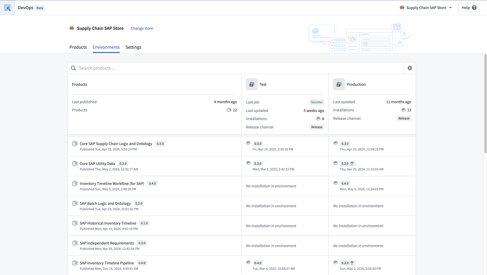
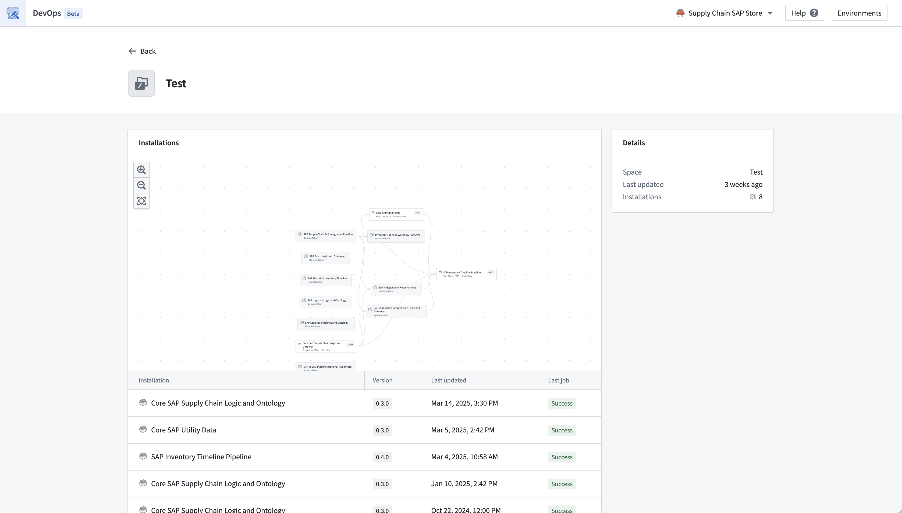
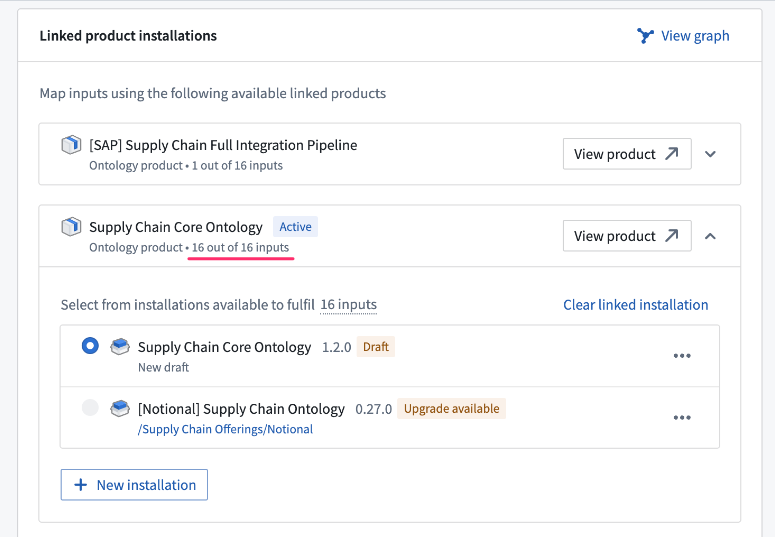

<!-- source: https://palantir.com/docs/foundry/devops-release-management/use-devops-for-release-management/ · mirrored 2026-08-07 from Palantir Foundry docs -->

# Use DevOps for release management

This guide outlines the steps to set up a release management process using DevOps, Marketplace, and spaces. Assuming you have already established a workflow in your development environment, these instructions below aim to guide you through the process of setting up additional environments and deploying your existing workflow into these new settings.

:::callout{theme="neutral"}
Using DevOps and Marketplace, as outlined below, is one way to implement a release management process. There are other ways to do this in the Palantir platform, such as using [Global Branching](/docs/foundry/global-branching/overview/).
:::

## 1. Set up environments using spaces

Use [spaces](/docs/foundry/security/orgs-and-spaces/#spaces) in the Palantir platform for environments. Create one space per environment that you need. For example, you can create `Development`, `Test`, and `Production` spaces. All resources and projects in the Palantir platform exist within a space, so the current space that your resources are in can be used as your `Development` space. If you would like to use that current space as your `Development` space, you only need to create additional `Test` and `Production` spaces.

Refer to [documentation on spaces](/docs/foundry/platform-security-management/manage-orgs-and-spaces/#spaces) to learn how to create and configure spaces.

Multiple workflows can exist within a space, and resources can be shared across them.

If the ability to create a space is disabled on your enrollment, contact Palantir Support to create a new space.

Environments can be managed from the DevOps application and are configured across the enrollment and affect all stores. You can configure environment settings by navigating to the **Settings** option for the table, followed by **Configure environments**.

From the **Environments** settings, users can add suggested environments, spaces that contain installations for the given store, or select another space. You can also re-order the list of environments to determine how they are displayed on this page. Users can only edit, add, or remove environments for the spaces the user holds owner access to, and the spaces must only be associated with one enrollment.

## 2. Package resources into products

Use [DevOps](/docs/foundry/foundry-devops/overview/) to package resources from your development environment into products. You can package your workflow into one or more products. A typical split might look like:

* Datasource product containing data connection resources.
* Ontology product containing object types and their backing datasets, and generic Actions and Functions.
* One or more Use case products containing Workshop modules, and workflow-specific Actions and Functions.   
     
  [Review our guide on how to create a product.](/docs/foundry/foundry-devops/create-products/)   

In general, it is best practice to package an entire Project as a product to maintain a 1:1 relationship between Projects and products. This simplifies the process of determining the appropriate product for a resource.

Ontology entities are not part of any Project. Consider the following guidance when deciding where to package object types, link types, action types, and functions:

* **Object types** should be packaged in the product where the backing **dataset** is packaged.

* Out of the two object types used in a **link type**, the link type should be packaged in the product as the object type that is most **downstream**. For example, given a use case product called `Logistics Use Case` with an object type called `Truck` which has a link to the `Plant` object type in the `Core Ontology` product, the link type should be packaged in the `Logistics Use Case` product. In this situation, we can say that the `Logistics Use Case` product sits **downstream** of the `Core Ontology` product, and that the `Core Ontology` product sits upstream of the `Use Case X` product. If both object types are in the same product, then package the link type in that product as well.   
     

* For **action types**, consider the following:

  * Action types are usually implicitly associated with a use case. In these cases, you should package the action type in the relevant use case product. For example, if the `Reroute Truck` action type is used by applications in the `Logistics Use Case`, package the action type with the use case.
  * Action types can be backed by Functions. In these cases, the action type will have a dependency on the Function that backs it. Package the action type in the same product as the Function that backs it.
  * An action type may be used in multiple use cases that are packaged in separate products. In these cases, you can factor out the common functionality, such as the action types and potentially the Functions that back them, into their own product or into a core Ontology product.

* **Functions** should be packaged within the same product as the source that produces them, such as the functions code repository or logic resource.

### Guidance on packaging multiple Projects

Workflows often rely on resources across multiple Projects, the same applies when Projects are packaged into products: the Products compose together because the resources packaged in one product can be used as the inputs for products that sit downstream. This means you can release manage larger workflows across multiple Projects. For example, you can package a data source product, a core Ontology product, and multiple use case products. Use case products will likely contain Workshop applications or other resources that rely on object types that will be part of the core Ontology product. In this situation, the use case products will require those object types as inputs and those inputs will be satisfied by the core Ontology product.

Package the relevant Projects into products. The products should compose together, so that the contents of one product can satisfy the inputs of downstream products.

[Learn more about linked products.](/docs/foundry/marketplace/linked-products/)

## 3. Release manage your products

Once your Projects have been packaged into products, you can now install these products into your second environment. In a release management process with `Development`, `Test`, and `Production` environments, this would be the `Test` environment. [Learn more about installing a product through Marketplace.](/docs/foundry/marketplace/install-product/)

Repeat this process for every subsequent environment. After installing a product in an environment, you can automate upgrades by customizing your [installation settings](/docs/foundry/marketplace/installations/#installation-settings). Additional customizations, such as release channels and maintenance windows can also be configured during the initial installation.

You can view environments in the Environments tab in the DevOps application. Users can view product installations in their configured environments. The products packaged in the store are displayed in the left column and these products can be installed and upgraded in the user-configured environments such as in `development`, `test`, `production` environments.

Users can see a high-level view of the installations in their environments, as well as some summary information of each environment. From here, users can navigate to the installations directly and take actions such as install, upgrade, edit release channels and locking installations.

A more detailed view of an environment can be found by selecting the individual environment.

### Guidance on installing multiple products

If you are installing more than one product at a time, take into account the ordering of products when doing this. Upstream products need to be installed before their downstream dependencies. When you install downstream products, their inputs should typically be satisfied by resources in the same environment, for example, use resources from your `Test` environment as inputs to the `Test` environment installations, and similarly for other environments.

The linked products feature will show you which products satisfy each other’s inputs when packaging.

### View environments in DevOps

You can view environments in the **Environments** tab in the DevOps application. For a given store, the development environment contains the source products of the store that users are able to install into their other environments. Users can view these product installations in their configured environments. The products packaged in the store represent the `development` environment and then these products are installed and upgraded in the user-configured environments such as in `development`, `test`, `production` environments.
