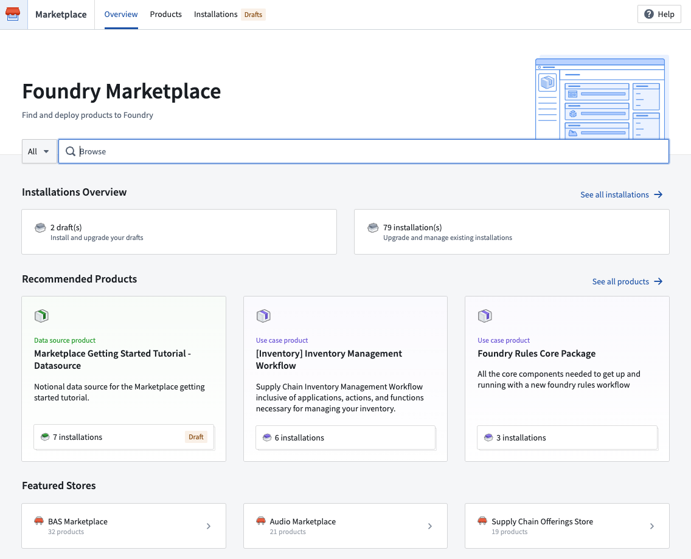

<!-- source: https://palantir.com/docs/foundry/devops/overview/ · mirrored 2026-09-06 from Palantir Foundry docs -->

# Product delivery

## Foundry DevOps

**Foundry DevOps** enables you to rapidly develop and deploy packages of data-backed workflows built in Foundry, leveraging your organization’s ontology, AI models, pipelines, data connections, or end-to-end use cases.

Key features of Foundry DevOps include:

* **Flexible packaging** of any combination of Foundry resources as a product.
* **Automated version and dependency management** to ensure seamless synchronization of modular components as products scale.
* Tagging of new product versions with **release channels** to ensure that they only reach qualifying installations.
* Management of a **fleet of installations**.

Foundry DevOps is a good fit for use cases such as:

* **Product distribution:** Publish your product for other installers within your organization or the broader Foundry community in the Foundry Marketplace.
* **Building ecosystems:** Install your product for each ecosystem participant (customers, subsidiaries, departments, and so on) with their input data.
* **Release management:** Create installations corresponding to development environments and customize maintenance windows for upgrades and release channels.
* **Bootstrapping new use cases:** Install your product once to serve as a starting point for your latest custom use case.

Learn how to [create products](/docs/foundry/foundry-devops/create-products/) and [manage products](/docs/foundry/foundry-devops/manage-products/).

## Marketplace

The **Marketplace** storefront facilitates easy discoverability to install published data products.

Key features of Marketplace include:

* **Guided product installation**, including **recommendations** for related products that fulfill product inputs.
* Ability to enable **automatic upgrades** for installations to accept new product versions with no user intervention, including **maintenance windows** and **release channels**.

Learn how to [browse](/docs/foundry/marketplace/browse-products/) and [install](/docs/foundry/marketplace/install-product/) Marketplace products.
