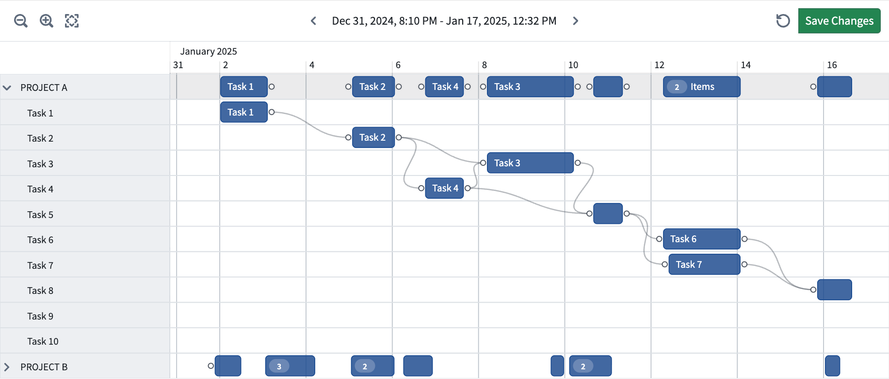
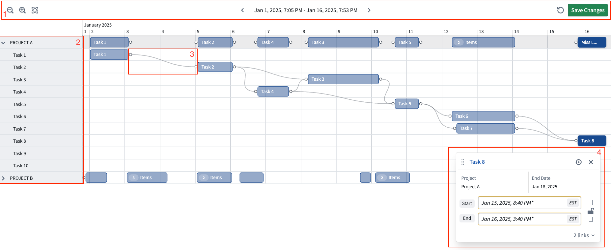

<!-- source: https://palantir.com/docs/foundry/dynamic-scheduling/program-scheduling-overview/ · mirrored 2026-08-14 from Palantir Foundry docs -->

# Program Scheduling widget

The **Program Scheduling** widget is a Workshop widget that provides a chronological view of programs, projects, and tasks. Use it to track progress across workstreams, visualize how tasks relate to one another, and identify blockers that may impact downstream deliverables. The widget works with any object type that has date or timestamp properties representing start and end times.

Module builders configuring a Program Scheduling widget can:

* Track project and task progress on an interactive timeline, with tasks displayed as pucks that reflect their scheduled duration.
* Visualize task dependencies as arrows between pucks, making it easy for users to identify blockers and understand how delays cascade through a program.
* Organize tasks into a hierarchical table of collapsible groups alongside the timeline — for example, grouped by project, team, or phase.

In the example below, the Program Scheduling widget displays tasks grouped by project phase, with dependency arrows highlighting the relationships between deliverables.

## Puck types

Each task or event in a data layer is rendered as a **puck** on the timeline. The puck type is configured per layer and determines how items are visualized and what interactions are available.

* **Standard pucks:** Rectangular bars representing tasks or activities that span a time range. These support dependency arrows to visualize dependencies between tasks.
* **Background pucks:** Shaded rectangular regions representing broader time periods such as project phases, planning cycles, or review windows. Background pucks provide visual context for the tasks in front of them but are read-only and cannot be edited by users.
* **Event pucks:** Thin vertical markers at a single point in time. These can represent milestones, deadlines, or key decision points.

## Dependencies

The Program Scheduling widget can visualize task dependencies as arrows connecting related pucks on the timeline, helping users understand sequencing constraints and identify which tasks are blocking downstream work. Dependencies are configured per layer by selecting an array property on the object type that references the primary keys of other objects in the same layer.

* Dependency arrows are only available for standard pucks.
* Hovering over a puck highlights its dependency chain, making it easier to trace which tasks are blocked and which are blocking others.
* You can hide arrows by default using the **Hide arrows by default** interface option. Users can toggle arrow visibility at runtime.

## Widget layout

The image below provides an overview of the full widget layout.

1. **Timeline:** The body of the widget displays task pucks positioned along a horizontal time axis controlled by configurable start and end timestamps. If edits have been made, the **Save Changes** button will appear on the right.
2. **Rows:** The left side of the body displays a hierarchical table of rows organized by configurable properties such as project, team, or phase. Groups can be expanded or collapsed.
3. **Dependencies:** Arrows connect related task pucks to visualize sequencing constraints and highlight blockers.
4. **Detail card:** Selecting a puck opens a detail card displaying properties for the selected task. Users can also edit and traverse links in this view.
