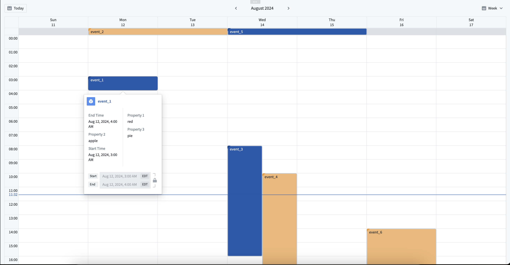

<!-- source: https://palantir.com/docs/foundry/dynamic-scheduling/scheduling-calendar-overview/ · mirrored 2026-08-14 from Palantir Foundry docs -->

# Scheduling Calendar widget

The Scheduling Calendar is a Workshop widget that can be used to display objects based on their date or timestamp properties. Users have the option to view their data by day, week, or month, and the option to enable drag-and-drop functionality for when changes to schedule objects are needed.

Examples of use cases that benefit from the Scheduling Calendar widget include:

* Appointment or meeting scheduling.
* Tracking task and milestone deadlines.
* Viewing employee shift assignments.

