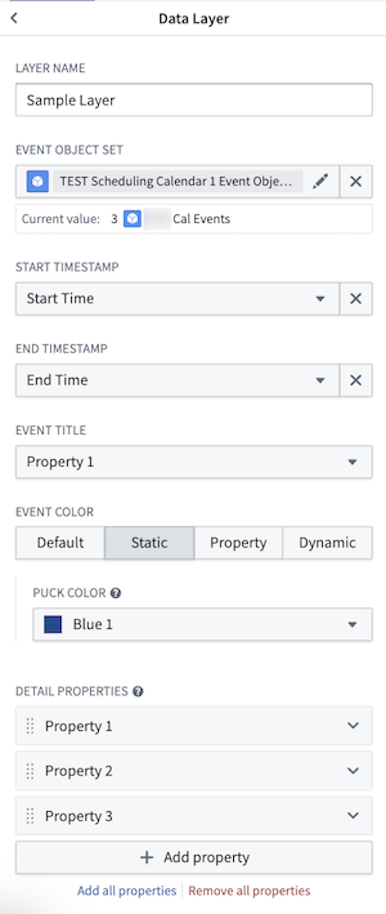
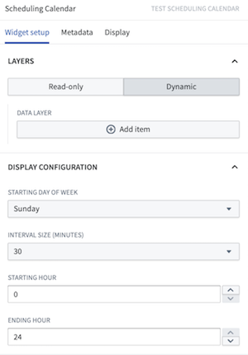

<!-- source: https://palantir.com/docs/foundry/dynamic-scheduling/scheduling-calendar-widget/ · mirrored 2026-08-14 from Palantir Foundry docs -->

# Widget configuration

## Widget modes

The Scheduling Calendar widget has two modes: read-only and dynamic. By default, the widget begins on read-only mode, which is designed for viewing and analyzing data without making any changes. Switching to dynamic mode enables you to add, edit, or delete schedule objects directly in the widget.

Dynamic mode requires specific Ontology settings on your schedule object type. You will need to add type classes to the properties that represent the start (`schedules:schedulable-start-time`) and end time (`schedules:schedulable-end-time`) for your object. You can do this by:

1. Navigate to your schedule object type in Ontology Manager.
2. In the **Properties** tab, select the property that needs a type class.
3. Select the **Interaction** tab from the property details panel on the right.
4. Scroll down and select **Add new type class**, then enter the type class kind and value in the provided text boxes.

## Input data (pucks)

* **Schedule Name:** The name of the layer to help differentiate between different layers during configuration. This value is not displayed in the widget itself.

* **Schedule Object Set:** This is the input variable to the Scheduling Calendar widget and determines what data will be displayed. The object type selected for this object set must have properties that represent a start time and an end time.

* **Start Time (read-only mode):** Select a date or timestamp property to use as the start time of the events. In dynamic mode, the widget will infer this value if the correct Ontology settings have been applied.

* **End Time (read-only mode):** Select a date or timestamp property to use as the end time of the events. In dynamic mode, the widget will infer this value if the correct Ontology settings have been applied.

* **Title:** Select a property to use as the displayed label value for the object pucks in the widget.

* **Color:** Select the color(s) to use when displaying events in the chart.
  * **Static:** Select a single color for all pucks.
  * **Segment-by:** Select a property and the widget will automatically color-code pucks based on the values of the selected property.
  * **Dynamic:** Configure conditional formatting rules to apply to pucks in the chart.

* **Pop-over Properties:** This section determines the properties that will be displayed on the popover card when a user’s cursor hovers over a puck on the calendar.

* **Save Handler Action (Dynamic mode):** Select an action that will be used for drag-and-drop interactions. This action should be a Modify action that edits the schedule objects start and end time properties.
  * The action must have parameters for modifying the start time and end time of the schedule object.
  * The parameter IDs in your action must exactly match the property IDs you selected for start and end time. For example:
    * If your start time property is `start_time`, the action parameter ID must also be `start_time`.
    * If your end time property is `end_time`, the action parameter ID must also be `end_time`.
  * The action parameters must have the same type classes (`schedules:schedulable-start-time` and `schedules:schedulable-end-time`) as the corresponding properties.
  * All parameters should be marked as optional.

* **Enable Drag to Create (Dynamic mode):** Select an action to let end users create new schedule objects by dragging across empty space on the calendar. See [Drag to create](#drag-to-create) for setup and usage details.

### Display configuration

* **Starting Day of Week:** This selection determines which day will serve as the beginning of the week when your chart is in either week or month view.

* **Interval Size (Dynamic only):**  By default, users can assign objects to any time on the Scheduling Calendar widget, down to the specific minute. Snap behavior allows builders to set defined intervals of when objects can be assigned. Once a puck is dropped to a new placement in the chart, the puck will snap to the beginning of the closest interval.

* **Starting Hour:** This selection determines when the chart will begin in day or week view.

* **Ending Hour:** This selection determines when the chart will end in day or week view.

## Drag to create

The Calendar widget lets end users create new schedule objects by holding a modifier key and dragging across the calendar.

### Set up drag-to-create behavior

1. In Ontology Manager, make a `Create Action` for the object type displayed in your calendar layer. This action needs the following parameters:

   * The `Start Time` property of the object
   * The `End Time` property of the object
   * Optionally, any additional properties you want users to fill out when an object is created.

   The start and end time parameters can be typed as either timestamp or date, to match the corresponding properties on your object type.
2. In Workshop, navigate to **Input Data (Pucks) > \[your calendar layer] > Interactions > Enable Drag to Create**.
3. Select the `Create Action` you configured.
4. Choose **Select parameter to configure**, then bind the start and end time parameters under **Local Default Value**:
   * For the start time parameter, select **SELECTED START TIMESTAMP** (or **SELECTED START DATE** if the parameter is date-typed) so that, on drag to create, the widget passes in the time you dragged from.
   * For the end time parameter, select **SELECTED END TIMESTAMP** (or **SELECTED END DATE**) so that, on drag to create, the widget passes in the time you dragged to.

### Use

To create a new object, hold the modifier key for your operating system and drag across empty space in the calendar:

* **macOS:** hold `Cmd` (⌘) and drag.
* **Windows:** hold the `Windows` key and drag.

When you release the drag, the widget displays the new proposed object immediately based on the start and end times of your drag. By default, a form will pop up on every create for maximum configurability. Selecting the **Hide form and apply immediately if valid** configuration will hide this form. New objects are only created in the Ontology upon saving changes.

## Common configuration issues

### Error: "The action parameter ids must align with the ids of the selected properties"

This error occurs when the save handler action's parameter IDs do not exactly match the property IDs used in the widget configuration.

**Cause:** The widget requires an exact match between:

* The property IDs of your start and end time properties
* The parameter IDs in your save handler action

**Solution:**

1. Check your property IDs in Ontology Manager:
   * Navigate to your schedule object type.
   * Note the exact property IDs (for example, `start_time`, `end_time`).
2. Check your action parameter IDs:
   * Open your save handler action in Ontology Manager.
   * In the action's parameter configuration, verify that parameter IDs exactly match your property IDs.
   * Parameter names can differ, but the *parameter IDs* must be identical to property IDs.
3. Verify type classes are applied to both properties and action parameters:
   * Properties should have `schedules:schedulable-start-time` and `schedules:schedulable-end-time` type classes.
   * The corresponding action parameters should have the same type classes.
4. If needed, edit the action parameter IDs to match your property IDs.
