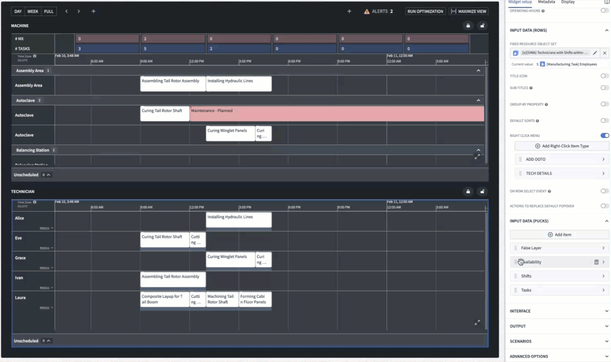
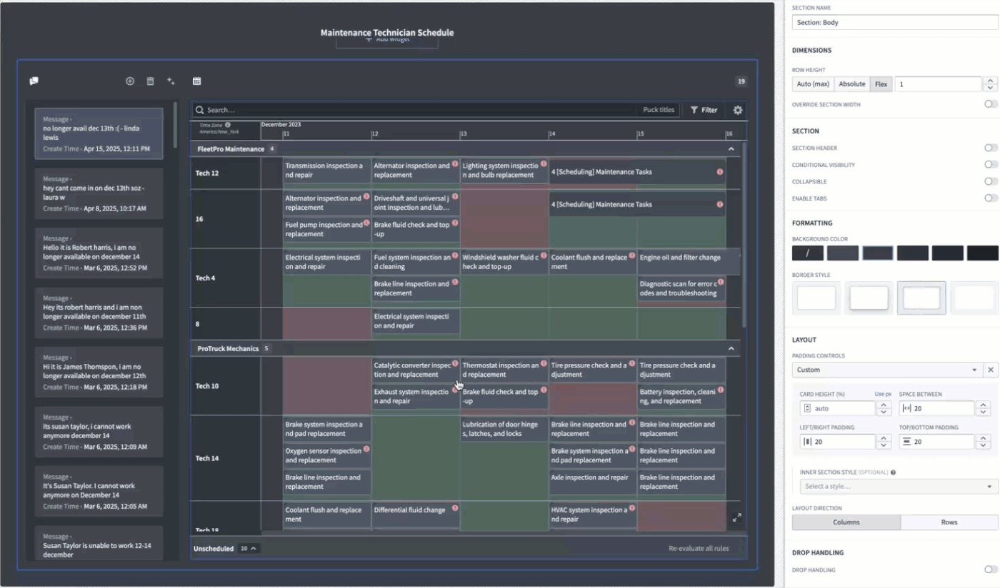
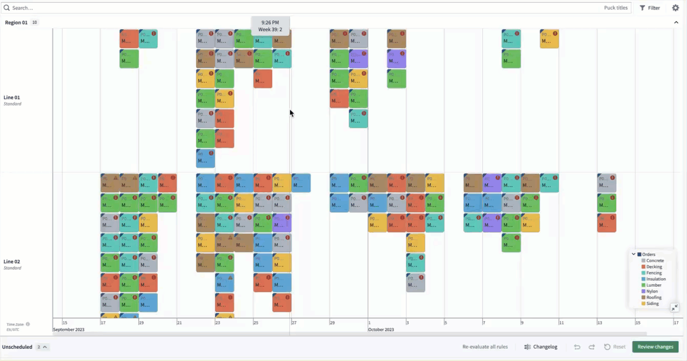

<!-- source: https://palantir.com/docs/foundry/dynamic-scheduling/scheduling-drag-and-drop/ · mirrored 2026-08-14 from Palantir Foundry docs -->

# Drag and drop

The drag-and-drop feature for the scheduling Gantt chart widget enables the end user to assign or re-assign the "pucks" to a different row and/or different point in time. Drag and drop is the primary way to interact with pucks in the widget.

## Set up drag-and-drop behavior

In order to configure the drag-and-drop behavior, you must provide a save action handler in the widget configuration options. On drag and drop of a puck, the widget will call this action. The steps below will guide you through setting up drag-and-drop behavior on the most common action type: a simple action that modifies the start, end, and assigned row of the associated schedule object. In this example, we will refer to the schedule layer as of `Object type A`.

## Set up instructions

1. In Ontology Manager, navigate to `Object type A` and create a modify action type. This action type should have the following parameters:
   * An object, of object type A.
   * The `Start timestamp` property of that object reference
   * The `End timestamp` property of that object reference
   * The foreign key property of that object reference, which corresponds to the `Row ID` that this schedule object is assigned.
     As a result, the action type should be configured such that inputting a `Start timestamp`, `End timestamp`, and/or updated foreign key will adjust the values on the object of object type A.

2. Now, in Workshop, navigate to **Input Data (Pucks) > \[your schedule layer] > Drag & Drop**.

3. Under **Save Handler Action**, select the action type you configured.

4. Under the action type you just inputted, choose **Select parameter to configure** and select the object, start timestamp, end timestamp, and foreign key parameters. You should now see these four parameters listed in the configuration. We will now select Scheduling Gantt variables to pre-fill these parameter values.
   1. For the `Object` parameter, under **Local Default Value**, select **SCHEDULE OBJECT** in the popup window to ensure that, on drag and drop, the widget automatically passes in the schedule object you are dragging and dropping.
   2. For the `Start Timestamp` parameter, under **Local Default Value**, select **SELECTED START TIMESTAMP** in the popup to ensure that, on drag and drop, the widget automatically passes in the new start timestamp that you have dragged the schedule object to.
   3. For the `End Timestamp` parameter, under **Local Default Value**, select **SELECTED END TIMESTAMP** in the popup to ensure that, on drag and drop, the widget automatically passes in the new end timestamp that you have dragged the schedule object to.
   4. For the `foreign key` parameter, under **Local Default Value**, select **RESOURCE ID** in the popup to ensure that, on drag and drop, the widget automatically passes in the new row (resource) that you have dragged the schedule object to.

You can now drag and drop any puck in this schedule layer to a new row (resource) and/or new start timestamp and end timestamp. On drop, this action type will be triggered with the parameters pre-filled with these updated values. See the next section for additional customizations.

## Drag-and-drop behavior customizations

You can customize the drag-and-drop behavior beyond the simple configuration described in the previous section.

### Update snap behavior

By default, when drag-and-drop is configured, pucks can be dragged on a minute-by-minute level. Snap behavior can be used to customize the granularity by which you want pucks to be dragged. For example, if you would like to enable the ability to drag and drop pucks such that they visually move plus or minus a day, rather than plus or minus a minute. Snap behavior will also apply when extending or shortening a puck's duration by dragging its edges. To set up, follow the instructions below:

1. Navigate to **Input Data (Pucks) > \[your schedule layer] > Drag & Drop > Snap Behavior**.
2. Provide a numeric variable for snap interval size.
3. Select the unit of time. For example, a value of `3` for snap interval size and `Day` for unit of time would mean that, whenever you drag and drop a puck in this layer, it will move by 3-day increments.

### Advanced save handler action type

On drag and drop, the widget calls your save handler action type with the provided parameters. In the standard case, this is a simple action type that modifies these properties directly. However, as long as the widget is able to pass in the `Schedule Object`, `Start Timestamp`, `End Timestamp`, and `Resource ID`, the underlying logic and outcome of the action type can be whatever you want. This means that rather than a simple edit, you could instead have this action type backed by a function on object, for example. You can also pass in additional parameters or values from Workshop into your action type.

In the following scenarios, consider using a function-backed action type for drag-and-drop usage:

* You want to edit the schedule object and conditionally trigger edits on other objects in your ontology.
* You want to edit the schedule object and create additional objects in your ontology.
* You want to edit the schedule object and call an API.

### Suggestion function

When dragging and dropping pucks to another row and/or time, you may want to provide the end user with on-demand recommendations. **Custom Suggestions > Suggestion Function** enables you to define a function that is triggered on drag and drop. This function - by your custom logic - can temporarily color time slots on the Gantt with green or red, to indicate "good" or "bad" drop locations.

Review [Suggestion functions](/docs/foundry/dynamic-scheduling/scheduling-suggestion-functions/) for more information.

