<!-- source: https://palantir.com/docs/foundry/dynamic-scheduling/scheduling-gantt-chart-widget/ · mirrored 2026-08-14 from Palantir Foundry docs -->

# Scheduling Gantt Chart widget

The Scheduling Gantt Chart is a Workshop widget that renders an interactive Gantt chart for scheduling or resource allocation workflows. Before setting up the widget, ensure you have configured your [dynamic scheduling Ontology](/docs/foundry/dynamic-scheduling/scheduling-ontology-primitives/).

Module builders configuring a Scheduling Gantt Chart widget can:

* Set title and sub-title properties for resource object rows (including icons and function backed properties).
* Select actions, events, and recommendations that appear in right-click menus.
* Choose a [puck style](/docs/foundry/dynamic-scheduling/scheduling-schedule-layer-style/) and customize colors and interactions (allocation behavior, snap behavior) for pucks.

In the example below, the Scheduling Gantt Chart assigns pilots to flights.

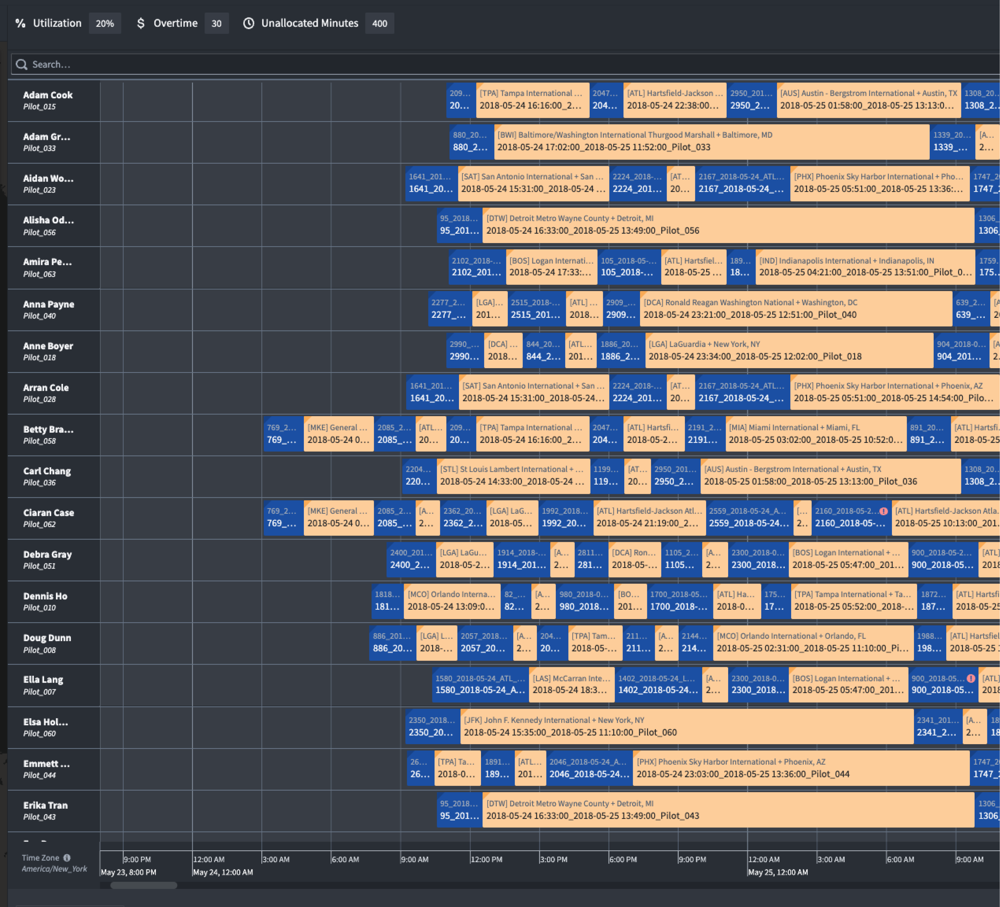

## Widget layout

The image below provides an overview of the widget layout.

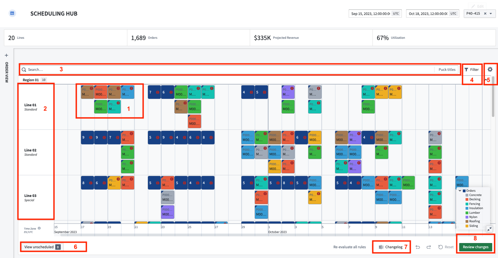

1. **Schedule objects (pucks):** Each schedule object is rendered as a puck on the Scheduling Gantt Chart. Users can drag and drop these pucks to update the object’s start time, end time, and/or linked resource object. Pucks are backed by two additional capabilities:
   * **Schedule object details:** Appear as a card when the cursor hovers over a puck. By default the card will show the start/end time, the status of any rules configured on the schedule object type, and a link to the object view. Builders can also add properties they would like displayed.
   * **Right-click menu:** Triggered when a user right-clicks on a puck. Builders can configure actions, events, and recommendations.
2. **Resource object or rows:** Each resource object is rendered as a row in the Scheduling Gantt Chart.
   * **Resource object details:** Appear as a card when the cursor hovers over a row. Cards display the object title, properties selected by the application builder and a link to the object view.
3. **Search bar:** The Scheduling Gantt Chart widget includes an in-widget search bar. Results will be highlighted with a yellow border as users enter search terms. Pressing the `Enter` key will create a new search group with the results.
4. **Violation rules filter:** The violation rules filter is used to focus on aspects of the schedule that need attention. You can toggle on/off the rules to be evaluated for their schedule and filter down to objects that are violating selected rules.
5. **User preferences (deprecated):** Users can define and save their preferred setup. Customizable options include:
   * **Timezone:** By default, all timestamps in Foundry are in UTC. This feature will handle the timezone offset for user selections.
   * **Collapse pucks:** The widget will automatically consolidate overlapping pucks into a single puck to preserve screen real-estate. This toggle allows users to turn this feature on and off.
   * **Show time now line:** Current time will be represented by a red vertical line.
   * **Expand legend:** Determine if the legend is to be expanded or collapsed by default.
   * **Expand unscheduled:** Determine if the unscheduled drawer is to expanded or collapsed by default.
   * **Expand all nested pucks:** Determine if nested pucks are to be expanded or collapsed by default.
   * **Scroll to pucks on external selection:** If enabled, when users select a schedule object outside of the widget, the timeline will scroll to the location of the selected object.
   * **Persist row widths:** Users are able to resize the width of resource object rows by dragging the row border. The width preference may be saved so that width does not reset to default when the application is reloaded.
   * **Persist row/grouping order:** Users are able to manually reorder resource object rows by dragging and dropping them. The order preference may be saved so that the order does not reset to default when the application is reloaded.
6. **Unscheduled drawer:** Schedule objects are considered unscheduled if they do not have both a start/end time and a linked resource object. If any or all of these properties are null, schedule object pucks will appear in the unscheduled drawer.
7. **Change log:** The change log keeps track of all edits a user has made to their schedule.
8. **Review changes:** This option will be displayed when using scenarios. Selecting it generates a pop-up with a summary of all Ontology edits made in the active scenario and any remaining validation rule violations. Confirm to execute the Ontology edits.

## Widget setup

The Scheduling Gantt Chart widget includes several required and optional configuration settings. This section presents an overview, and the required settings are specifically marked as such.

### Timeline data

* **Start Timestamp \[REQUIRED]:** The beginning of the timeline.
* **End Timestamp \[REQUIRED]:** The end of the timeline.

### Timeline configuration

* **Custom Display Range:** Configure the time period that is displayed in the timeline when users initially open the Workshop module. Users will be able to scroll the full length of the Scheduling Gantt Chart, unless specified elsewhere.
* **Custom Timeline Grid Precision:** Select a unit of time for Gantt chart grid lines that will override default grid lines.
* **Disable timeline zoom and scroll:** Disable users' ability to use the timeline scroll or zoom features.
* **Operating Hours:** Delineate ranges in the chart as "Operating/non-operating". These regions will be shaded in different colors. You can configure daily schedules, custom time ranges, or weekday-based schedules. Optionally, enable **Collapse by default** to collapse non-operating hours when the Gantt chart initially renders.
* **Timeline Date-Time Formatting:** Customize the date and time formatting for the timeline at different zoom levels. You can configure format strings for minute, hour, day, week, month, quarter, and year milestones. If no format is provided, a default will be used.

### Row data

* **Fixed Resource Object Set \[REQUIRED]:** Rendered in the interface as the rows of the Scheduling Gantt Chart widget. Each object within the set will correspond to one row.

### Row configuration

* **Title Icon:** Select an icon that appears alongside the title property of each row.
* **Row Title:** Select a property to override the default row title. You can also toggle whether the row title is displayed when the property value is null.
* **Sub-Titles:** Select one or more properties of the resource object set that will appear underneath the object title. Additionally, select an icon for each sub-title, as demonstrated in the image below.       
* **Group-By Property:** Select a property of a fixed resource object set that divides fixed resources (rows) into subgroups. The defined groups can be opened or closed via a toggle in chart. In the below example, the resources have been divided into the groups "Garden City," "Garza," and "Hoople."    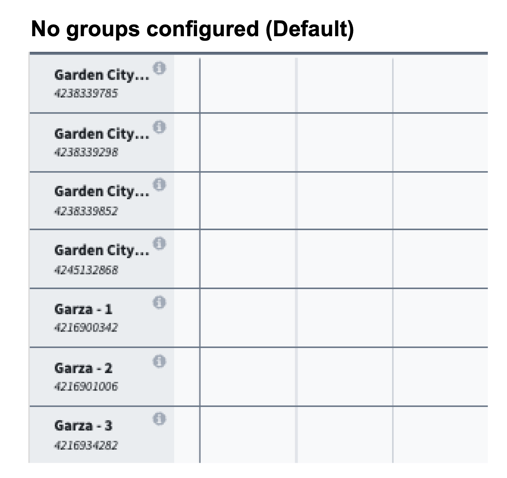    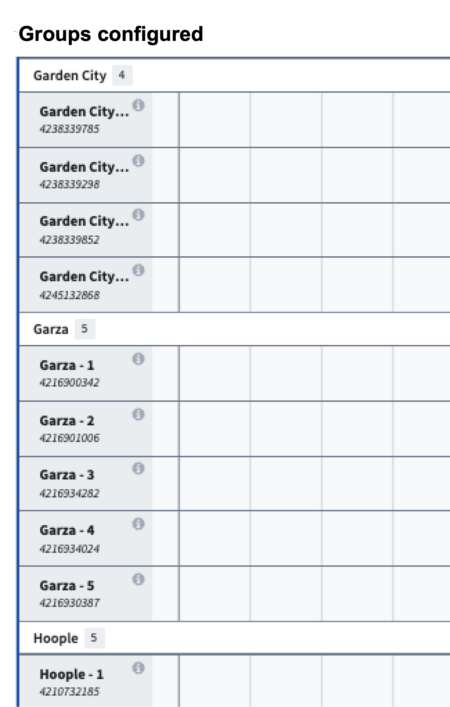   
* **Default Sorts:** Allow one or more default sorts to be applied to the ordering of rows in the chart.
* **Right Click Menu:** See [triggering actions and events on a row](/docs/foundry/dynamic-scheduling/scheduling-row-level-triggering-actions-and-events/) for more information.
  * **Action configuration:** Configure actions related to resource object type. These actions can be standard Ontology create, modify, or delete actions, or a custom [FoO-backed action](/docs/foundry/functions/functions-on-objects/).
  * **Search function:** Configure row-level recommendation function. This function is initiated when the user right-clicks a time in the chart where there is nothing scheduled. The placement of cursor corresponds to a specific time and resource object which can then be used as inputs to the function.
* **On Row Select Event:** Configure Workshop events to trigger when a row is selected in the chart. For example, cause a drawer with a more detailed object view to appear.
* **Popover Actions:** Configure actions to replace the default popover that appears when hovering over a row.

### Input data (pucks)

Each schedule layer is configured independently within the **Input Data (Pucks)** section. A schedule layer represents a set of `Schedule` objects displayed as pucks on the Gantt chart. Each layer has its own sub-sections for data, drag-and-drop behavior, appearance, interactions, and rules.

For each schedule layer, you can select a [puck style](/docs/foundry/dynamic-scheduling/scheduling-schedule-layer-style/) to change the visual representation. See [schedule layer (puck) styling](/docs/foundry/dynamic-scheduling/scheduling-schedule-layer-style/) for more information on puck styles, coloring, and properties.

#### Data

* **Schedule Object Set \[REQUIRED]:** The `Schedule` objects to be rendered in the chart.
* **Linked Resource Property \[REQUIRED]:** The property from the `Schedule` object that links to the `Resource` object.
* **Start Time Property \[REQUIRED]:** The property from the `Schedule` object to use as the start time.
* **End Time Property \[REQUIRED]:** The property from the `Schedule` object to use as the end time.
* **Object set filter for unallocated pucks:** An optional object filter that only applies to unallocated pucks.

#### Drag & drop

The **Drag & Drop** sub-section configures how pucks can be moved within the chart. See the [drag-and-drop documentation](/docs/foundry/dynamic-scheduling/scheduling-drag-and-drop/) for detailed setup instructions.

* **Allocation Behavior:** Determine how the placement of pucks will occur in the Scheduling Gantt Chart. The predefined options include:
  * **Allocate:** Drag-and-drop pucks anywhere in the chart. Multiple pucks can be assigned to the same resource at the same time.    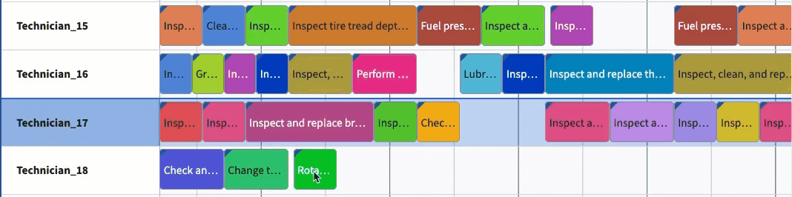   
  * **Allocate (no overlaps):** Similar to **Allocate**, this option ensures that pucks of the same object type do not overlap. When a puck is dropped on top of another puck, the existing puck, along with everything scheduled at a later time period, will automatically shift to prevent overlaps and maintain the sequence.    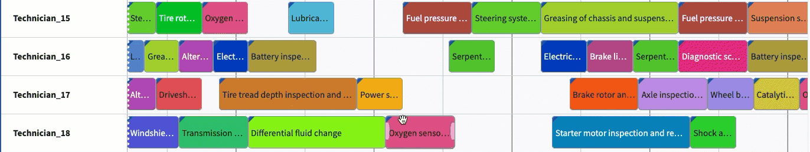   
  * **Allocate (resource only):** This option enables built-in support for when schedule objects can only be moved to different resources.
  * **Allocate (time only):** This option enables built-in support for when schedule objects can only be moved in time.
  * **Simple swap:** Similar to **Allocate (no overlaps)** with the exception that when a puck is dropped on top of another puck, the pucks will switch places with one another.    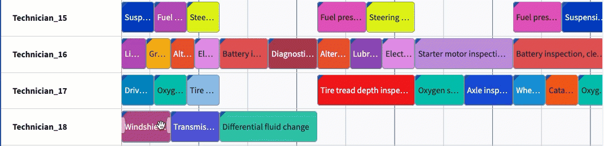   
  * **Swap with downstream:** Similar to **Simple swap**, this option allows the selected pucks to switch places. However, in this case, all subsequent pucks assigned after the swapped pucks will also follow their respective predecessors, effectively shifting the entire sequence downstream.    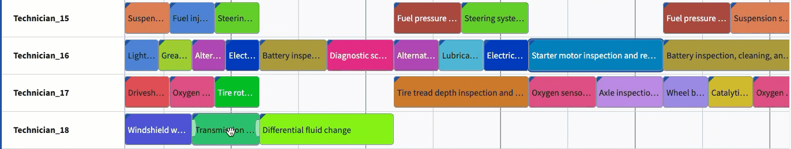   
  * **Snap to previous:** Pucks will automatically snap to the end of the closest existing puck on a given row.       

* **Snap Behavior:** By default, users are able to assign objects to any time on the Scheduling Gantt Chart widget, down to the specific minute. Snap behavior allows builders to set defined intervals of when objects can be assigned. Once a puck is dropped to a new placement in the chart, the puck will snap to the beginning of the closest interval.

  For example, a user configuring a schedule to support doctors' appointments may determine that all assignments (appointments) need to begin on the hour (:00) or half past the hour (:30).

  * The **Snap Interval Size** should be the integer that determines the duration of each interval. In the example below, the interval is set to 8 hours.    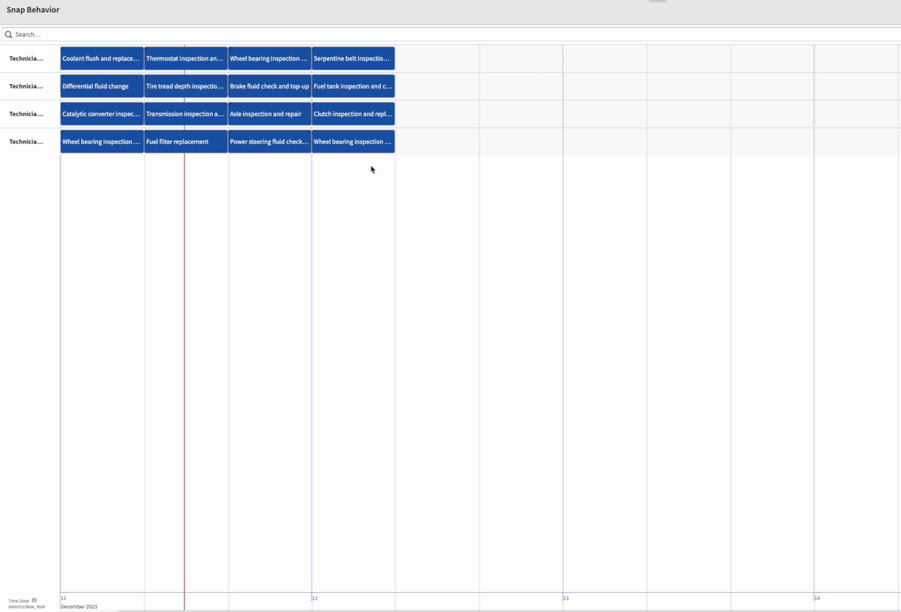   
  * The **Start Timestamp** option refers to the time at which the snap interval begins. By default, snap intervals begin at the start timestamp for the Scheduling Gantt Chart widget. When configured, this variable will override the default start and snap the puck into place at the configured time.

* **Save Handler Action:** The action that is called when a puck is dragged and dropped or resized.
  * A save handler must modify the following parameters on the `Schedule` object. Each parameter must be marked as optional.
    * Resource ID (the foreign key to the resource object)
    * Start time
    * End time
  * When configuring a save handler action, you should supply widget provided parameters as the defaults. Refer to the scheduling [drag-and-drop documentation](/docs/foundry/dynamic-scheduling/scheduling-drag-and-drop/) for more information.

#### Appearance

* **Color Config:** Select the colors that will be used for all pucks in this schedule layer. You can choose from the following color options:
  * **Static:** When this is selected, all pucks will be the same color, chosen with a dropdown color picker. Statically colored pucks look like the image below.    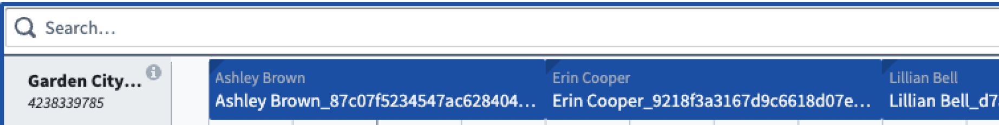   
  * **Segmented by:** The Gantt will rotate through a set of default colors to color pucks on the chart.   
  * **Conditional coloring:** Configure conditional coloring rules that determine puck colors based on property values.
* **Puck Title:** Select a property to override the default puck title.
* **Puck Properties:** Select properties to appear directly on each puck. Properties will appear on the puck in the same order as in the widget configuration.
* **Popover Properties:** Select properties to display when hovering over each puck. Properties will display in the same order as declared in the configuration.
* **Puck Sort Order:** Apply a sort on pucks when they are overlapping within a layer. This does not apply to background pucks.

#### Interactions

* **Custom Suggestions:** Select the suggestion function for your schedule object. The function results will be rendered as highlighted areas on the chart when users pick up a puck. This can be used to indicate where users can or should place pucks. When **Enforce Suggestions** is enabled, users can only drop pucks in highlighted regions (hold Shift to override). See [suggestion functions](/docs/foundry/dynamic-scheduling/scheduling-suggestion-functions/) for more information.
* **Drag Cursor to Create Action:** Enables a drag action across the interface to create a new object for the schedulable object type. The user initiates action by holding Shift and dragging their cursor within the widget. See the [drag to create documentation](/docs/foundry/dynamic-scheduling/scheduling-drag-to-create/) for more information.    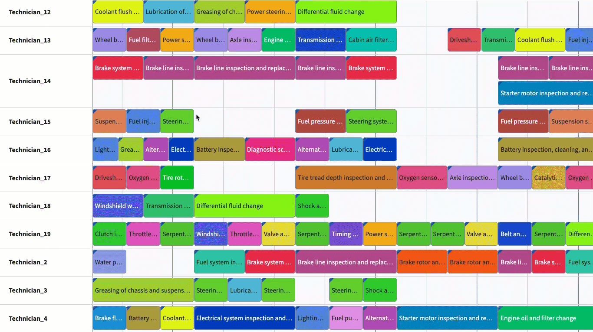   
* **Right Click Menu:**
  * **Action configuration:** Configure actions related to the schedule object type. These may be standard Ontology create, modify, or delete actions, or a custom Function-on-Objects-backed action.
  * **Search function:** Configure puck-level recommendation function. This function is initiated when the user right-clicks a puck. The start/end time of the schedule object and the object itself can then be used as inputs to the function.
  * **Events:** Configure combinations of standard Workshop events that can be triggered within the widget.
* **Popover Actions:** Configure actions that appear in tabs on the puck popover, replacing the default popover view.
* **Enable Cross Widget Drops:** Allow users to drag objects from other widgets into this schedule layer. When enabled, configure a drop action that determines how the dropped object is processed.
* **On Puck Select Event:** Configure Workshop events to trigger when a puck is selected in the chart.

#### Rules

Optional validation rules to apply to the schedule layer. See [validation rules](/docs/foundry/dynamic-scheduling/scheduling-validation-rules/) for more information.

:::callout{theme="note"}
Background and Event puck styles do not support Rules.
:::

### Layout

The **Layout** section is organized into four sub-sections that control the visual presentation of the widget.

#### Timeline

* **Timeline Location:** Places the timeline at either the top or bottom of the chart.
* **Display Cursor Time Flag:** When toggled on, a vertical line with a flag will be rendered on the timeline corresponding to the placement of the cursor. You can configure the time display format for the flag.    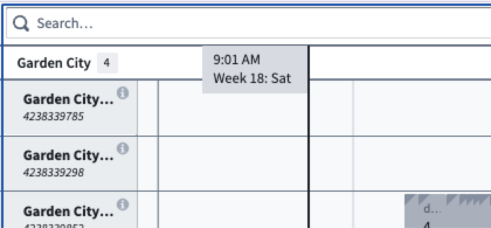   
* **Timezone:** Configure the timezone used for displaying times throughout the widget. This can be set to a static value or backed by a Workshop variable to allow dynamic timezone selection.
* **Expand Legend:** Determine if the legend is expanded or collapsed by default.

#### Top bar

* **Hide Header:** Hides the header, including the search bar, validation rule filters, and user preferences.
* **Custom Header Date/Time Formatting:** Configure a custom date and time format string for the header date range display.

#### Bottom bar

* **Hide Footer:** Hides the footer, including the unscheduled drawer, change log, and review option.
* **Hide Unscheduled:** When toggled on, the unscheduled toggle button will be hidden.
* **Expand Unscheduled:** When toggled on, the unscheduled pucks drawer will be expanded by default.
* **Standard Unallocated Puck Size:** By default, the size of the puck is proportional to time duration, as in the image below.    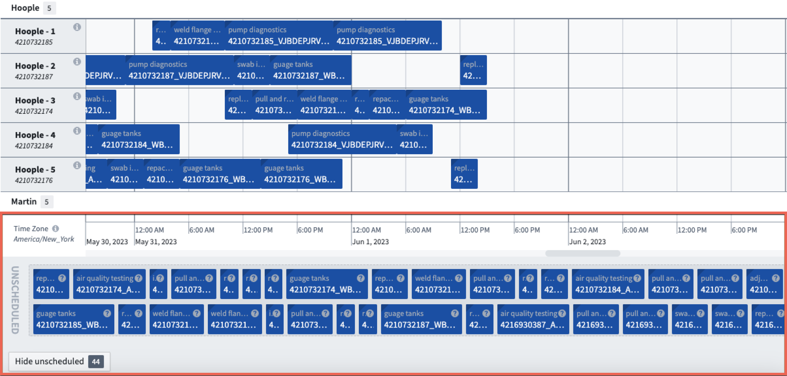   
  When the **Standard Unallocated Puck Size** is toggled on, the puck size is standardized in the unallocated area, as in the image below.    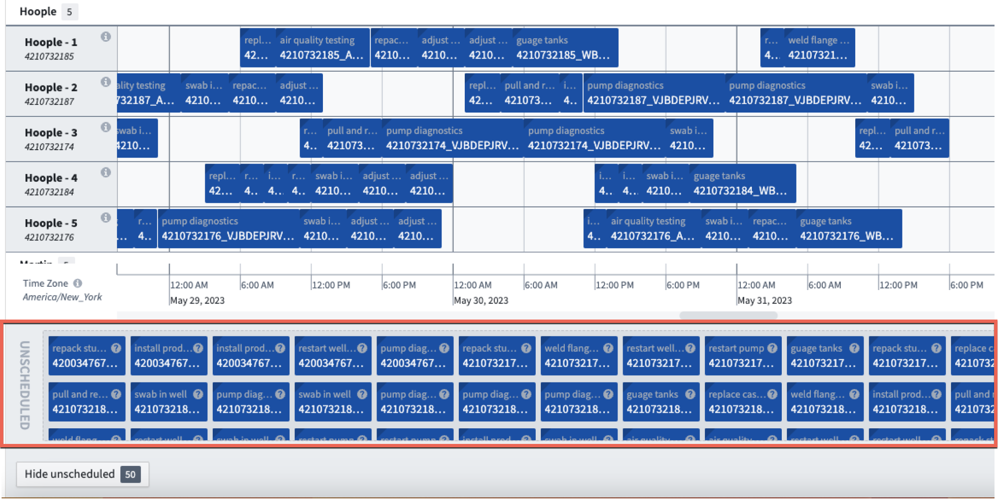   

#### Puck display

* **Split Rows by Schedule Layer:** Each schedule layer contains a sub-row on a given fixed resource. The order of schedule layers and labels are determined in the **Input Data (Pucks)** setting and will appear when hovering over the object. This setting is toggled off by default and is only applicable when the application is configured with multiple schedule layers.    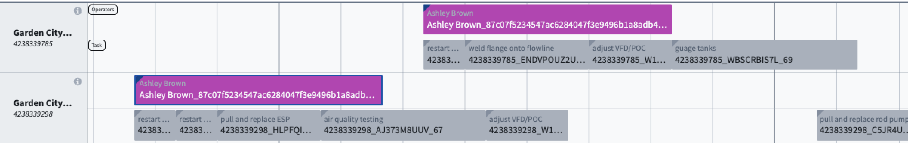   
* **Expand All Nested Pucks:** When enabled, pucks with nested children will be expanded by default.
* **Collapse overlapping pucks:** The widget will consolidate overlapping pucks into a single puck to preserve screen real estate.
* **Disable Popovers:** When toggled on, popovers are disabled.

### Metrics

The **Metrics** section allows you to supply custom functions to add metrics to the Gantt chart. You can configure two types of metrics:

* **Header Metrics:** Metrics that are aligned to the time axis of the chart.
* **Row Metrics:** Metrics that are aligned to each row within the chart.

See [inline metrics](/docs/foundry/dynamic-scheduling/scheduling-inline-metrics/) for more information.

### Output

The Scheduling Gantt Chart widget generates output variables that can be used by other Workshop widgets to enhance your application. These output variables include:

* **Selected Objects:** An object set of objects selected in the widget.
* **Search Results Output:** An object set of the objects returned by the most recent search/recommendation. This output will only populate if the function returns objects.
* **User Preferences (deprecated):** A serialized string that can be used with the module interface or state saving to persist saved user preferences.

### Scenarios

Configure [Ontology scenarios](/docs/foundry/ontology/overview-ontology-scenario/) for the Scheduling Gantt Chart widget.

* **Enable Scenarios:** When toggled on, allows the specification of a scenario variable that can be used in all other scenario-aware workflows. Actions made in the widget will first be written to the scenario. When toggled off, actions made in the widget will be written directly to the Ontology.
* **Disable Scenario:** A boolean variable that controls whether scenarios are disabled. When set to true, actions are written directly to the Ontology.
