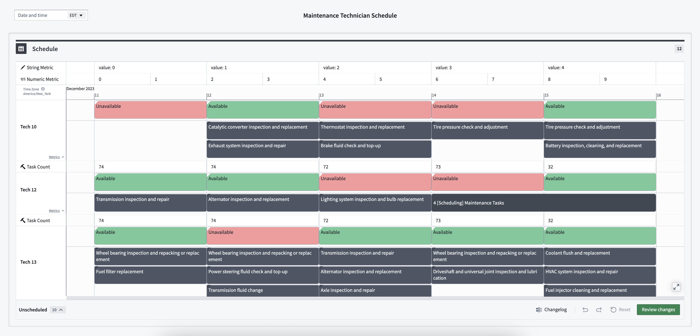
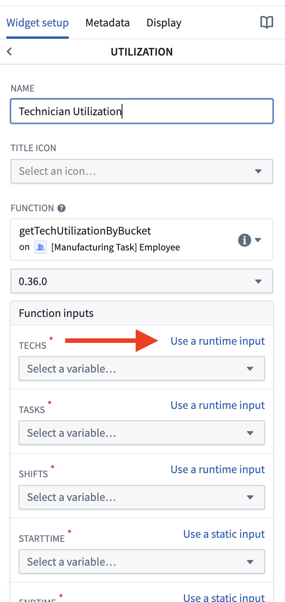
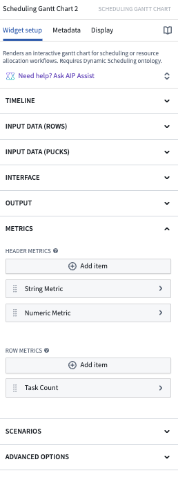
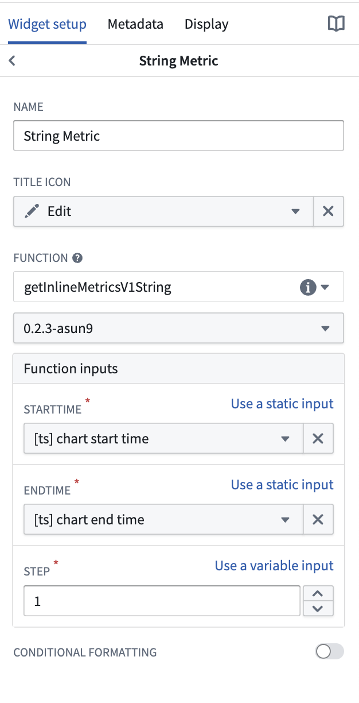

<!-- source: https://palantir.com/docs/foundry/dynamic-scheduling/scheduling-inline-metrics/ · mirrored 2026-08-14 from Palantir Foundry docs -->

# Inline metrics

Inline metrics provide application builders with a streamlined way to display key data directly in a chart.

* Header metrics are aligned with the timeline (x-axis) of the widget, offering high-level aggregations for the entire schedule.
* Row metrics are aligned with each row, providing insights into the scheduling and assignment of individual resource objects.



:::callout{theme="info"}
The code examples on this page are available in both [TypeScript v1](/docs/foundry/functions/typescript-v1-getting-started/) and [TypeScript v2](/docs/foundry/functions/typescript-v2-getting-started/) functions. Select the tab that matches your function version. TypeScript v1 defines each function as a method, annotated with the `@Function()` decorator from `@foundry/functions-api`, on an exported class, and queries the Ontology through `Objects.search()`. TypeScript v2 defines functions with `export default`, imports types from `@osdk/functions`, and queries the Ontology through an [Ontology SDK](/docs/foundry/ontology-sdk/typescript-osdk/) client or an `ObjectSet` passed as a parameter. For a full comparison, review the [TypeScript v1 versus TypeScript v2 comparison](/docs/foundry/functions/language-feature-support/#typescript-v1-vs-typescript-v2).
:::

## Functions signature

Inline metrics require functions that return a list of a [custom type](/docs/foundry/functions/types-reference/) that matches the following shape:

```typescript tab="TypeScript v1"
interface InlineMetricsBucket {
    range: IRange<Timestamp>;
    value: Double
}
```

```typescript tab="TypeScript v2"
import { Double, Range, TimestampISOString } from "@osdk/functions";

interface InlineMetricsBucket {
    range: Range<TimestampISOString>;
    value: Double;
}
```

Inline metrics can support alternative return types as well.

```typescript tab="TypeScript v1"
// NOTE: The name of the interface is not important - only the names of the keys
interface InlineMetricsBucketInteger {
    range: IRange<Timestamp>;
    value: Integer
}

interface InlineMetricsBucketString {
    range: IRange<LocalDate>;
    value: string
}
```

```typescript tab="TypeScript v2"
import { DateISOString, Integer, Range, TimestampISOString } from "@osdk/functions";

// NOTE: The name of the interface is not important - only the names of the keys
interface InlineMetricsBucketInteger {
    range: Range<TimestampISOString>;
    value: Integer;
}

interface InlineMetricsBucketString {
    range: Range<DateISOString>;
    value: string;
}
```

The `range` key can support range types over `Timestamp`, `LocalDate`, or `Integer` (with numerical values representing epoch milliseconds). TypeScript v1 uses the `IRange` type from `@foundry/functions-api`, while TypeScript v2 uses the equivalent `Range` type from `@osdk/functions` with the corresponding `TimestampISOString`, `DateISOString`, or `Integer` inner types.

The `value` key can support `string`, `Integer`, or `Double` values.

## Sample header metric function

```typescript tab="TypeScript v1"
import { Double, Function, IRange, Timestamp } from "@foundry/functions-api";
import { Objects } from "@foundry/ontology-api";

interface InlineMetricBucketV1Double {
    range: IRange<Timestamp>;
    value: Double;
}

export class MyFunctions {
    // Counts the number of tasks within the given range bucketed by a step in days
    @Function()
    public getInlineMetricsV1WithObjectCounts(startTime: Timestamp, endTime: Timestamp, step: Double): Array<InlineMetricBucketV1Double> {
        const tasks = Objects.search().schedulingMaintenanceTask().filter(x =>
            x.startTime.range().gte(startTime).lte(endTime)
        ).all();
        const buckets: InlineMetricBucketV1Double[] = [];

        let current = startTime;
        let count = 0
        while (current < endTime) {
            const currentEnd: Timestamp = current.plusDays(step);
            const tasksInRange = tasks.filter(x => x.startTime! >= current && x.startTime! <= currentEnd);
            buckets.push({
                range: {
                    min: current,
                    max: currentEnd
                },
                value: tasksInRange.length
            })
            current = currentEnd;
            count++;
        }
        return buckets
    }
}
```

```typescript tab="TypeScript v2"
import { Client } from "@osdk/client";
import { Double, Range, TimestampISOString } from "@osdk/functions";
import { SchedulingMaintenanceTask } from "@ontology/sdk";

interface InlineMetricBucketDouble {
    range: Range<TimestampISOString>;
    value: Double;
}

// Counts the number of tasks within the given range bucketed by a step in days
export default async function getInlineMetricsWithObjectCounts(
    client: Client,
    startTime: TimestampISOString,
    endTime: TimestampISOString,
    step: Double
): Promise<Array<InlineMetricBucketDouble>> {
    const tasks = await Array.fromAsync(
        client(SchedulingMaintenanceTask)
            .where({ startTime: { $gte: startTime, $lte: endTime } })
            .asyncIter()
    );
    const buckets: InlineMetricBucketDouble[] = [];

    let current = new Date(startTime);
    const end = new Date(endTime);
    while (current < end) {
        const currentEnd = new Date(current);
        currentEnd.setUTCDate(currentEnd.getUTCDate() + step);
        const tasksInRange = tasks.filter(t =>
            t.startTime != null &&
            new Date(t.startTime) >= current &&
            new Date(t.startTime) <= currentEnd
        );
        buckets.push({
            range: {
                min: current.toISOString(),
                max: currentEnd.toISOString(),
            },
            value: tasksInRange.length,
        });
        current = currentEnd;
    }
    return buckets;
}
```

Since header metrics are displayed as a header alongside the x-axis, these functions are not necessarily tied to any specific objects as inputs.

## Sample row metric function

```typescript tab="TypeScript v1"
import { Double, Function, IRange, Timestamp } from "@foundry/functions-api";
import { ObjectSet, SchedulingTechnician_1 } from "@foundry/ontology-api";

interface InlineMetricBucketV1String {
    range: IRange<Timestamp>;
    value: string;
}

export class MyFunctions {
    // Returns the name of the row alongside the number bucket to which it belongs
    @Function()
    public getInlineMetricsV1StringWithObject(techs: ObjectSet<SchedulingTechnician_1>, startTime: Timestamp, endTime: Timestamp, step: Double): Array<InlineMetricBucketV1String> {
        const techName = techs.all()[0].fullName;
        const buckets: Array<InlineMetricBucketV1String> = [];

        let current = startTime;
        let count = 0;
        while (current < endTime) {
            const currentEnd: Timestamp = current.plusDays(step);
            buckets.push({
                range: {
                    min: current,
                    max: currentEnd
                },
                value: `${techName}-${count}`,
            })
            current = currentEnd;
            count++;
        }
        return buckets
    }
}
```

```typescript tab="TypeScript v2"
import { ObjectSet } from "@osdk/client";
import { Double, Range, TimestampISOString } from "@osdk/functions";
import { SchedulingTechnician } from "@ontology/sdk";

interface InlineMetricBucketString {
    range: Range<TimestampISOString>;
    value: string;
}

// Returns the name of the row alongside the number bucket to which it belongs
export default async function getInlineMetricsStringWithObject(
    techs: ObjectSet<SchedulingTechnician>,
    startTime: TimestampISOString,
    endTime: TimestampISOString,
    step: Double
): Promise<Array<InlineMetricBucketString>> {
    const firstPage = await techs.fetchPage({ $pageSize: 1 });
    const techName = firstPage.data[0].fullName;
    const buckets: Array<InlineMetricBucketString> = [];

    let current = new Date(startTime);
    const end = new Date(endTime);
    let count = 0;
    while (current < end) {
        const currentEnd = new Date(current);
        currentEnd.setUTCDate(currentEnd.getUTCDate() + step);
        buckets.push({
            range: {
                min: current.toISOString(),
                max: currentEnd.toISOString(),
            },
            value: `${techName}-${count}`,
        });
        current = currentEnd;
        count++;
    }
    return buckets;
}
```

Row metrics accept the corresponding row object as runtime input. When specifying your function in the configuration, you can specify the object parameter as runtime input and the widget will automatically pass the corresponding row through to the function for you.



## Widget configuration

The Scheduling Gantt Chart widget config has a **Metrics** section which includes options for header-level and row-level metrics.



Within the metric configuration setup, you can provide a display title, select an icon, and/or set up conditional coloring.


