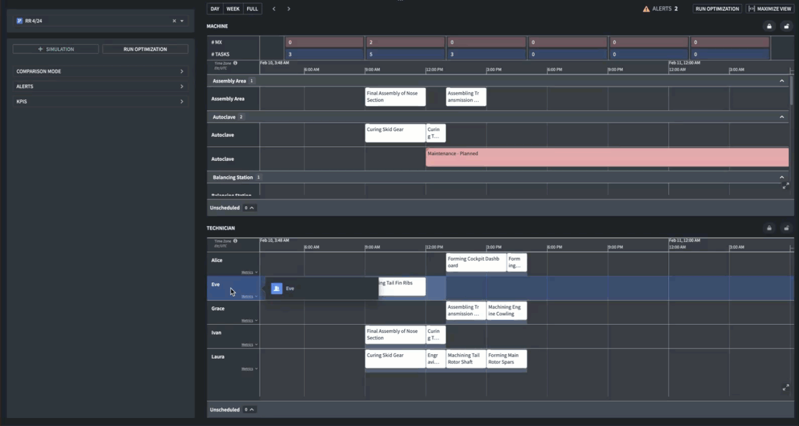

<!-- source: https://palantir.com/docs/foundry/dynamic-scheduling/scheduling-row-level-interactions-overview/ · mirrored 2026-08-14 from Palantir Foundry docs -->

# Row-level interactions

Each row on the Scheduling Gantt chart represents a `Resource` object. Your `Resource` can for example, represent:

* Technicians for task assignment
* Vehicles being scheduled for maintenance
* Crew allocation for trips

You can use row-level interactions to enable users to modify certain properties of your row objects, create objects, or trigger events in your Workshop module.

