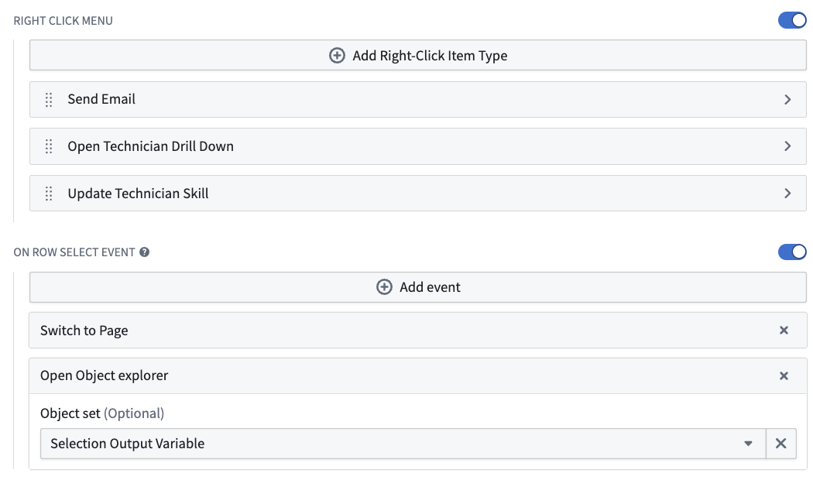
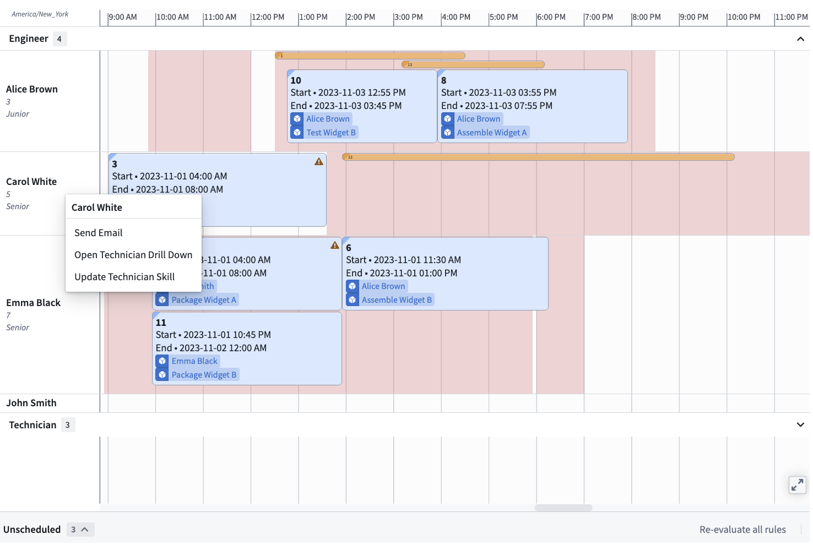

<!-- source: https://palantir.com/docs/foundry/dynamic-scheduling/scheduling-row-level-triggering-actions-and-events/ · mirrored 2026-08-14 from Palantir Foundry docs -->

# Triggering actions and events on a row

Ontology actions enable you to create, modify, and delete objects in the Ontology. Workshop events enable you to trigger pop-ups, toggle sections, switch tabs, update variable values, and more. On each row, you can configure actions and events that can be triggered by the end user.

Actions and events can be triggered by:

* **Row right-click menus**
* **"On row select" events**

## Row right-click menu

A row-level right-click menu can be configured under **Row Configuration > Right Click Menu**. Menu options can be reordered by dragging the menu item. The available right-click menu options are detailed in the following sections:

* [Action types](#action-types)
* [Workshop events](#workshop-events)

### Action types

Common uses:

* Edit a property on the row object;
* Create a new object at the point in time that you right-click in the Gantt chart.

1. Provide a custom name for this menu option.
2. Select any ontology action type to trigger on click. This can be related to the `resource object type` but is not required.
3. Prefill the parameters of your action type with Workshop variables or Scheduling Gantt chart-specific variables:
   * **Resource object:** Auto-fills with the row object you right-click on.
   * **Selected start timestamp:** Auto-fills with the timestamp of the point in the row you right-clicked. Useful when right-clicking in the whitespace of the row.

### Workshop events

Common uses:

* Trigger a popover with more details about the selected row
* Open a different Workshop application or page, with the selected row pre-populated as an input.

1. Provide a custom name for this menu option.
2. Select a Workshop event to trigger on click. Often uses the Gantt chart's selection output variable as a reference to the selected row.

## "On row select" event

The "on row select" event can be configured below the right-click menu in the configuration. When toggled on, these events trigger when the user selects (clicks on) a row header. Events can be any Workshop event.
