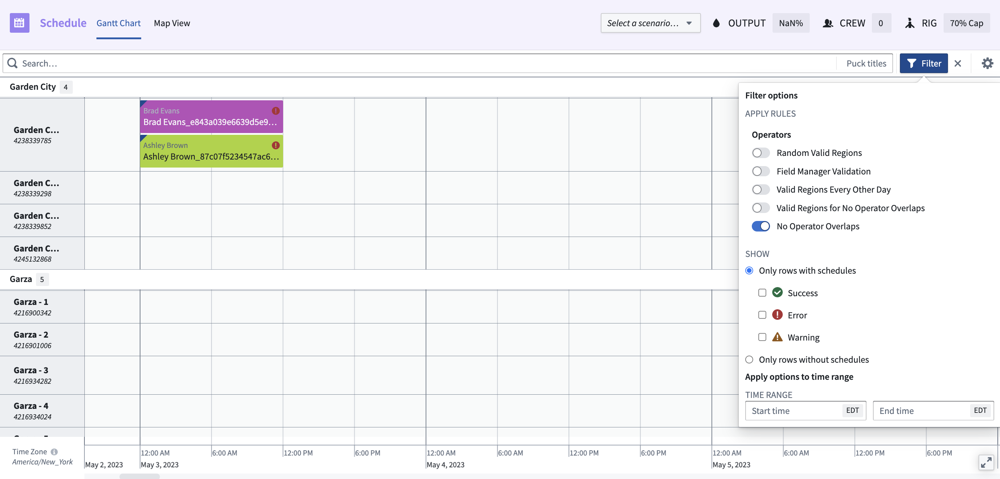
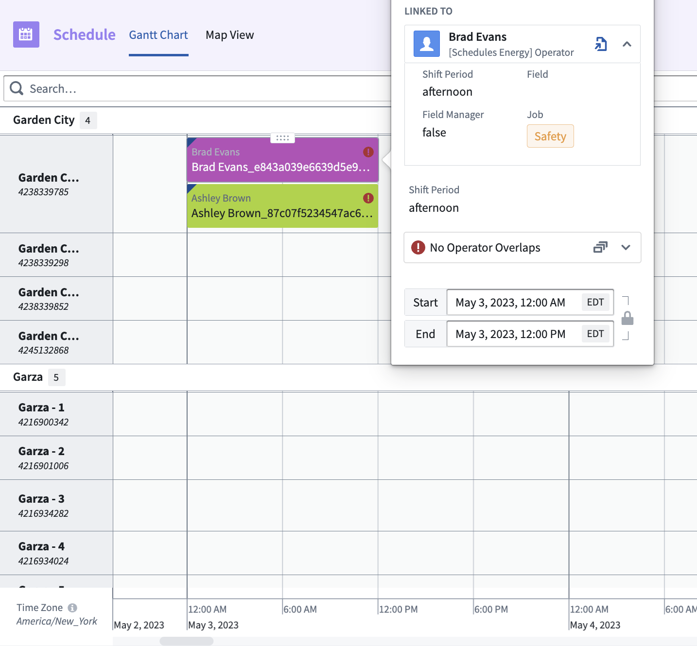
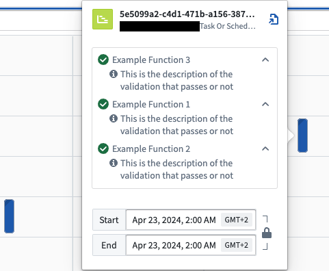
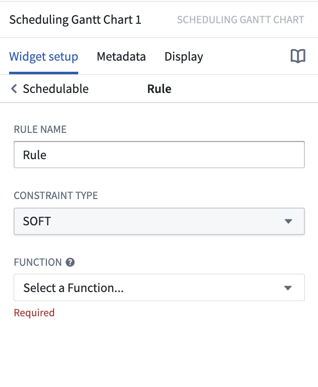

<!-- source: https://palantir.com/docs/foundry/dynamic-scheduling/scheduling-validation-rules/ · mirrored 2026-08-14 from Palantir Foundry docs -->

# Validation rules

Constraints are an inherent part of any scheduling workflow. From simple time restrictions to frequently changing rule matrices, rules can range in complexity. Validation rules allow you to codify these constraints, enabling end users to build and modify schedules with an understanding of the limitations and restrictions that define your organization’s operations.

Each validation rule is backed by a TypeScript function that evaluates whether the current state of a schedule object meets a certain condition as defined in the function logic.

Users are presented with the results of validation rules on the front-end of the Scheduling Gantt Chart widget in Workshop. Upon initial load, all rules are evaluated based on the current state of the Ontology. With each modification to the schedule, the rules are re-evaluated. This process empowers users with the knowledge of how their decisions comply with specific constraints and restrictions.

Below is an example of scheduling constraints within a Scheduling Gantt Chart widget. In the first image, the rule **No Operator Overlaps** is applied, as indicated with the toggle. This option ensures that only results abiding by this rule will be presented. The following image demonstrates the output. In this example, there is a conflict between the two rows, where the operators, Brad Evans and Ashley Brown, are overlapping.





## Orchestration

In the Scheduling Gantt Chart widget in Workshop, the validation rules will be called each time a change is performed to validate the schedules.

```
1. Action "saveHandler" called on scenario
2. Validation rules called on updated scenario
3. Action "saveHandler" called on scenario
4. Validation rules called on updated scenario
etc ...
n. The user selects "Submit changes", and all Actions that have been applied to the scenario are applied to the Ontology
```



## Implement validation rules

Rules are configured directly in the Scheduling Gantt Chart widget, allowing you to apply rules on a per use case basis. To add a rule to your Scheduling Gantt Chart widget:

1. Navigate to the schedule data layer for the relevant object type.
2. Scroll down to the **Rules** section and select **Add new item**.
3. In the **Rule Name** text box, provide a description of the rule that will be shown to end-users in the Scheduling Gantt Chart.
4. Select a **Constraint Type** from the drop down menu. “HARD” will be represented by a red circle with an exclamation point. “SOFT” will be represented by an orange triangle with an exclamation point.
5. Select the **Rule Function** from the drop down menu.
6. Your Function should have a `scheduleObjectPrimaryKeys` input argument. You can leave this argument empty as it will be autofilled by the widget at runtime.



### Functions interface

The types below represent the necessary information to write a validation rule, which includes the status of the rule for each object.

```typescript
type IFoORule = (scheduleObjectPrimaryKeys: string[]) => Array<IRuleResult>

/*
   Rule result is interpreted as follows:
   true - Rule validated as passing
   false - Rule validated as not passing
   undefined - Rule is not relevant to the given schedule object
*/

interface IRuleResult {
    result: boolean | undefined;
    scheduleObjectPrimaryKey: string;
    details?: Array<IRuleResultDetails>;
}

/*
   By default the text on the pop-over card will display the rule name
   as configured in the rule object

   Optionally, you can explicitly define custom text based on the results
   of rule evaluation

   Additionally, you can provide a set of related puckIds to point users
   towards why a rule is passing or failing
*/

interface IRuleResultDetails {
    description: string;
    relatedPuckIds: string[];
}
```

### Example Functions

The following is a basic example of a Function without the core logic of the validation:

```typescript
import { Function, Integer } from "@foundry/functions-api";
import { Objects, TaskOrSchedule, ObjectSet} from "@foundry/ontology-api";

// For type definitions, review our public documentation

interface IRuleResultDetails {
    description: string;
    relatedPuckIds: string[];
}
interface IRuleResult {
    result: boolean | undefined;
    scheduleObjectPrimaryKey: string;
    details?: Array<IRuleResultDetails>;
}
type IFoORule = (scheduleObjectPrimaryKeys: string[]) => Array<IRuleResult>


export class MyFunctions {

    // NOTE: it is important that the input argument to a constraint function is named EXACTLY `scheduleObjectPrimaryKeys`.
    // This is how the widget knows to send over the correct set of keys to this Function.
    @Function()
    public async evaluateIfTaskOrScheduleIsValid(scheduleObjectPrimaryKeys: string[]): Promise<Array<IRuleResult>> {
        // Fetch all schedule Ontology Objects
        const taskOrSchedules = await Objects.search().taskOrSchedule()
            .filter(taskOrSchedule => taskOrSchedule.primaryKey.exactMatch(...scheduleObjectPrimaryKeys))
            .allAsync();

        // Iterate through every input key and generate a result entry for it
        const ruleResults: Array<IRuleResult> = scheduleObjectPrimaryKeys.map(pk => {
            const currentTaskOrSchedule = taskOrSchedules.find(taskOrSchedule => taskOrSchedule.primaryKey === pk);
            // Do something with the object and validate something, ...

            // Build the validation result
            const currentValidationDetails: Array<IRuleResultDetails> = [];
            currentValidationDetails.push(
                {
                    description: "This is the description of the validation that passes or not",
                    relatedPuckIds: []
                });

            const currentResult: IRuleResult= {
                result: true,
                scheduleObjectPrimaryKey: pk,
                details: currentValidationDetails,
            };
            return currentResult;
        });

        return ruleResults;
    }
}

```

More complex validation rules can be created. For example, rules can check the following:

* If schedules are in sequence (no gap)
* If the schedules overlap
* If the person attributed to a schedule has the matching skills or certifications
