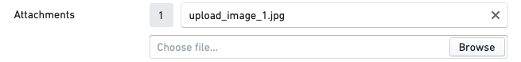
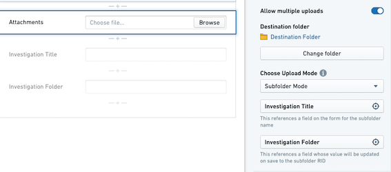

<!-- source: https://palantir.com/docs/foundry/forms/attachments-field/ · mirrored 2026-08-26 from Palantir Foundry docs -->

# Attachments field

:::callout{theme="warning"}
Foundry Forms is no longer the recommended approach for data entry or writeback workflows on Foundry. Instead, build user input workflows with the Foundry Ontology, representing the relevant data structures as object types and configuring the writeback interaction with Actions. Learn more in the [Forms overview](/docs/foundry/forms/overview/) documentation.
:::

The Forms **attachments** field allows respondents to upload attachments with their entries.

The attachments field supports the following configuration options:

* **Allow multiple uploads:** If enabled, this option allows respondents to upload multiple attachments to the field rather than a single attachment.

* **Destination folder:** This option specifies to which folder the attachments should be uploaded. All attachments to this field from all entries will be stored in this folder.

* **Upload mode:** This field has two options:

  * **Default mode:** All attachments will be standalone files in the destination folder.

  * **Subfolder mode:** Upon successful submission of the form, a new folder will automatically be created inside the specified destination folder. All attachments will be standalone files in this subfolder. Configuring this mode requires two additional fields:

    * **Subfolder name:** The value of this field will be used as the name of the subfolder.

    * **Subfolder RID:** The value of this field will be auto-populated with the subfolder RID.

:::callout{theme="neutral"}
When resubmitting an entry, attachments will get uploaded to this destination subfolder. If the subfolder RID is missing during resubmission, a new subfolder will be created. However, the new subfolder name and RID will not be automatically saved to this field.
:::

:::callout{theme="neutral"}
To use subfolder mode, you must create an additional text field within your form. It will be an empty field that will be selected as the subfolder RID above. To avoid respondent confusion, make this field read-only or hidden.
:::

:::callout{theme="neutral"}
`Destination folder` and `Upload mode` cannot be affected by an [update configuration transform](/docs/foundry/forms/transforms/#update-configuration).
:::
