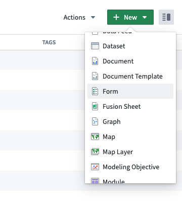
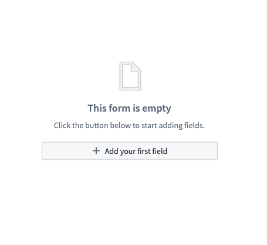
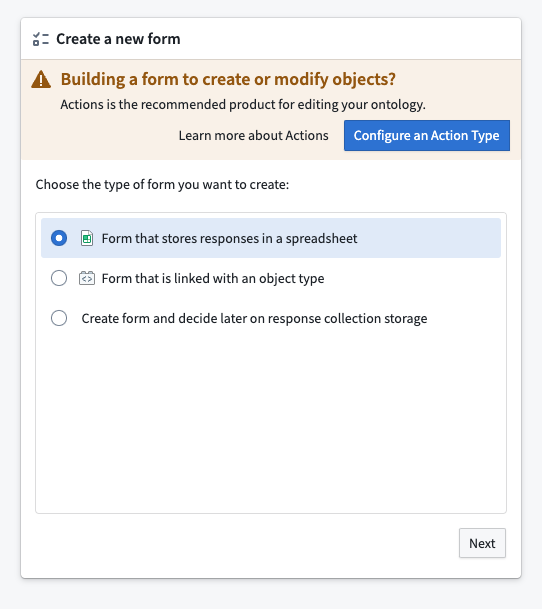
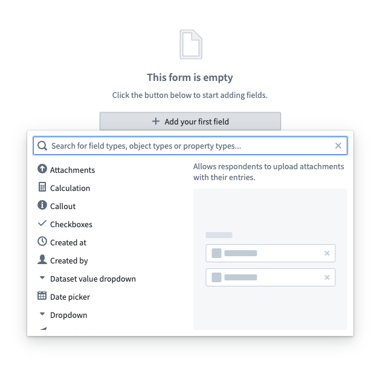
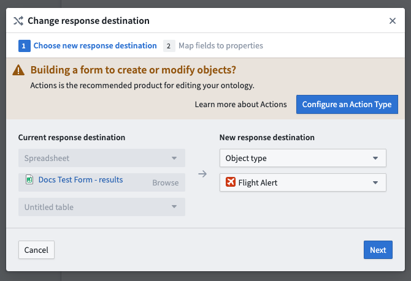
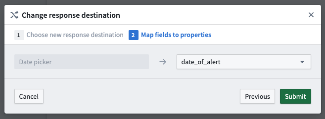

<!-- source: https://palantir.com/docs/foundry/forms/create-a-form/ · mirrored 2026-08-26 from Palantir Foundry docs -->

# Create a form

:::callout{theme="warning"}
Foundry Forms is no longer the recommended approach for data entry or writeback workflows on Foundry. Instead, build user input workflows with the Foundry Ontology, representing the relevant data structures as object types and configuring the writeback interaction with Actions. Learn more in the [Forms overview](/docs/foundry/forms/overview/) documentation.
:::

To create a new form, first open the Forms application from the Foundry navigation sidebar. You will be prompted to create a new form or open an existing one. Alternatively, navigate to a Project in the filesystem view, then select **+ New > Form**.

Once you create a new form, you will be prompted to choose a response destination:

* Fusion spreadsheet
* Ontology object type ([if permissioned](/docs/foundry/forms/permissions/)

You may also create a form now and decide the response destination later.

While both destination options write to datasets, Fusion writes directly to the spreadsheet every time a change is made. Object storage in Foundry requires users to schedule a build of the writeback dataset configured in the Ontology. This decision can be [changed](#change-the-response-destination) later.

## Create and configure a new form

Complete the following steps to create a simple form:

1. First, navigate to the form creation screen.   
      

2. Next, choose the response destination for your new form.   
      

3. Then, select **Add your first field**.

4. Select the desired field type from the available list of options.   
      

5. Now, modify the field as needed using the Visual Editor sidebar to the right of the form.

6. Then, select the **+** above or below an existing field to continue adding more fields.

7. Finally, select the green **Save** button in the top right to save your form.   
      

### Change the response destination

To change the response destination of your form, follow these steps:

1. From the **Response data** tab to the right of your screen, select **Change response destination**.

2. Choose the new response destination for your form.   
      

3. Map any added fields to properties available in the new destination.   
      

4. Select the green **Submit** button to save.

## Sheets and fields

Forms are comprised of [sheets](/docs/foundry/forms/sheets/) and different types of fields:

* [Simple fields](/docs/foundry/forms/simple-fields/) ask for basic input from the respondent.
* [Data-backed fields](/docs/foundry/forms/data-backed-fields/) link a form to data that already exists in Foundry.
* [Auto-populating fields](/docs/foundry/forms/auto-populating-fields/) allow users to capture metadata about the form, such as who created it and when.
* The [Attachments field](/docs/foundry/forms/attachments-field/) is a special type of **simple field** that supplements responses with files.

### Modify sheets and fields

To modify an item:

1. Open the Visual Editor. This can be done by either:
   * Hovering over the item and selecting the gray settings wheel in the top right, or
   * Double-clicking the item (for sheets, double-click the header).
2. Explore and modify the available configuration options, which are grouped under the tabs:
   * Properties
   * [Validators](/docs/foundry/forms/validators/) (for fields only)
   * [Transforms](/docs/foundry/forms/transforms/)
3. Select the green **Save** button at the bottom of the panel.

:::callout{theme="neutral"}
To unlock additional configuration options, use the [Code Editor](/docs/foundry/forms/code-editor/).
:::

### Reorder sheets and fields

To reorder an item:

1. Hover over the item to be reordered.
2. Select either of the arrows in the top left to shift the field up or down one position.

There is also a drag-and-drop handle to the left of the field.

### Remove sheets and fields

To remove an item:

1. Hover over the item to be deleted.
2. Select the red **x** within a circle in the top right.
3. Confirm the deletion by selecting the same icon once more.

A field can also be removed with the Visual Editor:

1. Double-click the field to open the Visual Editor.
2. From the **Properties** tab, select **Delete sheet/field** at the bottom of the panel.

Finally, an item can be drag-and-dropped to the **Drop here to delete** button at the bottom of the form.
