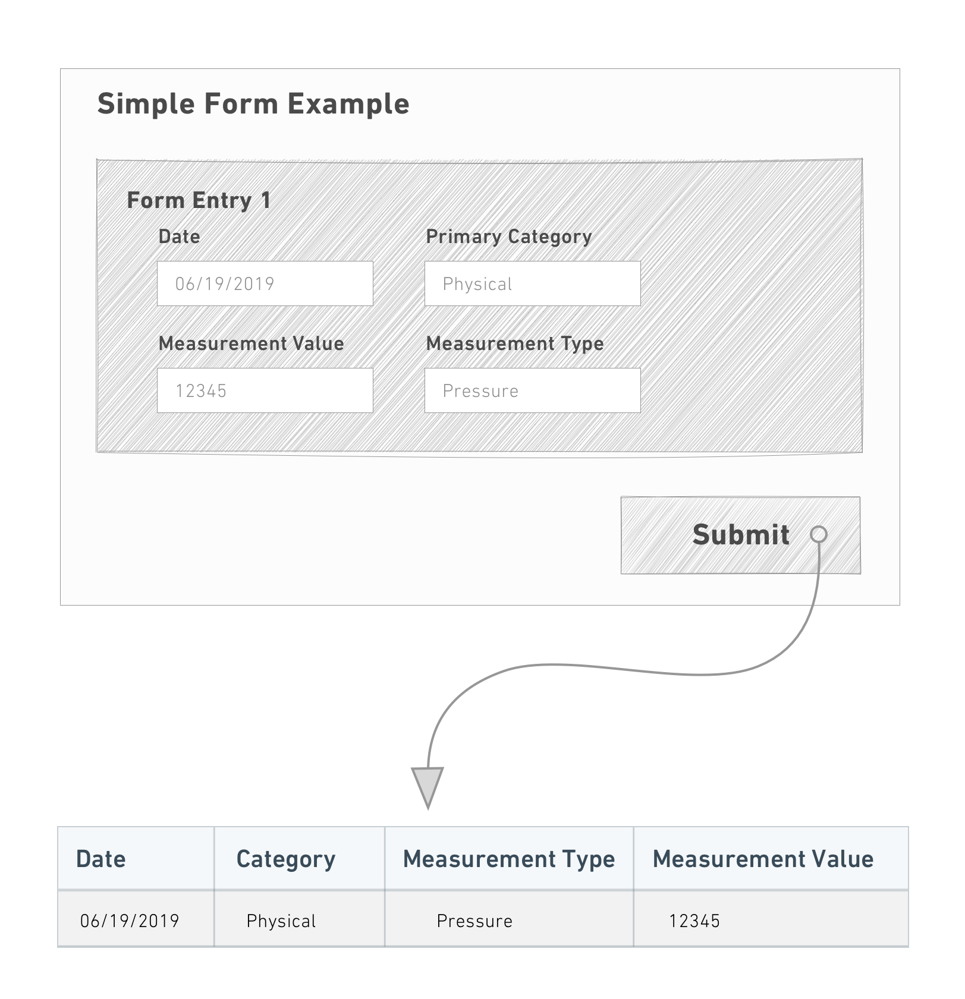
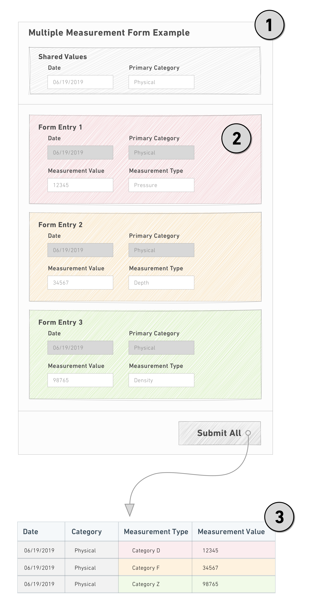
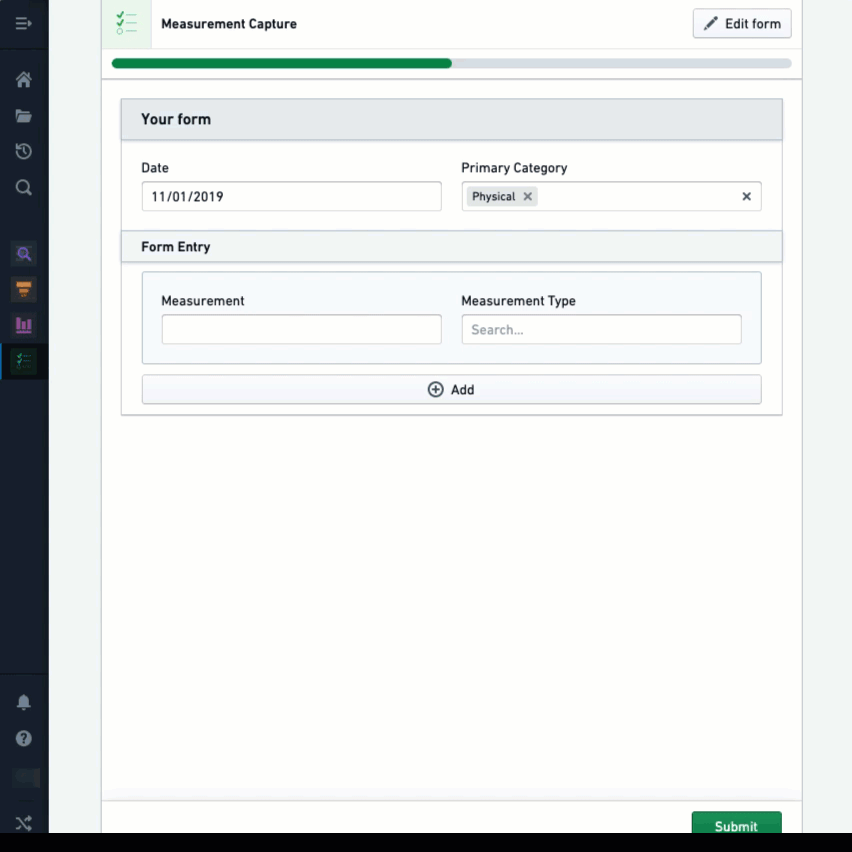
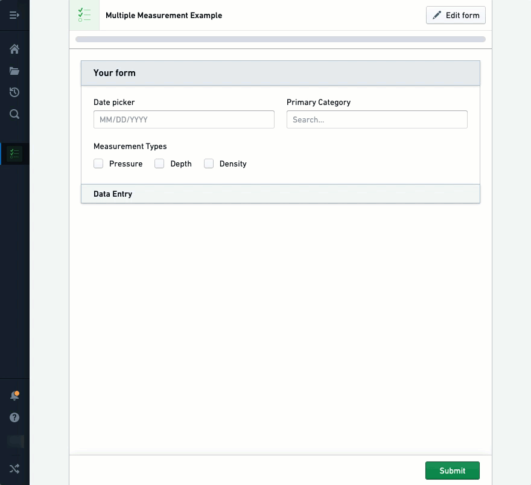

<!-- source: https://palantir.com/docs/foundry/forms/multiplicity/ · mirrored 2026-08-26 from Palantir Foundry docs -->

# Multiplicity

Foundry Forms is designed to make the intake of information from a variety of sources as easy as possible. In most cases, this involves configuring a form where a respondent will fill it out once and create a single new row (or object) based on the values entered. This can be more or less complex, but the basic expectation is that the respondent must interact with a single instance of the form.

This expectation does not work for use cases where the same form must be filled out repeatedly by the same user.

Consider the data collection needs for a scientist who needs to record observations on a long-running experiment.

We can design a simple form to capture the necessary information about each observation:

This behavior becomes tedious and repetitive, however, if there are many observations to record. Time is wasted making the same selections (in this case,`Date` and `Primary Category`) for each instance of the form and submitting responses.

These use cases are best resolved with **Multiple Entries**. Rather than filling out one form at a time, the user specifies which fields are "shared" and which are "unique" for each instance of the form:

Notice the following:

1. The shared fields are factored out and entered once in the header.
2. Each form instance then only displays the fields that are unique.
3. Once all the forms are complete, a single submit creates the rows (or objects) using both the shared and unique values.

Multiple entry forms do not support `Default Value` or `UrlParams` configuration.

## Configure a free multiple entry form

Follow the steps below to create a form that takes multiple entries in a free-form context:

1. Select **+** above or below an existing field to continue adding more shared fields.
2. Select **+** below the last field and select **Insert new sheet**.
3. Double-click the new sheet header to open the Visual Editor.
4. Toggle **Multiplicity config** on (button will display blue).
5. Select **Free multiplicity** from the dropdown and adjust the settings as needed.
6. Select the green **Save** button.
7. Select **+** immediately below the new sheet header to add unique fields.

In the example above, each instance of `Measurement` and `Measurement Type` generates a new entry in the backing spreadsheet because they are in separate sheets. `Date` and `Primary Category`, which exist outside of the sheets, have been captured as a common value for each of the three entries created from this submission.

## Configure a parameterized multiple entry form

In addition to sharing common values across all form instances, parameterized multiple entry forms use a shared field to determine how many form instances to display and set a unique value in each one.

Consider the experiment observations example from above. If measurements need to be collected for `Pressure`, `Depth`, and `Density` every day, we can enforce that these are always the values used for `Measurement Type`.

Unlike free multiple entry forms, parameterized multiple entry forms need additional configuration to connect the shared field with the fields that will capture its unique values:

Follow the steps below to create a form that takes multiple entries in a parameterized context:

1. Select **+** above or below an existing field to continue adding more shared fields.
2. Select  **+** below the last field and select **Insert new sheet**.
3. Select **+** immediately below the new sheet header to add the field (for example, `Text`) that will hold the value.
4. Double-click the new sheet header to open the Visual Editor.
5. Toggle **Multiplicity config** on (button will display blue).
6. Select **Parameterized multiplicity** from the dropdown.
7. In the **Parameterized uri** field, enter the URI of the field in the sheet.
8. Change the next dropdown from **Constant** to **Tag**.
9. Select **No field with current tag()**. Available fields will highlight in purple.
10. Select the shared field that will populate the value.
11. Select the green **Save** button.

:::callout{theme="neutral"}
To make the prefilled values uneditable, open the Visual Editor for the receiving field and toggle on **Make this field read only**.
:::

### Advanced: Configure with objects

To receive one form per instance of an object, you can use the `Objects Provider` field following the steps below:

1. Select **+** above or below an existing field and add an `Objects Provider` field.
2. Select **+** below the last field and select **Insert new sheet**.
3. Select **+** immediately below the new sheet header and add a `Text` field.
4. Double-click the new sheet header to open the Visual Editor.
5. Toggle **Multiplicity config** on (button will display blue).
6. Select **Parameterized multiplicity** from the dropdown.
7. In the **Parameterized uri** field, enter the URI of the `Text` field.
8. Change the next dropdown from **Constant** to **Tag**.
9. Select **No field with current tag()**. Available fields will highlight in purple.
10. Select the `Objects Provider` field.
11. Select the green **Save** button.

:::callout{theme="neutral"}
The `Objects Provider` field could be filtered based on the value of another field.
:::
