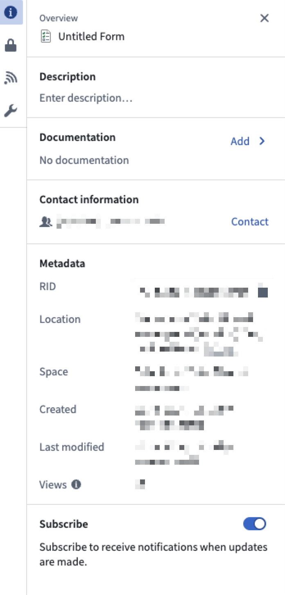

<!-- source: https://palantir.com/docs/foundry/forms/notifications/ · mirrored 2026-08-26 from Palantir Foundry docs -->

# Receive notifications

:::callout{theme="warning"}
Foundry Forms is no longer the recommended approach for data entry or writeback workflows on Foundry. Instead, build user input workflows with the Foundry Ontology, representing the relevant data structures as object types and configuring the writeback interaction with Actions. Learn more in the [Forms overview](/docs/foundry/forms/overview/) documentation.
:::

Once you create a form, you can decide to set up notifications after each submission.

Use the following steps to configure forms notifications:

1. First, navigate to the form in Editor mode.

2. Select the icon in the top right to reveal the **Details** panel.   
      

3. Toggle **Subscribe** to receive notifications when updates are made.

When a form receives responses, any user with the correct [permissions](/docs/foundry/forms/permissions/) can access the resulting data within the platform.
