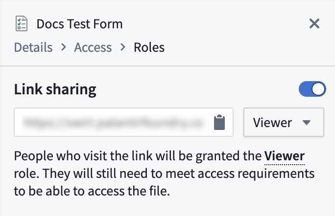
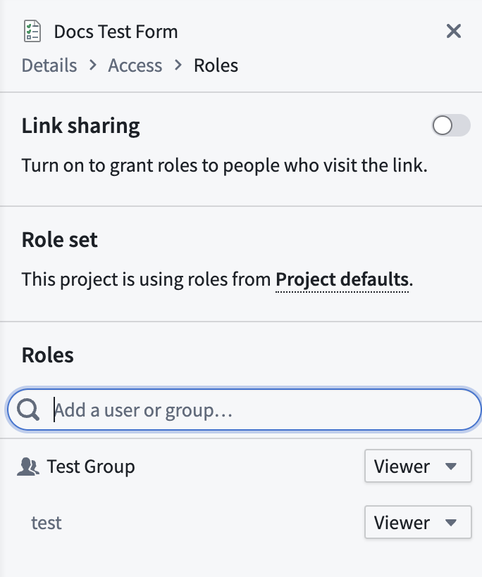

<!-- source: https://palantir.com/docs/foundry/forms/share-form/ · mirrored 2026-08-26 from Palantir Foundry docs -->

# Share a form with other users

:::callout{theme="warning"}
Foundry Forms is no longer the recommended approach for data entry or writeback workflows on Foundry. Instead, build user input workflows with the Foundry Ontology, representing the relevant data structures as object types and configuring the writeback interaction with Actions. Learn more in the [Forms overview](/docs/foundry/forms/overview/) documentation.
:::

Before sharing a form, first determine what level of access is appropriate for another user. There are three different roles available to assign to other Form users:

* **Editor:** Can edit files and modify sharing.
* **Viewer:** Can view the contents of files but cannot edit them or modify sharing.
* **Discoverer:** Can only see file names and metadata.

You can choose to share your form through [link sharing](#link-share) or manually [adding a user or group](#add-a-user-or-group).

:::callout{theme="neutral"}
All respondents must at least be granted the **Viewer** role to view form content.
:::

## Link share

Generate a link that can be shared with copying and pasting. One access role can be specified for all who visit the link. Follow the steps below to set up link sharing:

1. Navigate to the form in Editor mode.

2. Select the **Share** button in the top right to reveal a side panel.

3. Toggle **Link sharing** on.   
      

4. Adjust the access role as needed using the dropdown.

5. Copy and paste the autogenerated link to share the form.

## Add a user or group

Share your form among colleagues in a controlled way. One access role can be specified for each user or group.

1. Navigate to the form in Editor mode.

2. Select the **Share** button in the top right to reveal a side panel.

3. In the **Roles** section, enter the name of the user or group you want to add.   
      

4. Select **+ Add** next to the name.

5. Adjust the access role as needed using the dropdown.

6. Select the blue **Save** button at the bottom of the panel.
