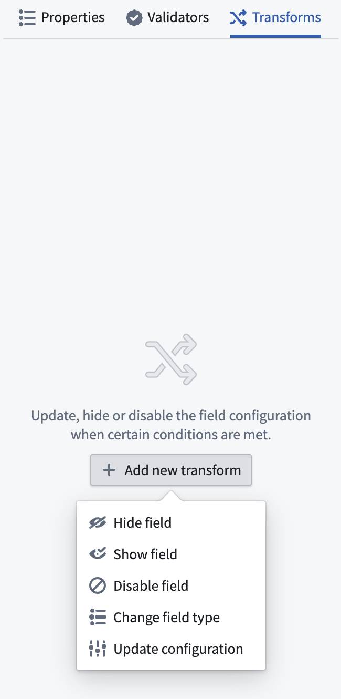
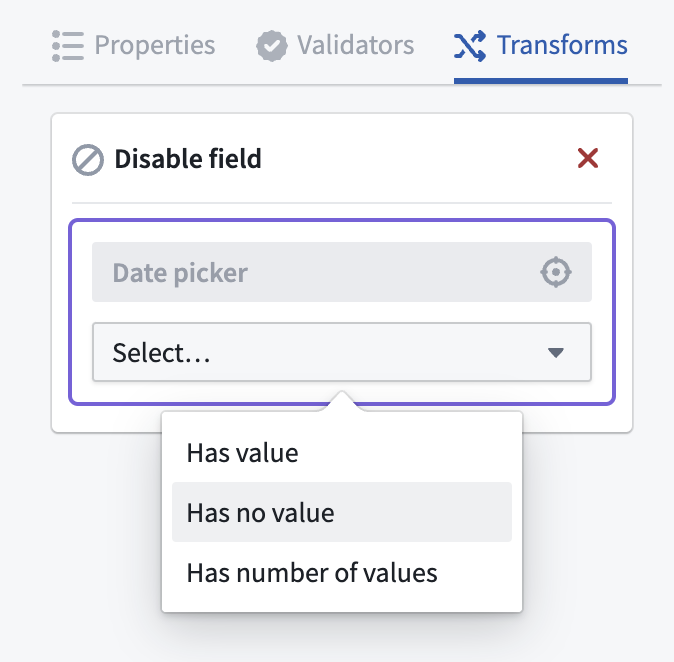

<!-- source: https://palantir.com/docs/foundry/forms/transforms/ · mirrored 2026-08-26 from Palantir Foundry docs -->

# Transforms

:::callout{theme="warning"}
Foundry Forms is no longer the recommended approach for data entry or writeback workflows on Foundry. Instead, build user input workflows with the Foundry Ontology, representing the relevant data structures as object types and configuring the writeback interaction with Actions. Learn more in the [Forms overview](/docs/foundry/forms/overview/) documentation.
:::

Transforms are a set of tools that allow users to create dynamic dependencies within their forms. In specifying conditional modifications to fields, users are able to direct data from respondents more efficiently and accurately.

Transforms can be accessed after creating and configuring a new field. There are five types of transforms, all of which can be combined to create different outcomes for respondents as they fill out the form.

## Hide field

The `hide field` transform allows users to hide a field from respondents based on the values of other fields. By reducing the clutter of inapplicable fields, this transform can help move respondents through the form more quickly.

### Example

`Hide Field B if Field A has value X.`

## Show field

The `show field` transform allows users to show a field to respondents based on the values of other fields. Similar to `hide field`, this transform can help move respondents through the form more quickly, offering only applicable fields.

### Example

`Show Field B if Field A has value X.`

## Disable field

The `disable field` transforms allows users to disable a field based on the values of other fields. Unlike with the `hide field` transform, fields transformed with the `disable field` transform will still be visible; those fields can be configured to display important information to respondents, guiding them to other fields that are either unanswered or answered in such a way that they are now blocked from entering a value.

### Example

`Disable Field B if Field A has value X.`

## Update configuration

The `update configuration` transform allows users to update the configuration of a field based on the values of other fields. Almost all options can be changed, excluding those that must remain constant, including`tag`, `uri`, `defaultValue`, `transforms` themselves, and options available in [Attachments](/docs/foundry/forms/attachments-field/) fields.

### Example

`Add [required validator] to Field B if Field A has value X.`

## Change field type

The `change field type` transform allows users to change the type of a field based on the values of other fields.

### Example

`Change type of Field B to [Text Area] if Field A has value X.`

## Add transforms

To add a transform to a field, complete the following steps:

1. First, double-click a field to open the Visual Editor to the right.

2. From the **Transforms** tab, select **Add new transform**, then select a type.

    

3. Select the field on which the transform will be dependent (available options will be highlighted in purple).

4. Configure the condition; for example, `Has no value`.

    

5. If using an **update configuration** or **change field type** transform, define the outcome.

6. Select the green **Save** button.

## Create complex conditions

After adding a transform with a simple condition, a more complex condition can be created as follows:

1. Select the pencil icon in the top right of the transform configuration in the **Transforms** tab of the Visual Editor.
2. Select **+** below the existing condition of the transform, and choose to configure a new condition.
3. Use the **Is/Not** and **And/Or** dropdowns to create a complex condition tree.

:::callout{theme="neutral"}
Hover over the **Is/Not** dropdowns to understand which conditions are grouped together by **And/Or**.
:::

### Example

`Show Field C if Field A has value X and Field B does not have value Y.`

## Define multiple transforms

Multiple transforms can be added to a single field by clicking the **Add new transforms** button at the bottom of the panel. Transforms are applied in the order they are defined; if there are any conflicts, the last transform takes precedence.

### Example

`Change [Label] of Field B to "Zip Code" if Field A has value X. Add 5-digit [regex validator] to Field B if Field A has value X.`

:::callout{theme="warning"}
A field should not have both a `show` and a `hide` transform. These can be consolidated to a single `show` transform if you want the field to be hidden by default, or a single `hide` transform otherwise.
:::
