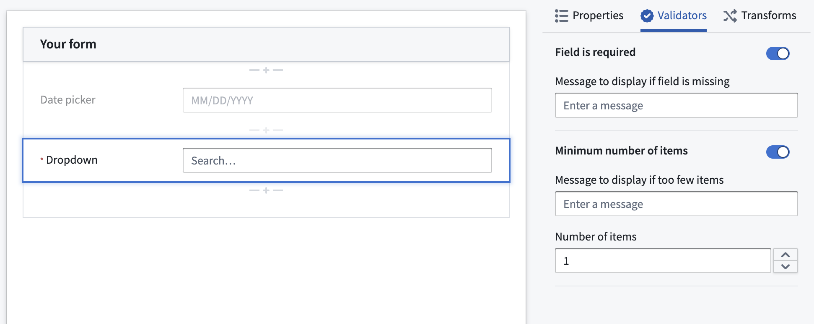

<!-- source: https://palantir.com/docs/foundry/forms/validators/ · mirrored 2026-08-26 from Palantir Foundry docs -->

# Validators

:::callout{theme="warning"}
Foundry Forms is no longer the recommended approach for data entry or writeback workflows on Foundry. Instead, build user input workflows with the Foundry Ontology, representing the relevant data structures as object types and configuring the writeback interaction with Actions. Learn more in the [Forms overview](/docs/foundry/forms/overview/) documentation.
:::

In Foundry Forms, each form field can have one or more validators to guard against malformed input. Some examples of validators are:

* **Regex:** Value must match some [regular expression ↗](https://regexr.com/).
* **Required:** Value must be filled.
* **Range:** Value must be between `min` and `max` values.

:::callout{theme="neutral"}
The respondent will not be able to submit the form until all validator criteria is met.
:::

## Add validators

To add validators to a form field, follow the steps below:

1. First, double-click the field to open the Visual Editor in the right sidebar.
2. Next, from the **Validators** tab, toggle on the desired validators.   
      
3. Configure the validators as necessary.
4. Select the green **Save** button in the bottom right.
