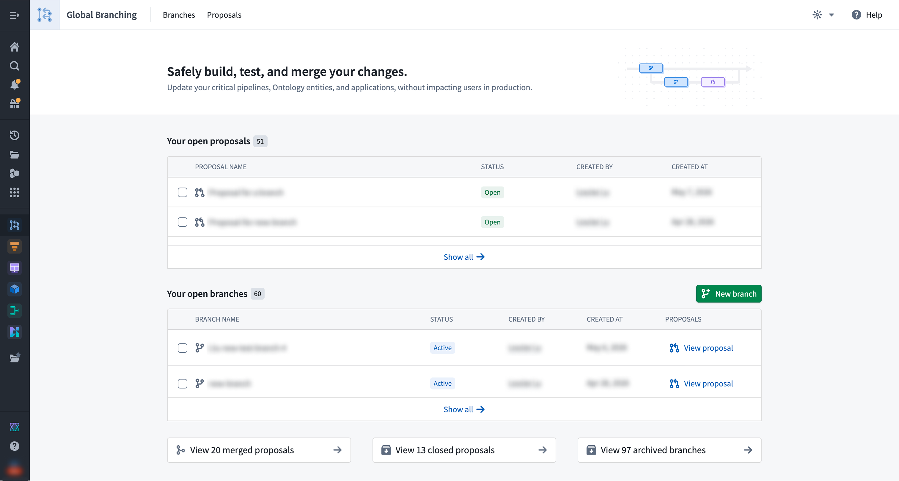
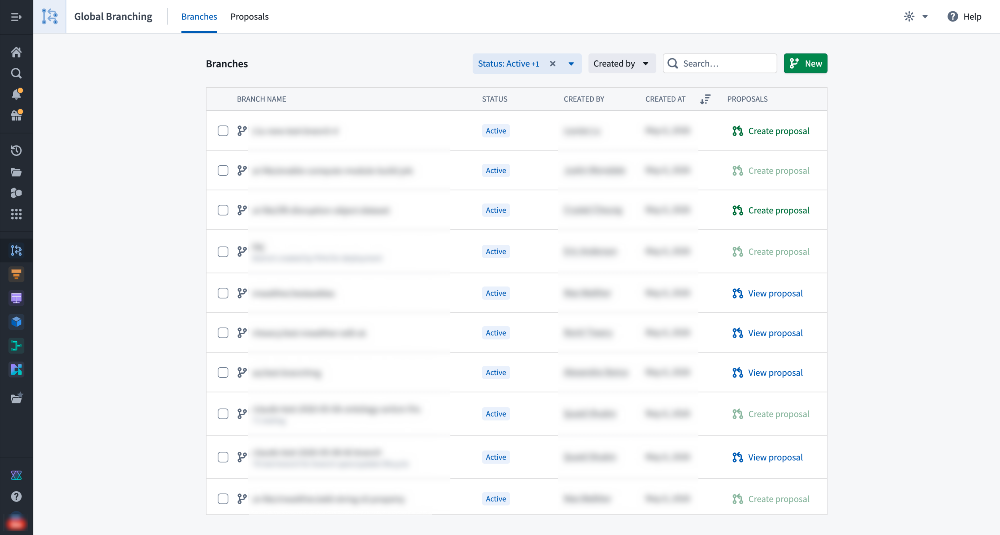
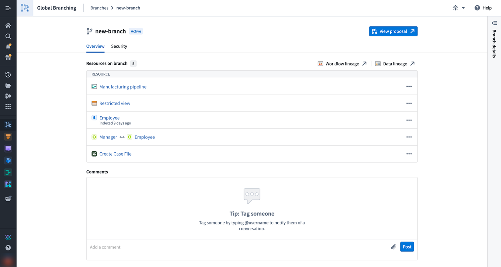
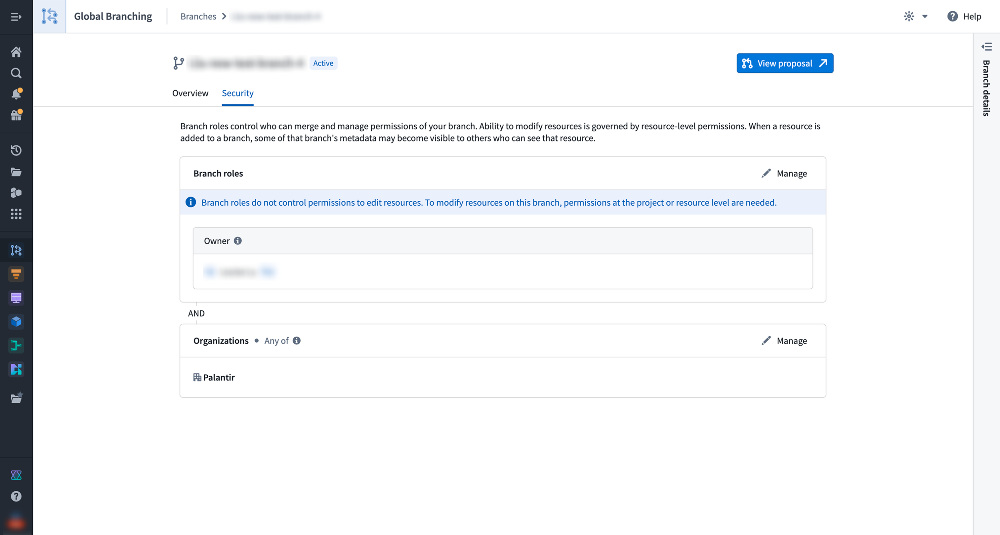
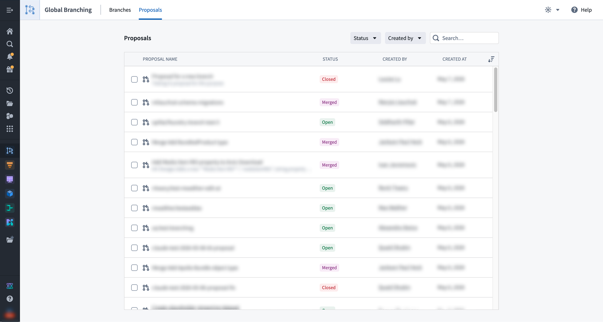
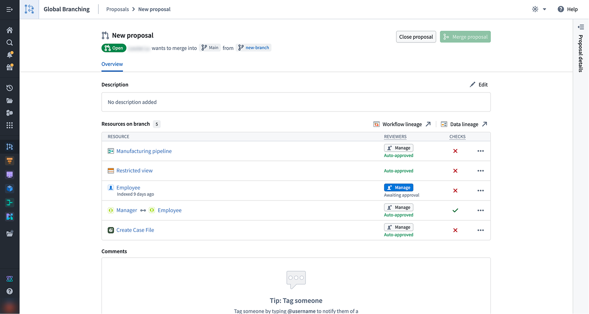
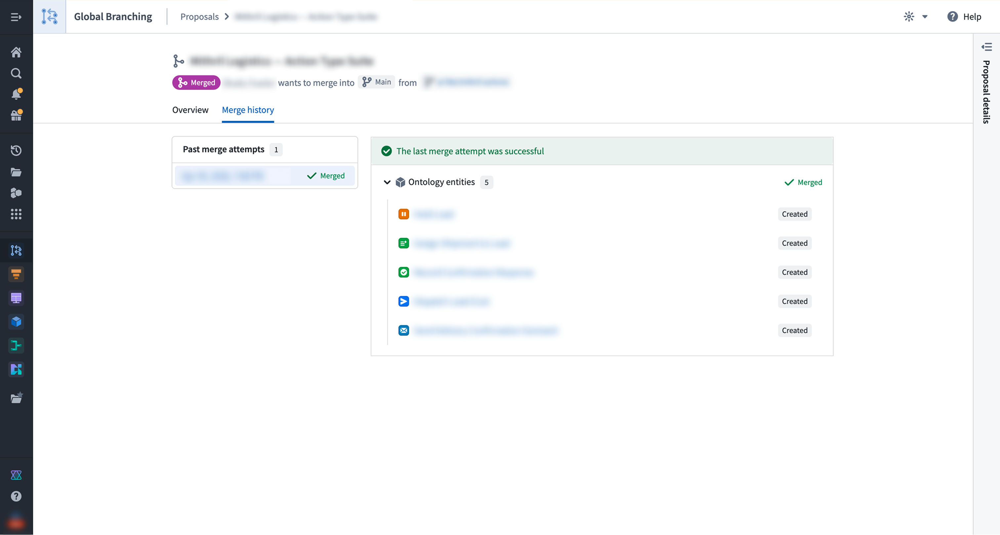

<!-- source: https://palantir.com/docs/foundry/foundry-branching/branching-app/ · mirrored 2026-08-18 from Palantir Foundry docs -->

# Global Branching application

The Global Branching application enables you to maintain your organization's branches. You can use the Global Branching application as a centralized hub for your branches and proposals, allowing you to create new branches, view branches and proposals, and approve and merge proposals.

## Homepage

The homepage provides you with an overview of your proposals and branches.

Under the **Your open proposals** section, you can view and access your active proposals. Proposals serve as a mechanism for reviewing and approving changes made in a branch.

Under the **Your open branches** section, you can view and access your open branches. Branches are a separate environment where you can experiment and test ideas without affecting `main`. From this section, you can create a proposal, archive an existing branch, or create a new global branch. Note that archiving a branch with an open proposal will also close that proposal.

:::callout{theme="neutral"}
Open branches include both active and inactive branches.
:::

At the bottom of the page, you have access to shortcuts that navigate to your merged proposals, closed proposals, or archived branches. Selecting one brings you to the relevant tab.

## Branches

The **Branches** tab lets you view all branches that you have access to, and lists their name, status, creator, and creation date. You may also navigate to a proposal associated with a branch, or create a proposal for a branch directly from this list.

You can take the following actions:

* **New:** Create a new branch.
* **Archive:** Archive an open branch. This will close any open proposals.
* **Filter:** Filter branches by **Status** and **Creator**, and use the search bar to find branches by their names.

To navigate to a specific branch page with more detailed information, select its corresponding row.

### Branch page

The branch **Overview** tab offers consolidated information about a branch and allows you to create a proposal or navigate to the associated existing proposal. Details include:

* The branch's name and current status.
* The resources that have undergone modifications.
* High-level information about the branch, including the last time the branch was updated, branch creation date, branch creator, selected space, organizations, and ontology.
* A comments section.

The branch **Security** tab allows branch owners and space administrators to manage role assignments. Refer to [branch security](/docs/foundry/global-branching/branch-security/) for more information.

## Proposals

The **Proposals** tab lets you view proposals that you have permission to access and lists their name, status, creator, and creation date.

You can take the following actions:

* **Filter:** Filter proposals by **Status** and **Creator**, and use the search bar to find proposals by their names.
* **Close:** Close a proposal by selecting the checkbox located to the left of the proposal.

To navigate to a specific proposal page with more detailed information, select its corresponding row.

Selecting a proposal will provide detailed information about that proposal.

### Proposal page

The proposal **Overview** tab consolidates information about your proposal and allows you to track its status throughout the entire development process, from editing and testing to reviewing and merging. The central section of the **Overview** tab is a list of resources modified on the corresponding branch. For each resource in the list:

* Manage reviewers according to the resource's approval policies. Refer to [adding reviewers to proposals](/docs/foundry/global-branching/core-concepts/#adding-reviewers) and [resource protection and approval policies](/docs/foundry/global-branching/resource-protection-and-approval-policies/) for more information.
* Navigate to the resource's review experience.
* View check statuses and resolve any failing checks. Review [checks](/docs/foundry/global-branching/core-concepts/#checks) for a better understanding of this feature.
* View the more options menu (`...`) for additional actions such as removing the resource from the branch.

You can also open your modified resources in Workflow Lineage and Data Lineage.

The **Merge history** tab centralizes information about the proposal merge attempts and displays any errors encountered while merging a specific resource. This tab will only appear after the first merge attempt.

