<!-- source: https://palantir.com/docs/foundry/foundry-branching/branching-lifecycle-usage/ · mirrored 2026-08-18 from Palantir Foundry docs -->

# Core concepts

## Branching

Software developers typically use version control systems to coordinate work in a codebase. This enables multiple engineers to contribute to the same code safely.

In the Palantir platform, you can think about data and change management the way software developers think about code: you need a way to allow many people to make changes and interact with the same data without interfering with someone else's work. Global Branching takes the best practices from software development and applies them to the Palantir platform, harnessing a common feature of version control systems called **branching**.

At a high level, **branching** allows you to fork your existing environment and work on components of your end-to-end workflow in a contained branch. When you are satisfied with your changes, you can merge the changes introduced by your branch back into the `main` branch.

## Branching workflow

Global branches can be created within Foundry applications or directly in the Global Branching application. The diagram below shows how you can use a branching workflow to make changes to resources in the Palantir platform.

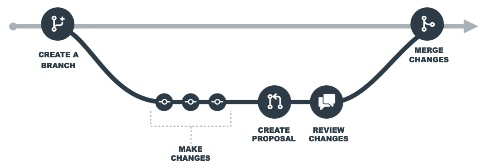

### Create or access a branch

You can create a branch from the branch selector in a Foundry application or through the Global Branching application.

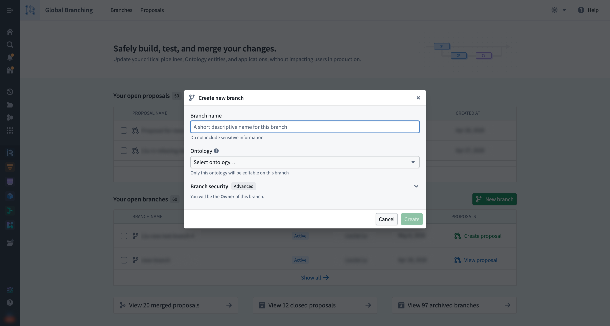

Refer to the [Branch security](/docs/foundry/global-branching/branch-security/#creating-a-branch) documentation for more information on how ontology, organization, and space are relevant to branch creation.

To access an existing global branch, select it in the branch selector in any supported application. You can also find and navigate to an existing branch from the **Branches** tab in the Global Branching application.

When working on a global branch in a supported application, the [branch taskbar](/docs/foundry/global-branching/branch-taskbar/) will be visible.

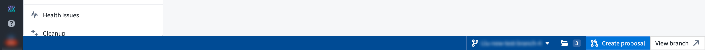

### Make changes on a branch

#### Editing resources

Within your branch, you can make changes to Foundry resources without affecting the `main` branch. However, creating or deleting Foundry resources on a branch will affect `main`. This does not apply to ontology resources: you can create, modify, or delete entities on the branch without affecting the `main` branch.

To start making changes to a resource, some applications require you to add the resource to your branch upfront; others add it automatically after you save your first changes. When upfront addition is required, you will be prompted when you select the branch.

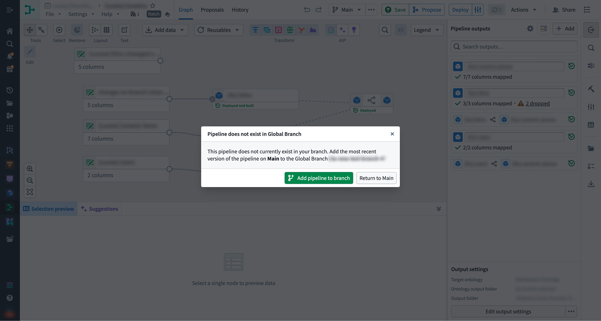

#### Updates from the `main` branch

While you are making changes to a resource on your branch, the same resource may be updated on the `main` branch. To pick up those updates, [rebase](#rebasing-and-conflict-resolution) your branch — that is, merge the changes from `main` into your branch and reapply your previously saved branch changes on top.

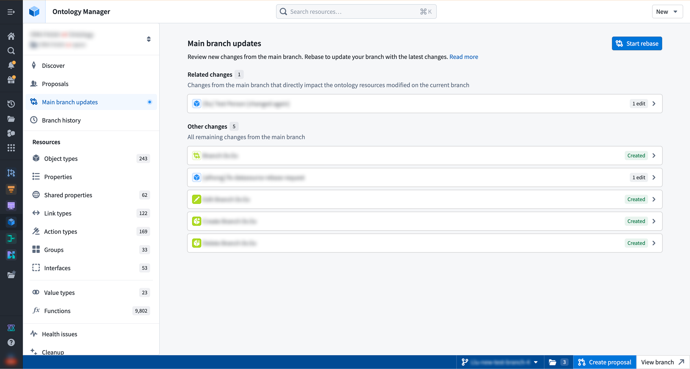

#### Removing changes from your branch

Removing a resource from a branch returns its state to the version of the resource on the `main` branch. You can remove resources from a branch directly from the Global Branching application or from the branch taskbar.

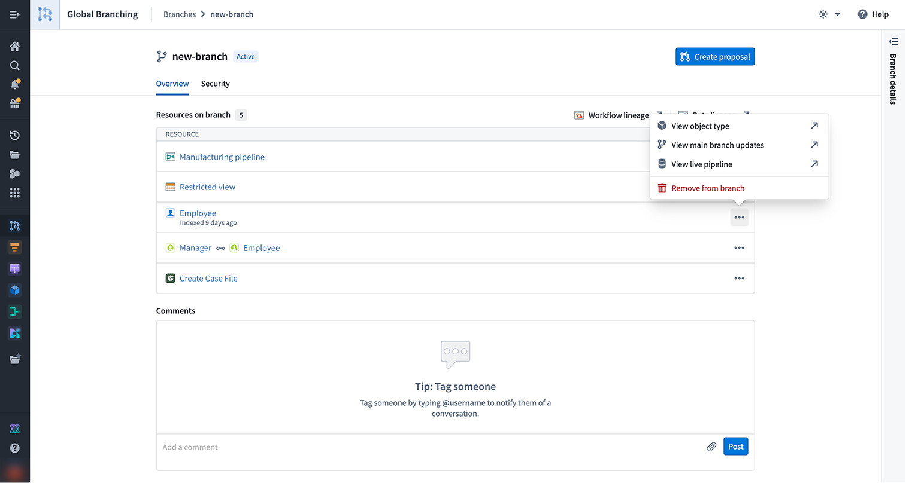

:::callout{theme="warning"}
It is possible to break your branch state by removing a resource, so it is important to check the lineage of your resource and ensure that no other branched resources rely on your changes.
:::

### Create and prepare a proposal

When you are satisfied with the state of your branch, create a proposal to start reviewing and ultimately merging your changes into the `main` branch. To get started, either select **Create proposal** from the Global Branching application or the same option from the branch taskbar. Creating a proposal requires the branch `Owner` role or space `Administrator` privileges. Refer to the [branch security](/docs/foundry/global-branching/branch-security/#roles) documentation for more information on branch roles and permissions. A proposal has a description field that allows you to provide information required to review the changes and supports markdown text.

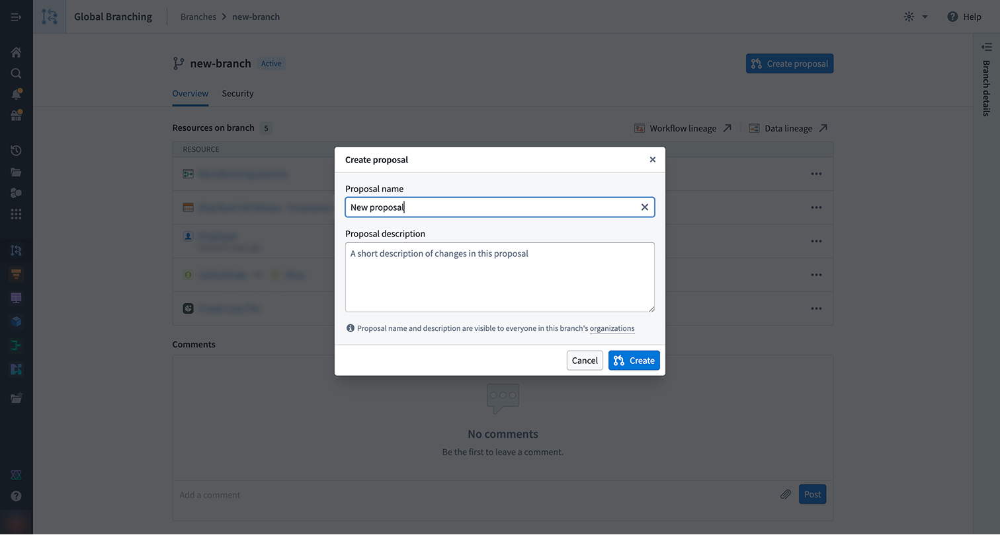

From the proposal page or the branch taskbar, you can use checks to view the readiness of your resources to merge, as well as assign reviewers.

#### Checks

When a proposal is created, checks will run on each resource to determine if the proposal can be merged.

Checks surface any issues that may prevent a resource from merging, including conflicts between the `main` branch and your current branch as well as required approvals. All checks for branched resources must pass in order to merge a proposal.

#### Rebasing and conflict resolution

In order for a branch to be in a mergeable state, all of its resources need to be mergeable with the latest version of the `main` branch. When a resource is out-of-date with `main` or cannot be merged cleanly, the rebasing check fails. You will be redirected to the appropriate application to rebase your branched resource. If there are conflicts between your branched resource and the resource on `main`, you will have to resolve those conflicts in order for the rebasing check to pass.

To view documentation on how different applications implement rebasing, refer to the [integrations](/docs/foundry/global-branching/integrations/) page.

Global Branching auto-resolves any non-conflicting changes during a rebase. For true conflicts — where the same property of the same resource was edited on both `main` and your branch — there is no automatic resolution; you must pick one version manually before the rebase can proceed.

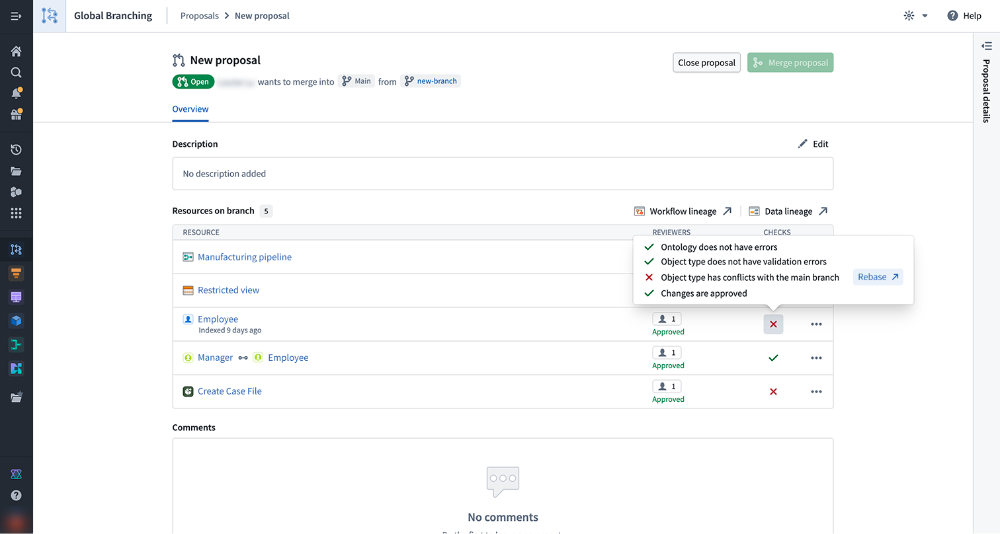

#### Adding reviewers

To merge your branch, all approval policies must be satisfied. Non-protected resources still require approval from a user with edit-level permissions, which may be granted automatically when the contributor satisfies the policy. Protected resources require a review from the required reviewers defined in the [resource protection and approval policies](/docs/foundry/global-branching/resource-protection-and-approval-policies/).

For each resource marked **Awaiting approval**, select **Manage** to assign the required reviewers and view the associated approval policies. Once a reviewer is assigned, they will receive a notification.

For Code Repositories and Pipeline Builder pipelines, the approval policy is defined within the resource.

### Review a proposal

Assigned reviewers can access the resource's review page by selecting **Review** from either the branch taskbar or the Global Branching application.

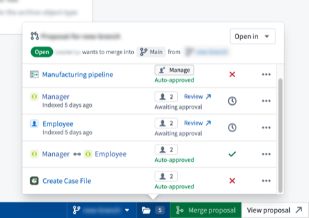

:::callout{theme="warning" title="Rejecting changes to resources on a proposal"}
A single rejection from any user during the review process will cause the resource's changes to be `Rejected`. This will
prevent the entire proposal from merging. The rejecting user will be required to re-review the changes and `Approve` them before
the proposal can be merged.
:::

### Merge a proposal

Once changes have been approved and all checks have passed, the proposal can be merged into the `main` branch by selecting **Merge proposal** in the branch taskbar or from the Global Branching application. Merge permissions are explained in the [branch security documentation](/docs/foundry/global-branching/branch-security/).

When merging a proposal, you can trigger builds for the affected resources, including those not directly changed on the branch. There are three build options:

* **Build all affected resources:** All resources affected by changes on your branch will be built, so that data in upstream changes flow as required downstream.
* **Build modified resources only:** Only resources directly changed on this branch will be built. You may need to build resources manually if they depend on upstream changes to this branch.
* **Do not build resources:** No resources will be built. You will be required to manually build resources after the proposal has merged.

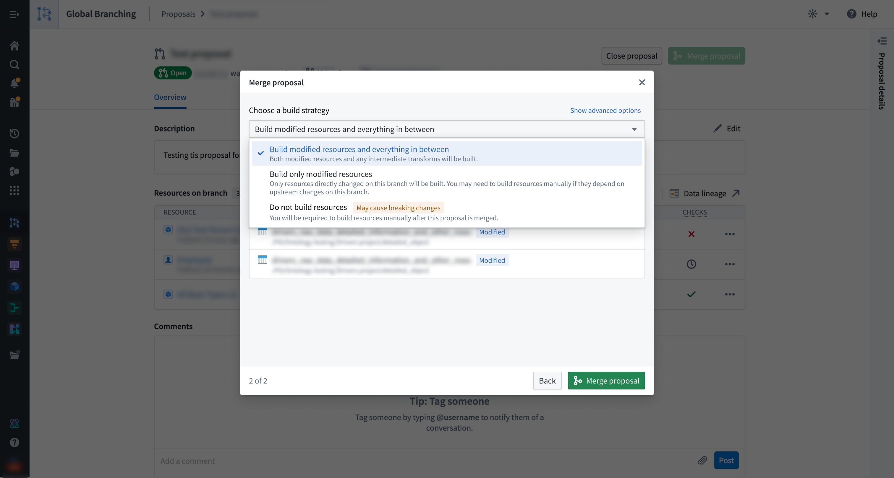

In case of a partial merge failure, the proposal page will show which resources successfully merged and which failed to merge and remain on the branch. You cannot currently revert a partially-failed merge. You must resolve any errors shown and try to merge your proposal again.

## Branch and proposal lifecycle

### Branch lifecycle

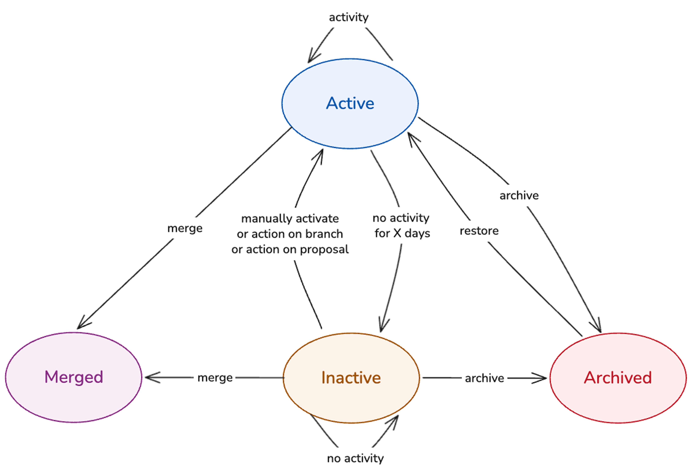

When a branch is created, its status is set to **Active**. From there, the branch can move into one of the following states: **Inactive**, **Archived**, or **Merged**. The four available branch states are defined as follows:

* **Active:** A branch that is being worked on or going through the merge process. Data built or indexed on an active branch is retained while it stays active.

* **Inactive:** A branch that is automatically marked as inactive after a configurable period of no activity. In this state, ontology resources are de-indexed, and data deletion follows after a specified number of days. Builds of resources on an inactive branch will immediately fail. When a branch is marked as inactive, branch owners will receive both an email notification and an in-platform notification.
  * The period after which a branch is marked as inactive and data deletion is triggered is defined in **Control Panel**, under **Control Panel > Spaces > Actions > Global branch retention policy**. By default, branch inactivity is set to 35 days, and branch data deletion is triggered after 7 days.
    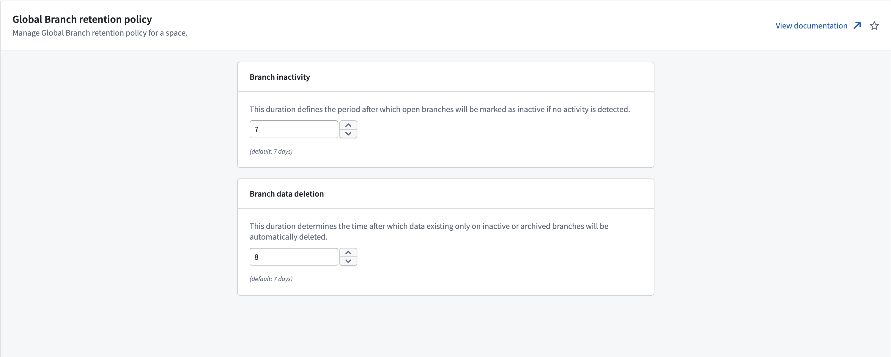
  * To move an inactive branch back to an active state, you can manually remove the Inactive label on the branch.
  * A dialog warns you that the branch is inactive when you open a resource on it. Select **Activate branch** to activate the branch. If you instead close the dialog, you can continue interacting with the resource, although this is not recommended.
    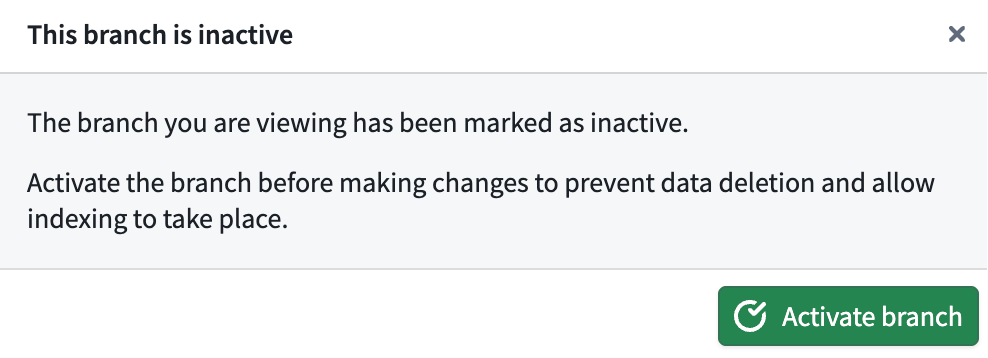

* **Archived:** A branch that is no longer being worked on; archiving is always manual. Branch owners will receive both an email notification and an in-platform notification. De-indexing, build failure, and data deletion on archived branches work in the same way as on inactive branches. Metadata, such as resources previously modified, is retained, and archived branches can be restored. Archived branches do not appear in the branch selector, but can be opened and restored in the Global Branching application.
  * A dialog warns you that the branch is archived when you open a resource on it. Select **Restore branch** to restore the branch. If you instead close the dialog, you can continue interacting with the resource, although this is not recommended.
    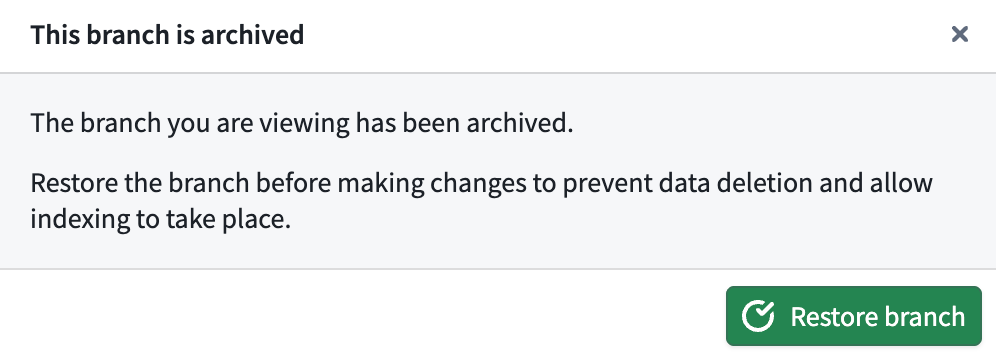

* **Merged:** A branch whose proposal has been merged. Merged branches are terminal: they cannot be restored, do not appear in the branch selector, and are only accessible from the Global Branching application.

#### Working with previously inactive or archived branches

When a branch has been inactive or archived, de-indexing of ontology entities or deletion of logic and data may have occurred for resources on the branch. If the branch is later activated or restored, you may need to perform the following actions to replace deleted or de-indexed data:

* **Ontology entities:** To trigger re-indexing of ontology entities, make a no-op change such as a minor update to the description of the ontology resource or reindex via the banner in Ontology Manager.
* **Code repositories:** If job specs have been deleted, make a no-op change such as editing a comment in the relevant transforms of your repository, then commit. Running a build from within the code repository will then re-put logic to the relevant datasets and build them. Running this first build from other applications such as Data Lineage will not put the job specs.
* **Pipeline builder:** Deploy and build from pipeline builder to re-put job specs and data on your branch.
* **Build schedules:** Builds on archived or inactive branches will automatically fail. If a schedule builds resources on the branch, it may be paused due to repeated build failure. You can resume the schedule manually from the Build Schedules application or Data Lineage.

#### Known limitations

* After repeated build failures, schedules on inactive or archived branches will automatically pause. If you reactivate your branch, manually un-pause the schedule on the branch if necessary.
* During local development, for example when using git directly to interact with branched resources from your local machine, you will not be prevented from working on an inactive or archived branch. Materialized data and/or job specs based on any changes you make may be deleted.

#### AI FDE

* [AI FDE](/docs/foundry/ai-fde/overview/) does not allow modifying inactive or archived branches; it prompts you to reactivate or restore the branch to continue.

### Proposal lifecycle

A proposal can be in one of three states:

* **Open:** A proposal that is in progress or approved.
* **Merged:** A proposal that has been merged into the `main` branch.
* **Closed:** A proposal that has been closed and was not merged.
