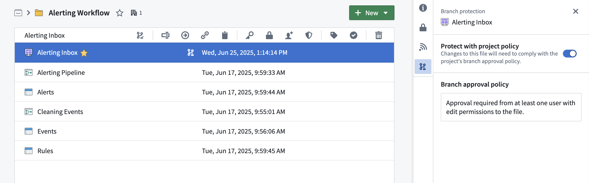
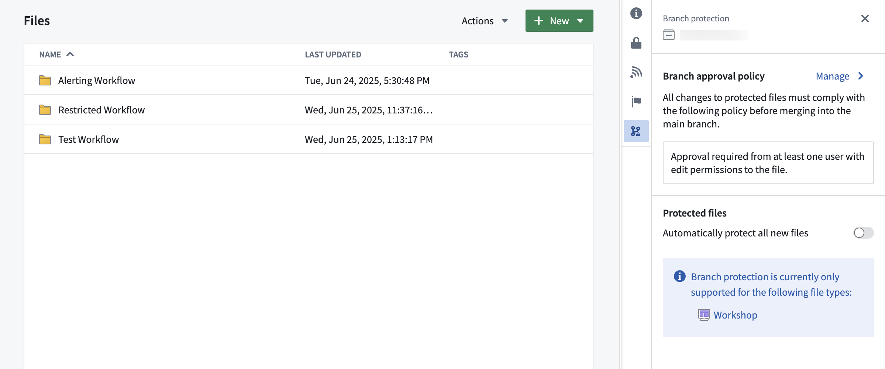
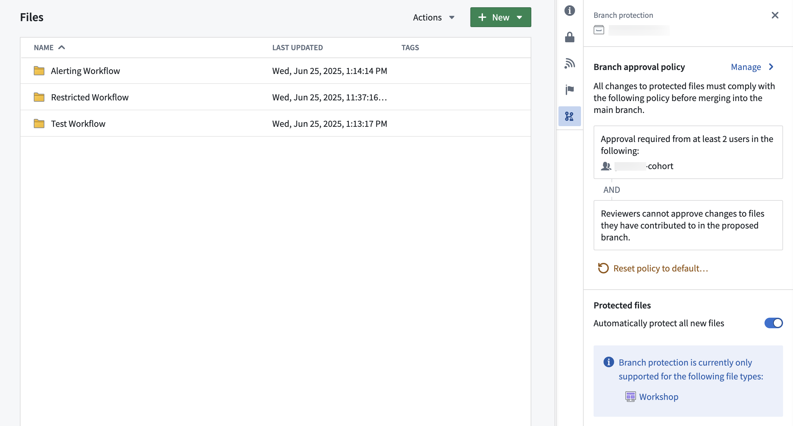
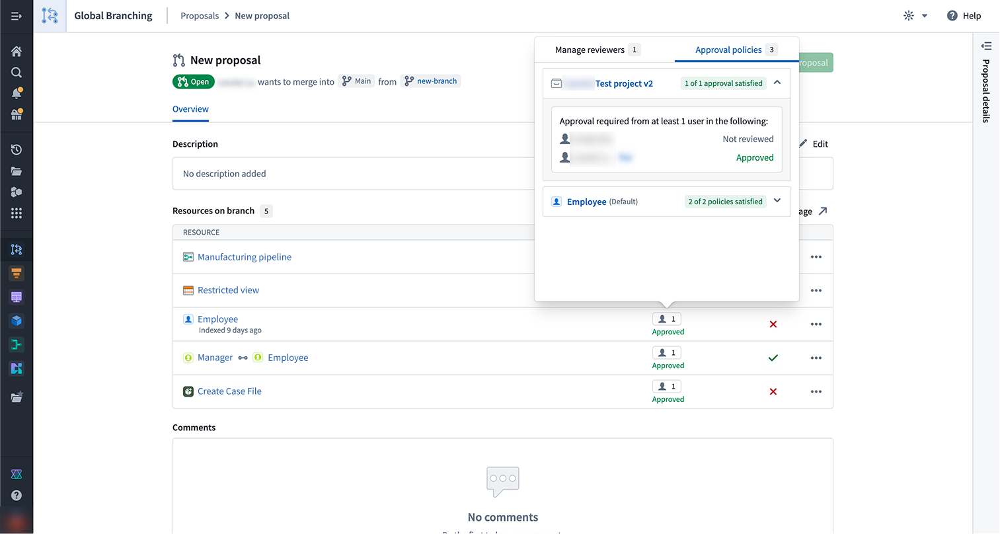
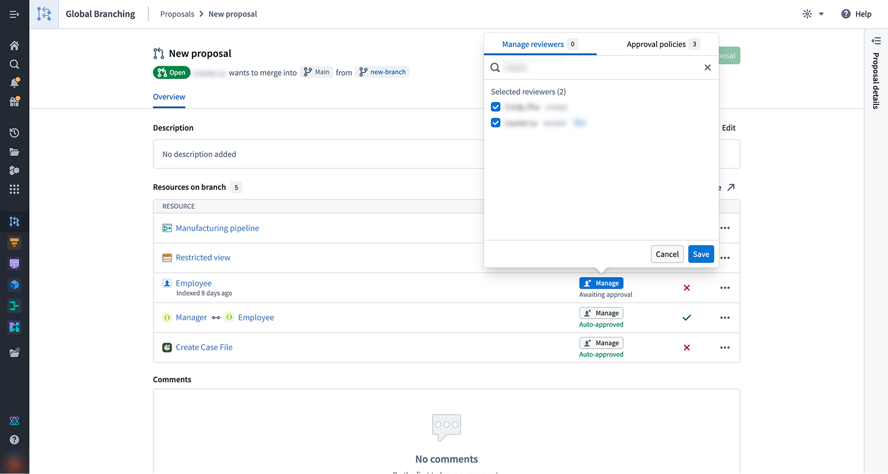

<!-- source: https://palantir.com/docs/foundry/foundry-branching/protecting-resources/ · mirrored 2026-08-14 from Palantir Foundry docs -->

# Resource protection and project approval policies

Protecting resources through branching and approval policies ensures that all contributions are made safely and in a controlled manner. When resources are protected, changes must be submitted via branches and can only be merged after receiving approval according to the project's defined policies.

## Resource protection

To safeguard critical workflows or maintain development best practices, you can choose to *protect* the main branch of your resources. Protected resources cannot be changed directly; instead, changes must be made on a branch and then approved before merging into the main branch.

A branch may include both protected and unprotected resources; however, only protected resources require changes to be made on a branch in accordance with the project’s approval policy. Changes to unprotected resources will still require approval from a user with edit-level permissions unless specified otherwise.

Protected resources can be identified by the  icon (branch lock) in the Compass file system.

Any user with owner permissions on a resource can choose to protect or unprotect that resource. Resources can be protected from your file system, individually or in bulk (by multi-selection). To protect a resource, right-click on a resource and choose **Protect** or **Unprotect** (depending on the current status). Workshop resources can also be protected from within the Workshop application by navigating to **Settings** and choosing the **Branch protection** tab.

## Branch protection tab

The branch protection tab in a project serves two purposes:

* **Defining branch approval policy:** Owners of projects can define a [project approval policies](#project-approval-policies) in the branch protection tab.
* **Automatically protecting new files:** When toggled on, this setting will automatically protect all new files created in the project.

## Project approval policies

Once a resource is protected, any change to that resource will have to be made on a branch and go through an approval process. The approval policy is set at the project level, and defines the approval required to merge changes to protected resources.

### Default approval policies

Choosing the default approval policy option for a project means each resource in the project is protected only by its respective default policies. For each resource, the application that owns the resource defines these policies — for example, the ontology defines default policies for object types.

These policies are typically simple: contributors and approvers must have **edit** access on the resource itself. Some cases are more complex. To see the exact policies for a given resource, see **Viewing a resource's approval policies** below.

Default policies are satisfied in one of two ways:

* **Automatically**, when the contributor's own permissions cover the policy.
* **Through review**, when a separate user with the required permission approves the change.

For example, suppose `SomeResource` has two default policies:

* **Policy 1** requires permission `X`
* **Policy 2** requires permission `Y`

In this case:

1. User A has permission `X`. They modify the resource on a branch, which automatically satisfies **Policy 1**.
2. User B has permission `Y`. They review and approve the change, which satisfies **Policy 2**.
3. Both default policies are now satisfied, and the change can proceed.

A single user can also satisfy both policies on their own. User C has both permission `X` and permission `Y`, so they can modify the resource and merge the change without a separate approver — their permissions cover both policies.

*Example project with default approval policy:*

### Custom approval policy

Approval policies have three customizable parameters:

* **Eligible reviewers:** Users or groups allowed to review and approve changes to the main branch of a protected resource.
* **Number of approvals required:** The minimum number of approvals needed.
* **Contributor approval:** Specify whether contributors to the resource are allowed to approve changes to that resource. A contributor is any user who has made a change to that resource on the branch.

Once a policy has been created on a project, it will apply immediately to *all protected resources* in that project when you create a branch and then a proposal. Additionally, if you update the policy to be more or less restrictive, proposals linked to that policy will be refreshed and have their status reevaluated against the new policy requirements. Only users that are owners on the project can update its custom policy.

*Example project with custom approval policy:*

## Moving a resource to a new project

A resource's protection status is preserved when moving resources between projects. For example:

* **Moving a protected resource to a new project:** The resource will remain protected in the new project.
* **Moving an unprotected resource to a new project:** The resource will remain unprotected in the new project.

When a protected resource moves to a new project, any change to that protected resource must be made on a branch and will be governed by the approval policy of the new project.

:::callout{theme="neutral" title="Moving a resource with an open proposal"}
If a resource with an open proposal is moved to a new project, the existing proposal may take up to 1 day before the resource's policy displays the new project policy. Updating the module on the branch or attempting to merge the proposal will also trigger a refresh of the resource's policy to match the new project policy.
:::

## Using project policies alongside local branch protection

[Code repositories](/docs/foundry/code-repositories/branch-settings/#protected-branches) and [Pipeline Builder](/docs/foundry/pipeline-builder/branches-protected-branches/) both have local branch protection mechanisms and approval policies. These will remain in place.

In the future, users will have the option to opt into the project approval policy for their code repositories and builder pipelines.

## Viewing a resource's approval policies

You can view the approval policies that apply to a resource by selecting the 👤 button in the reviewers column on the proposal page or in the branch taskbar. This will open a popover with two tabs, **Manage reviewers** and **Approval policies**.

The **Approval policies** tab will show both custom policies (set at the project or the resource level) and default policies that apply to a given resource. For each policy, you will also be able to see additional information including the eligible reviewers, the number of approvals required, and whether contributor approval is allowed.

The **Manage reviewers** tab shows who you have requested review from and the status of the review. You can also use the edit button to add or remove reviewers.

