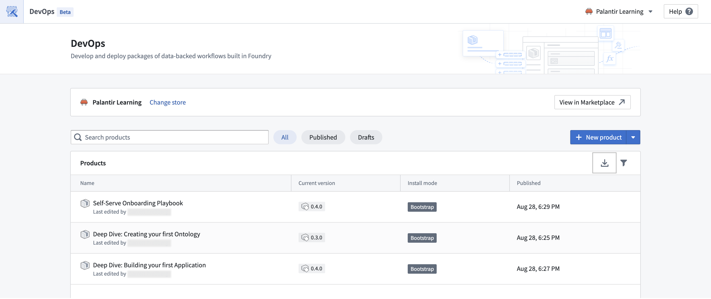
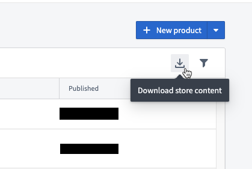
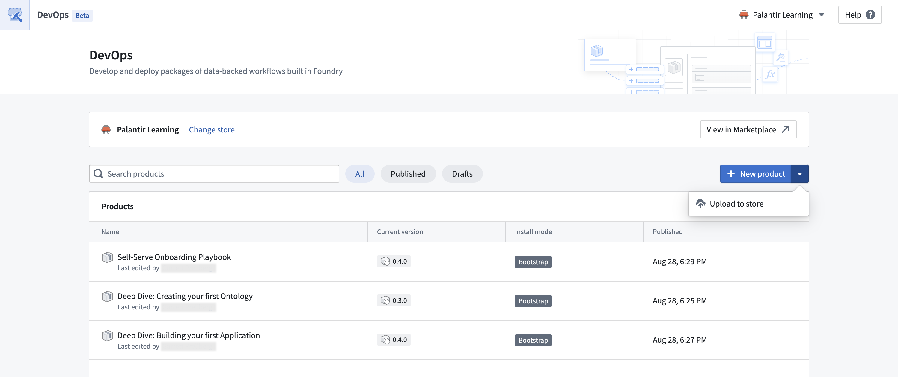

<!-- source: https://palantir.com/docs/foundry/foundry-devops/export-import-products/ · mirrored 2026-09-06 from Palantir Foundry docs -->

# Export and import products

Marketplace products can be exported from a local store and imported into another local store. Sharing is possible between any two local Marketplace stores on the same enrollment, or between two different enrollments. For required permissions, refer to [export product permissions](/docs/foundry/foundry-devops/manage-store-permissions/#export-product-permissions) and [import product permissions](/docs/foundry/foundry-devops/manage-store-permissions/#import-product-permissions).

## Export a product

:::callout{theme="warning"}
Marketplace products may contain sensitive data, and the exported file **is not encrypted**. Sensitive data can include datasets, media sets, models, and metadata including names, descriptions, and schemas. Keep security in mind when exporting marketplace products.
:::

A user with sufficient permissions can export a selection of products from a local store. Marketplace products are exported as a file, which should only be used for short-lived transport and not for permanent storage. We hold the right to introduce breaking changes to the format of this file, making it unable to be imported. It is the exporter's responsibility to verify that the product is allowed to be exported outside of the platform, and to ensure that it is handled securely afterward. The exported file is code signed; any changes to the file in transit will make the file not importable.

The option to download a store's content is located on the store page, where all of its products are listed. The **Download store content** option can be found on the right side of the product table header next to the filter icon.

## Import a product

:::callout{theme="warning"}
Marketplace products may contain sensitive data. Sensitive data can include datasets, media sets, models, and metadata including names, descriptions, and schemas. Make sure you are allowed to import products to your store and keep security in mind when doing so.
:::

A user with sufficient permissions can import a Marketplace file exported from another local store. It is the importer's responsibility to verify that the product is allowed to be imported into the platform. In most cases, this means cooperation between the exporter and importer to ensure that only appropriate data is shipped between Marketplace stores.

The option to upload store content is also located on the store page, where all store products are listed. The **Upload to store** option can be accessed from the dropdown next to the **New product** button above the **Products** table.
