<!-- source: https://palantir.com/docs/foundry/foundry-devops/folder-tracking/ · mirrored 2026-09-06 from Palantir Foundry docs -->

# Track a source folder

Tracking a source folder allows you to automatically package all resources within a Compass project or folder. Instead of manually selecting and maintaining individual resources, you can designate a folder as the source. DevOps will automatically discover and include the relevant resources it contains every time you release a new version.

This feature is useful when you have a well-defined [project](/docs/foundry/security/projects-and-roles/) that contains all the outputs you want to include in your product.

## Configure a new product tracking a source folder

To start a new product draft that tracks a folder, select the **Select source folder** option in the DevOps landing page.

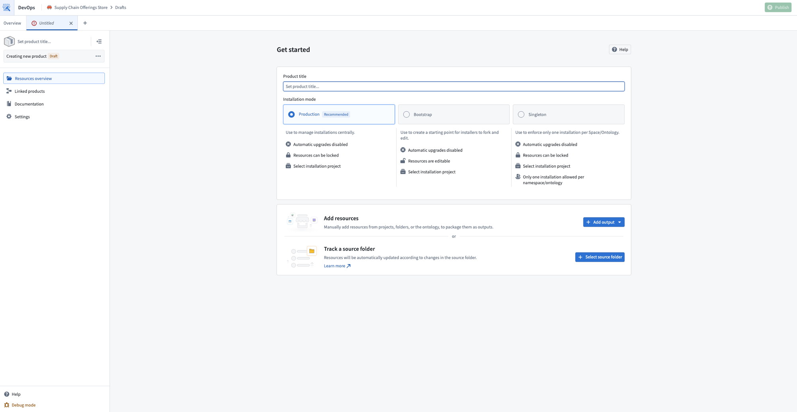

Select the folder that will be used as the source, and configure the initial settings that will be used to create the product.
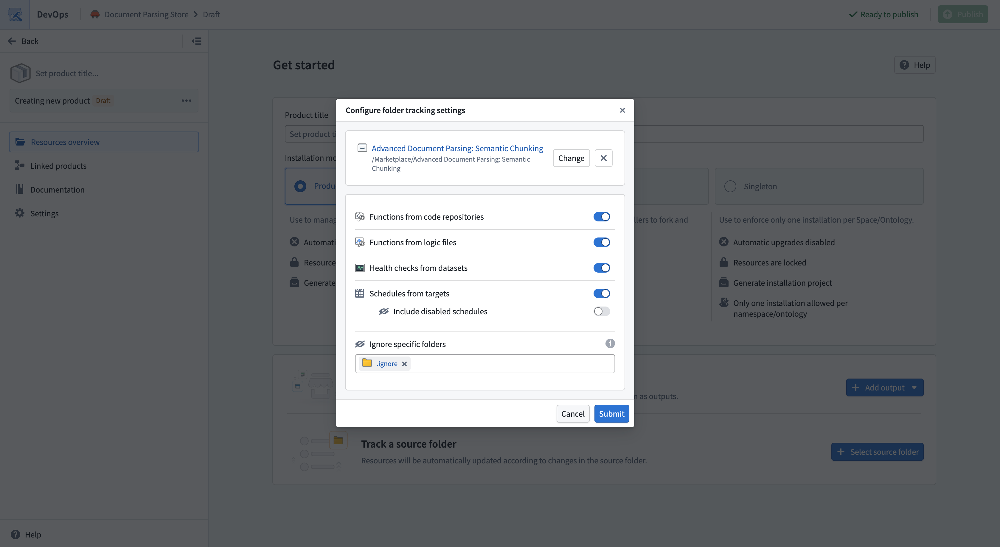

## Discovery settings

By default, all files in the project will be included in your product. For files that are not present in the [Compass filesystem](/docs/foundry/compass/overview/), you can use settings to automatically track related resources. For example, you can track all health checks that exist on the datasets in the project.

You can edit the settings for tracking a folder at any time by selecting **Edit** in the folder tracking banner at the top of the page.

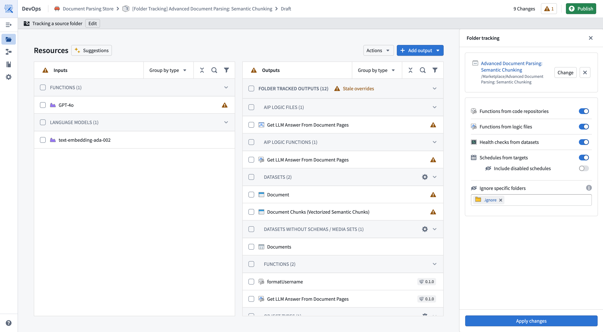

### Ignoring resources

Not all resources in a folder may be ready for packaging. For example, you might have a sub-folder for experimental work that should not be included in your product.

To exclude resources:

* Create a sub-folder in the source project that will be ignored in the Compass filesystem.
* Move resources you want to ignore to this sub-folder.
* In your DevOps draft, add the sub-folder to the **Ignore specific folders** settings. When you ignore a folder, all its contents are also ignored.

## Syncing with the source folder

As you make changes to your Compass project, you will want to update your product to reflect those changes.

Every time you **Create new version** of your published product, the latest changes from the project will be re-synced to reflect resources that have been removed or added to the product.

While inside the product draft, you can re-sync your product to the latest changes in your source folder using the **Refresh all** option.

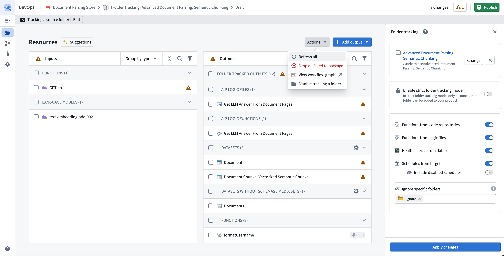

## Manual overrides

When tracking a source folder, you can combine both **Manually added outputs** and **Folder tracked outputs**. This allows you to combine automatic discovery with manual control.

You can [manually add outputs](/docs/foundry/foundry-devops/create-products/#add-outputs) using the **Add output** dropdown in the top right. This may be necessary to add resources that do not exist within the Compass filesystem, and that are not covered by [discovery settings](#discovery-settings).

### Override default configurations and versions

By default, when you track a folder each resource will be packaged with the default configuration, tracking the latest version of the resource. This allows you to automatically bring in the latest changes without any manual action.

To override the default configuration or version, select the resource to open the **Details** side panel and navigate to the **Edit** tab.

Once you have submitted changes, the resource will show an **Override** tag. Overridden resources are treated as manually added outputs, and continue to persist in new versions. You can remove the override at any time, which will revert the output to track the source folder with defaults.

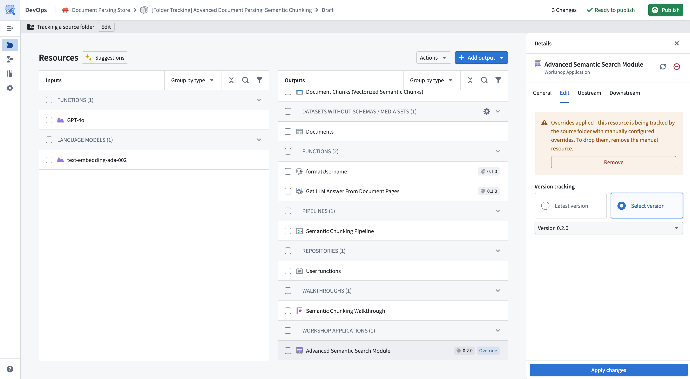

### Stale overrides

Over time your product may accumulate stale overrides. This can happen for the following reasons:

1. There is a resource that was previously a **Manually added output** and is now tracked as part of your source folder. For example, an object type that was initially [manually added](#manual-overrides), but since [migrated to Project based permissions](/docs/foundry/ontology-manager/migrate-to-project-based-permissions/).
2. There is a resource with an unnecessary override, because it matches the default configuration or latest version.

You can select the **Stale overrides** warning in the outputs row to clean them up.
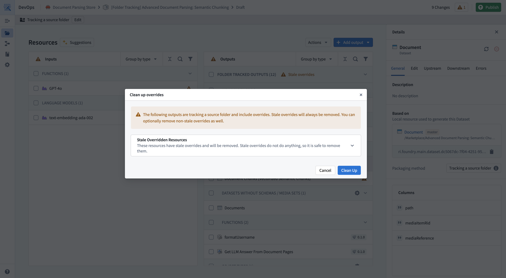

## Strict folder tracking

Strict folder tracking enforces that all resources in a product must exist within the source folder. When enabled, you cannot manually add outputs, and all resources must be discovered from the tracked folder. This ensures that your product contents exactly match your source folder.

### Enable strict mode

You can enable strict folder tracking when creating a new product or on an existing folder-tracked product:

* **New products:** Select the **Strict folder tracking** option in the folder tracking configuration dialog when setting up your product.
* **Existing products:** Select **Edit** in the folder tracking banner, then enable the **Strict folder tracking** option.

### Behavior in strict mode

When strict folder tracking is enabled:

* You cannot manually add outputs to your product. The **Add output** option is disabled.
* All resources must exist within the source folder. Resources that exist outside the tracked folder will cause validation errors.

### Validation errors

If your product contains resources that exist outside the source folder, a validation error will be displayed when attempting to publish. To resolve this, you must either move the resources into the source folder or disable strict mode.

### Disable strict mode

To disable strict folder tracking, select **Edit** in the folder tracking banner and disable the **Strict folder tracking** option. This will allow you to manually add outputs and override configurations as described in [Manual overrides](#manual-overrides).

## Migrating to track a source folder

If you have an existing product where resources were added manually, you can perform a one-time migration to configure your product to track a source folder, if your resources share a common Compass project.

1. Navigate to your product in the **Group by Folder** option. This will allow you to view the lowest common ancestor folder that your resources share.

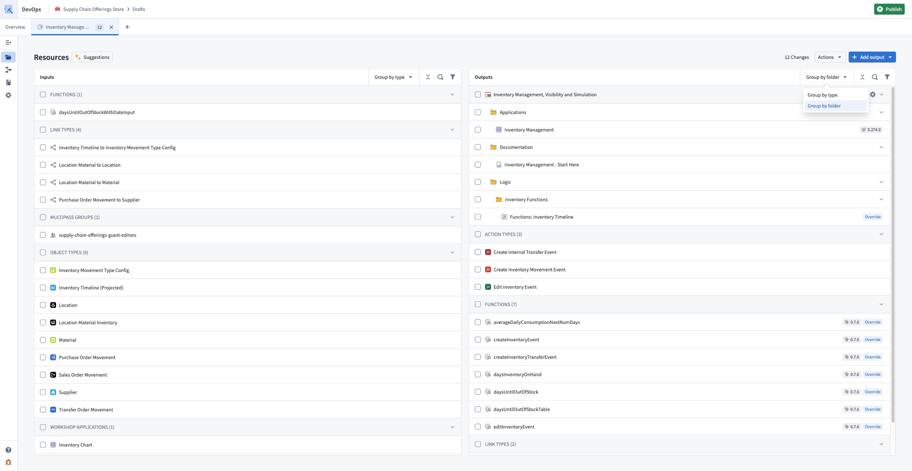

2. Under **Actions**, choose the **Migrate to folder** option.

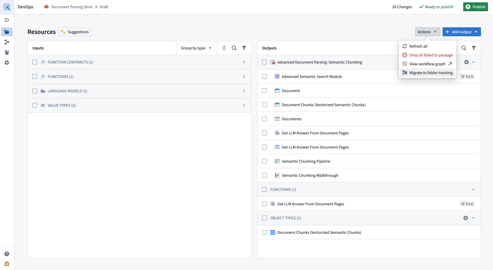

3. Choose the source folder you want to start tracking.

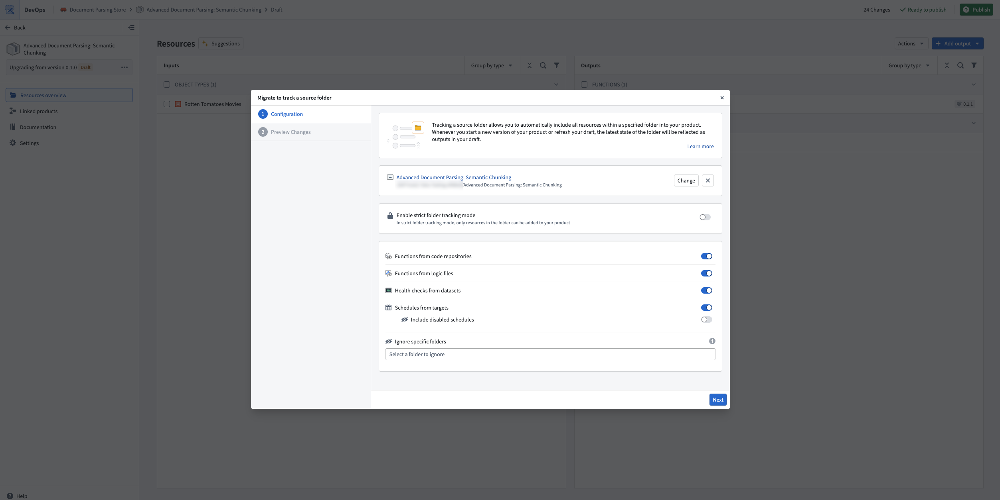

4. The migration dialog will show you a preview of the migration. This preview includes resources that will now be tracked as part of the resource. It will also include resources that will continue to be manually tracked, as they are not within the Compass filesystem, for example, Ontology entities that have not been [migrated to Project based permissions](/docs/foundry/ontology-manager/migrate-to-project-based-permissions/).

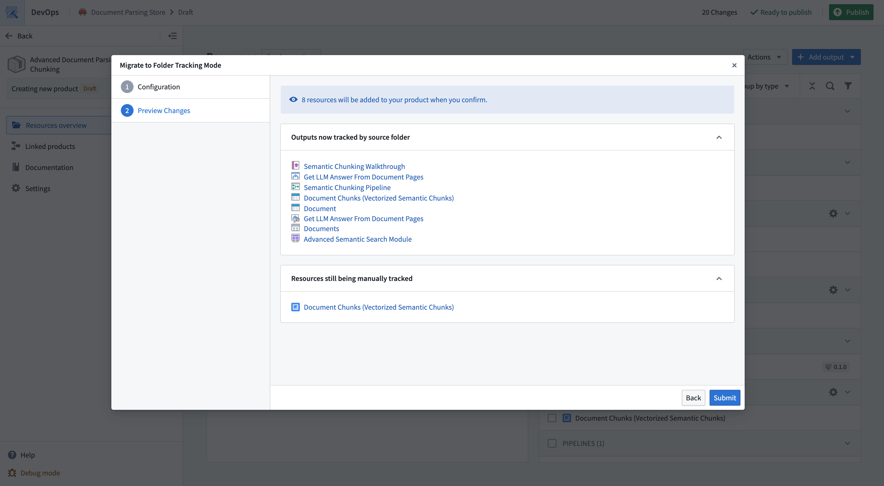

## Migrating away from tracking a source folder

If you decide folder tracking is not suitable for your product, you can switch back to manual output management. Under **Actions**, choose the **Disable folder tracking** option. This will open a preview that allows you to view the list of manually added outputs that will replace the tracked source folder.

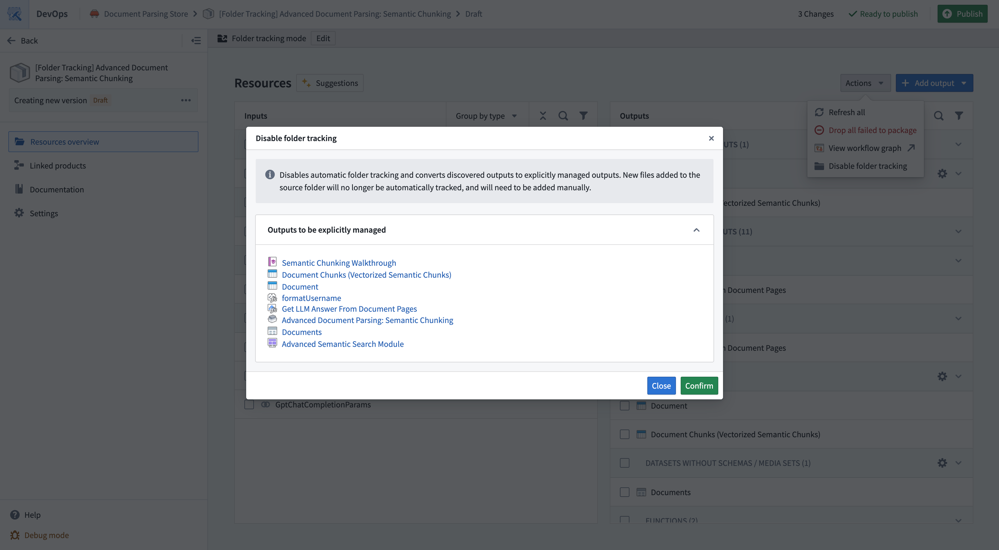
