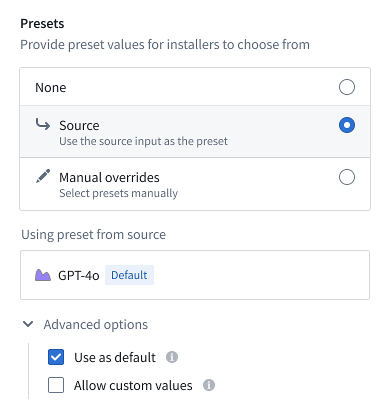
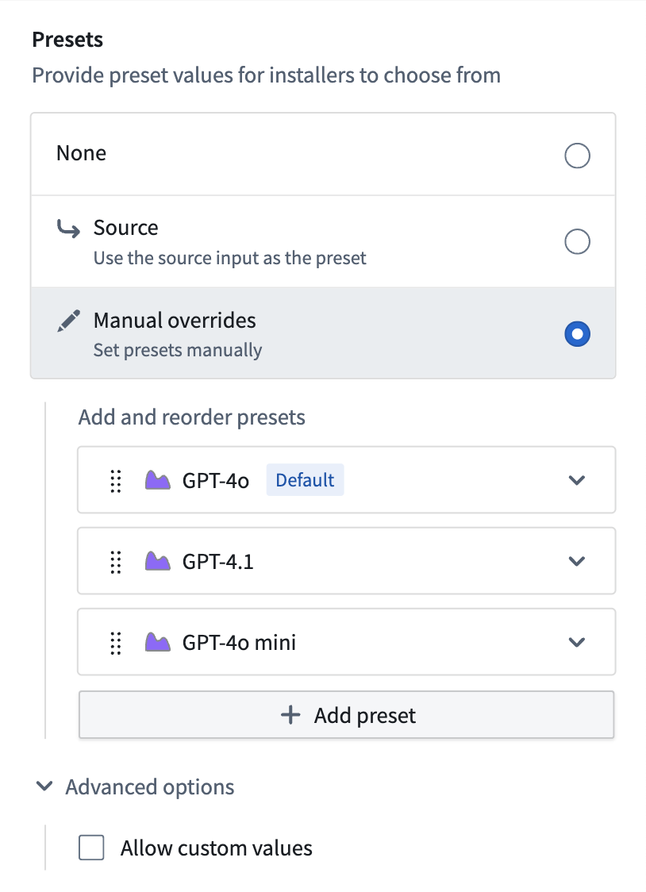
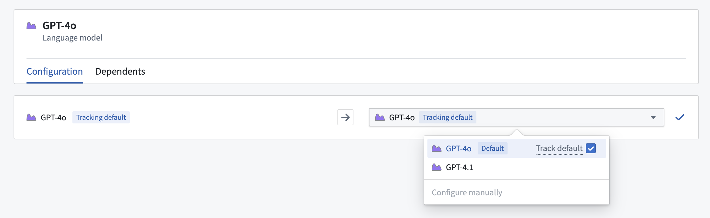
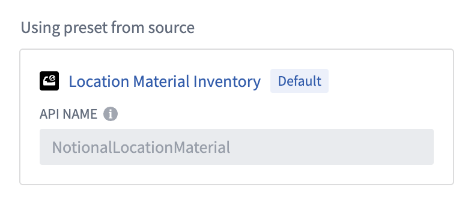

<!-- source: https://palantir.com/docs/foundry/foundry-devops/input-presets/ · mirrored 2026-09-06 from Palantir Foundry docs -->

# Input presets

To make installation configuration faster and more reliable, you can use presets and defaults on product inputs:

* **Presets:** Define a set of allowed values for an input. If a preset is made mandatory, installers must choose from the provided options and custom values are not allowed.
* **Defaults:** Specify one of the presets as the initial value for an input when starting an installation.

These features help enforce best practices, reduce errors, and speed up the installation process. During installation, inputs with defaults are auto-mapped, reducing manual work for installers.

## Adding presets and defaults

When packaging your product, select an input in the table. You can set presets and defaults from the sidebar.
From the sidebar, you can choose the method used for the preset.

* **None:** No preset will be used for the input.
* **Source:** Use the same input that your source entities depend on. If this changes over time, the preset will be automatically updated.
* **Overrides:** Manually provide a list of presets.

Once the presets are configured, you can then optionally select which preset should be used as the default.

* **Source:** Selected under the **Use as default** option in **Advanced settings**.
* **Overrides:** Hover over your desired default. Use the **...** dropdown menu and set the override as the default.

You can bulk set **Source** presets for inputs. To do this, select the inputs in the table and use the **Set presets** option in the page footer.

## Installation using presets and defaults

Once set, installers will be directed towards using presets to populate inputs. Where configured, installers may provide their own input values.

Some preset types (for example, Ontology entities) use API-name based presets, which means they will be looked-up in the target installation location (space and ontology). Review [Cross-environment compatibility](#cross-environment-compatibility) for more details.

Installers may choose to **Track default**, which will automatically update the input if the default changes during upgrades to different product versions.

## Cross-environment compatibility

Specific input types use locators (like API names) to ensure presets and defaults are functional across environments and enrollments. For example, object type presets use their API name, to find the corresponding object type in the target ontology during installation.

Where supported, this will be shown during the packaging process.

If the target installation environment does not have a resource satisfying the preset (for example, no object type with the required API name or no dataset with the required RID), then the preset will not be available for selection. If **Allow custom values** is checked for such an input, the installer can provide their own resource for the input and proceed with the installation. However if custom values are not allowed, the installer will not be able to install the product.
