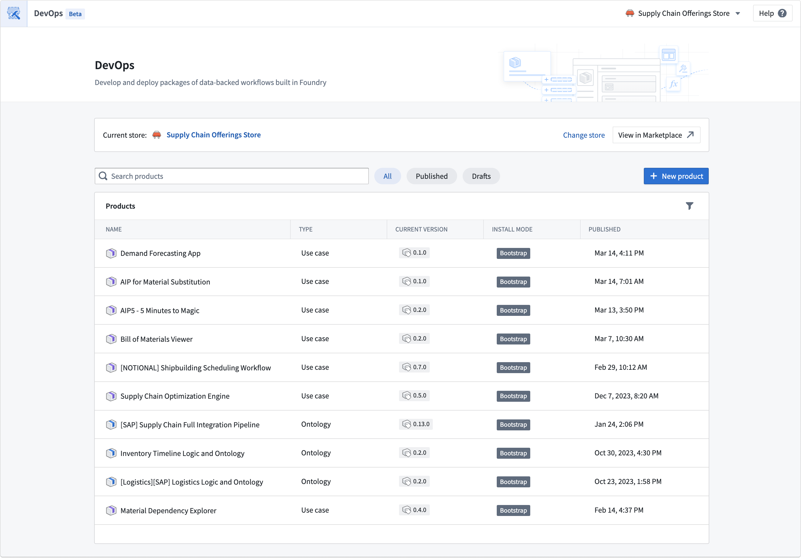
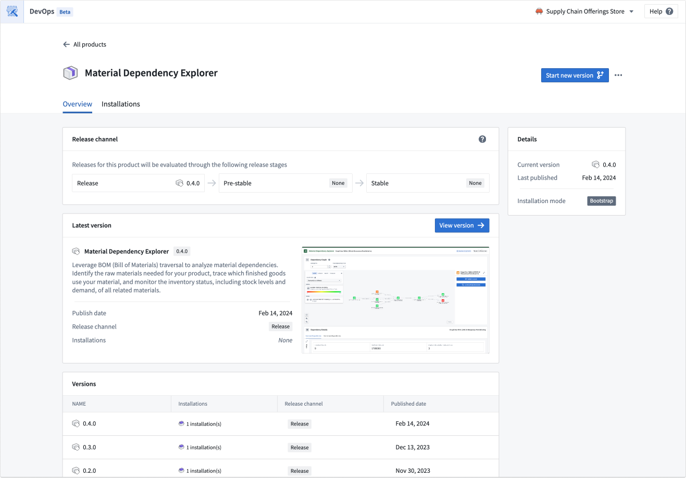
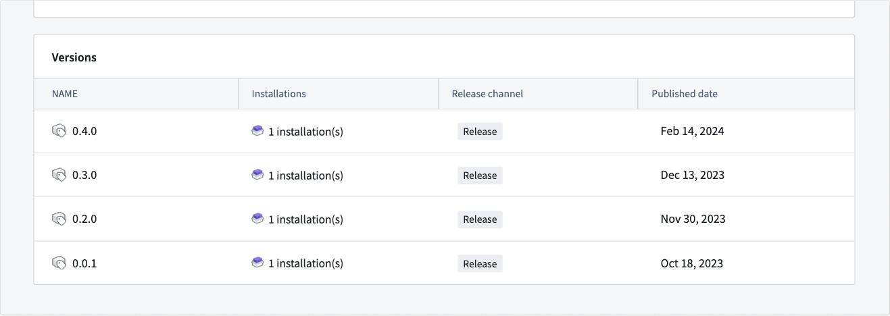
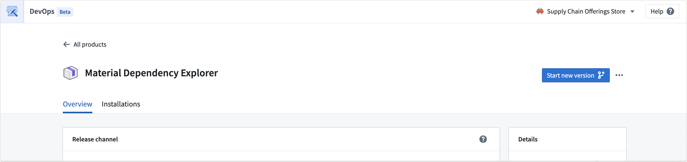
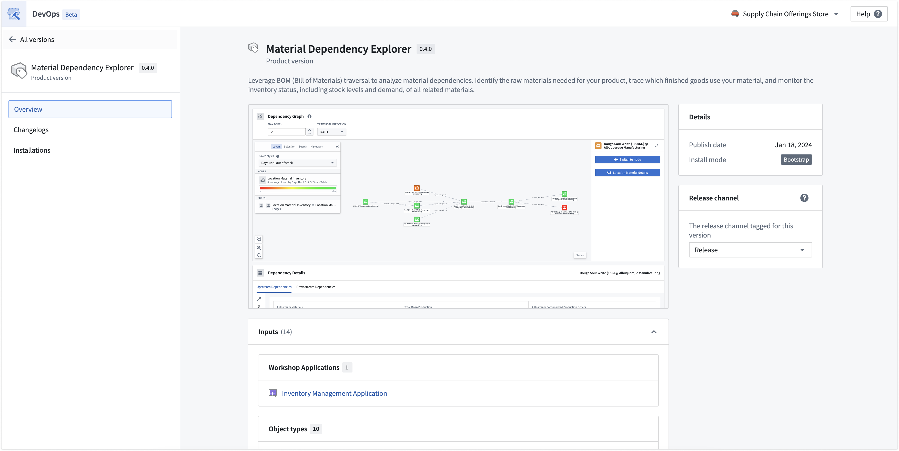
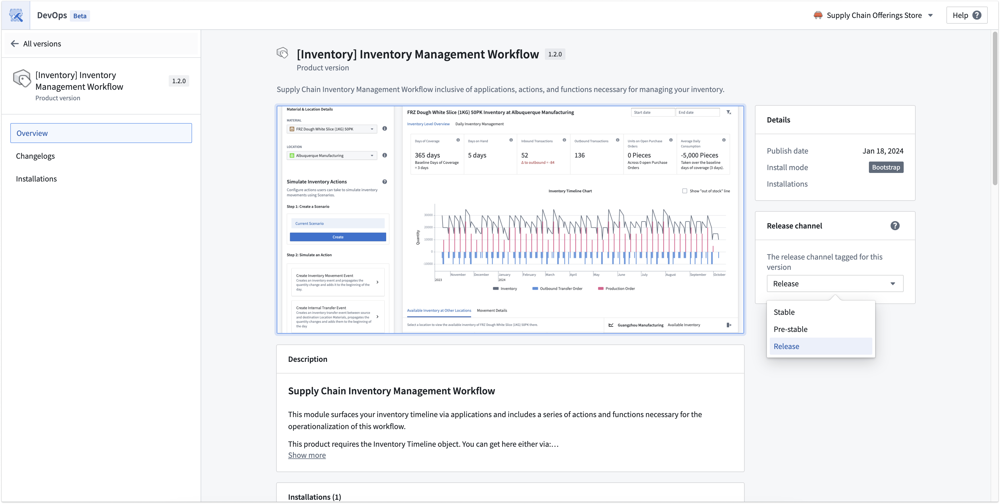
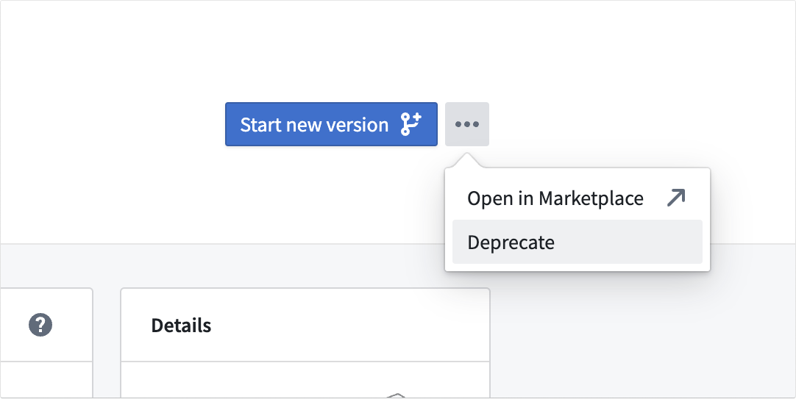
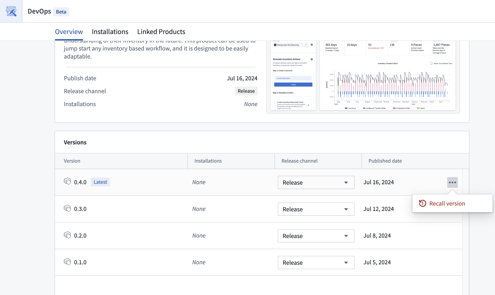
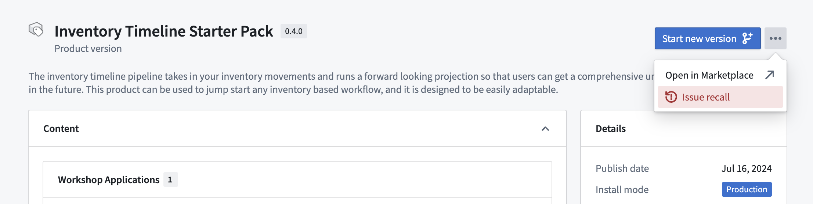

<!-- source: https://palantir.com/docs/foundry/foundry-devops/manage-products/ · mirrored 2026-09-06 from Palantir Foundry docs -->

# Manage products

After selecting a store, you will be able to see all products for which you have edit or view access. You can use the filter options located next to the search bar to view published products, product drafts, or both together.

Select a product to see the product overview, from which you can start new versions, review previous versions, and view the latest product version for each stage of release. A preview of the latest version is shown on the product overview page.

The product page displays all the product's versions in a table, where you can access each version's respective page.

To create a new version, select **Start new version** from the top-right of the product page.

## Product versions

Navigate to product version pages using the version table on the product page. The product version page displays content, inputs, local installations, and changelogs for each version.

## Release channels

You can tag product versions with [release channels](#release-channels) in order to push a specific version out to relevant installations tracking each channel. Each version can be tagged as **Release**, **Pre-stable**, or **Stable**. Each installation tracks a release channel, and by default, all installations are set to track the **Release** release channel. This setting can be found in the [installation settings](/docs/foundry/marketplace/installations/#installation-settings) during install.

To tag a product version with a release channel, first navigate to a product version page, then choose the release channel with the selector on the right.

Release channels are hierarchical rather than mutually exclusive. Depending on the track:

* **Release:** The installation receives the versions tagged as **Release**, **Pre-Stable**, or **Stable**.
* **Pre-Stable:** The installation receives the versions tagged as **Pre-Stable** and **Stable**.
* **Stable:** The installation receives the versions tagged as **Stable**.

## Configure a Maven coordinate

A Maven coordinate uniquely identifies a product for publishing to [connected Apollo hubs](/docs/foundry/administration/connected-hubs/). The coordinate is built from four parts:

| Part | Example | Configured in |
| --- | --- | --- |
| Reverse URL | `com.palantirfoundry.acme` | Derived from your enrollment URL (for example, `acme.palantirfoundry.com`) |
| Namespace identifier | `my-namespace` | **[Space management](/docs/foundry/platform-security-management/manage-orgs-and-spaces/)** extension in Control Panel |
| Store identifier | `my-store` | **Settings** tab for the store in DevOps |
| Product identifier | `my-product` | Product page in DevOps |

The reverse URL, namespace identifier, and store identifier combine to form the Maven group, while the product identifier serves as the artifact ID. For example, an enrollment at `acme.palantirfoundry.com` with namespace `my-namespace`, store `my-store`, and product `my-product` would produce the coordinate `com.palantirfoundry.acme.my-namespace.my-store:my-product`.

:::callout{theme="warning"}
Do not include any sensitive, restricted, or highly restricted data in any part of the Maven coordinate.
:::

## Product deprecation

To deprecate a product, select **Deprecate** from the dropdown menu next to the **Start new version** button on the product overview page to hide the product from the storefront. Hard deletion of products is not currently supported.

## Recall a product version

If a product version needs to be recalled, navigate to the product overview page and use the product version table to find the version you want to recall. Then, select **Recall version**.

You can also recall a version directly from the product version page, as shown below.

For local Marketplace stores, this action will prevent new manual installations, upgrades, and automatic upgrades from installing the recalled version. If you have already installed a recalled version, existing installations will not be affected. Recalled versions will not be suggested to users and will have limited visibility in the Marketplace.

For remote Marketplace stores, recall actions are not supported. Recalls issued in the local Marketplace store will not be reflected in different enrollments that use the store as a remote store.

If a product with recall information is manually uploaded to another local Marketplace store, the recall information will be retained.
