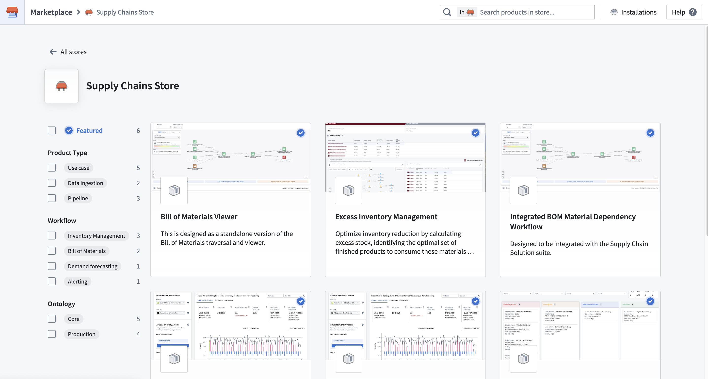
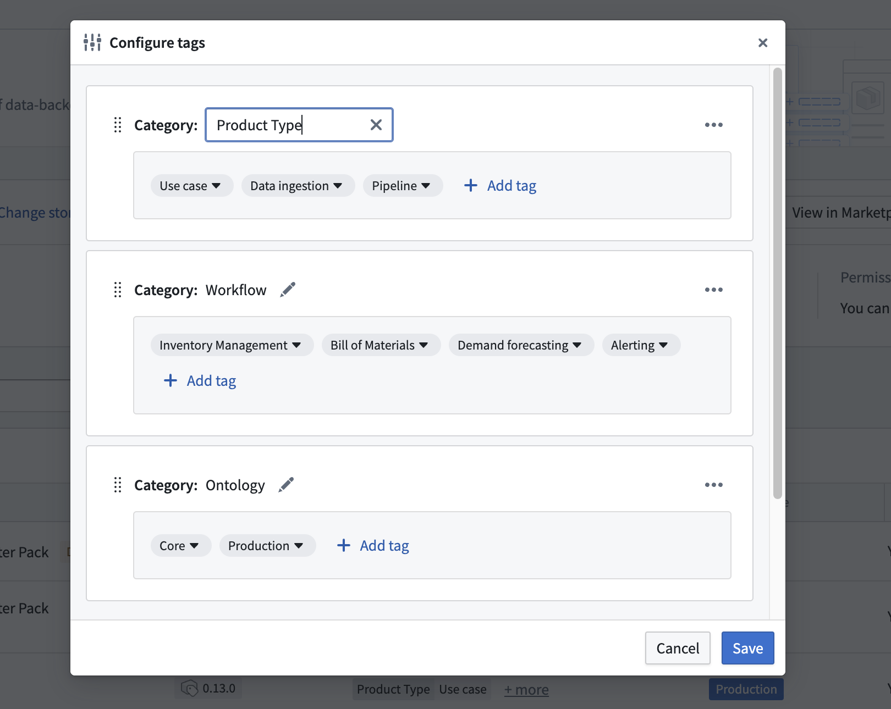
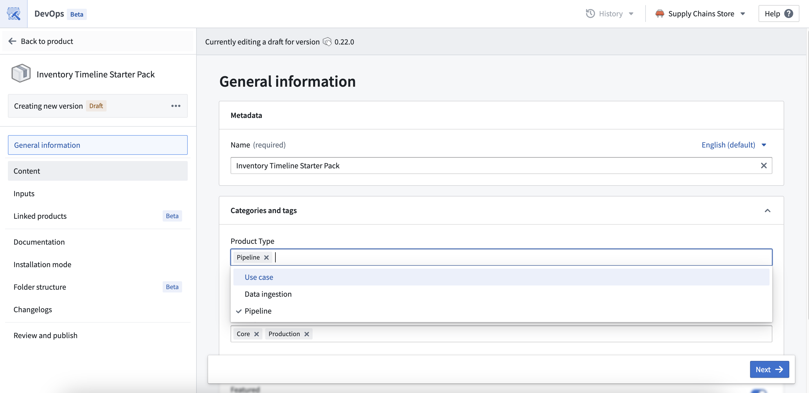

<!-- source: https://palantir.com/docs/foundry/foundry-devops/manage-store-tags/ · mirrored 2026-09-06 from Palantir Foundry docs -->

# Manage store tags

Marketplace products can now be tagged to allow a smooth store-browsing experience and improve product discovery for installers. **Tags** are labels that can be applied to products and a **Category** is a collection tags. These can be used to filter products in the [Marketplace store](/docs/foundry/marketplace/browse-products/#store). For required permissions, refer to [edit store tags permissions](/docs/foundry/foundry-devops/manage-store-permissions/#edit-store-tags-permissions).

## Configuring categories and tags on the store

Tags are defined on the store level and only exist within the given store. Tags are organized into categories. These can be configured via the **Settings** option located on the DevOps homepage.

The names of categories and tags can be edited after being created, but there cannot be duplicate category names within a store, or duplicate tag names within a category. Categories and tags can only be permanently deleted, which also deletes any relevant tags from products it has been applied to. Once deleted, categories and tags cannot be restored, and tags will need to be re-created and re-added to products. Categories can be re-ordered here to control the ordering of the categories filters in the Marketplace Store.

## Applying tags on products

Once tags have been defined on the store, they can then be applied to the relevant products. To apply tags, you have to create and publish a new version of the product.

