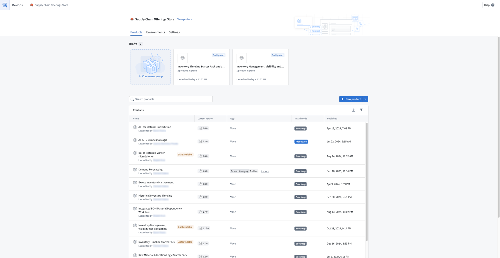
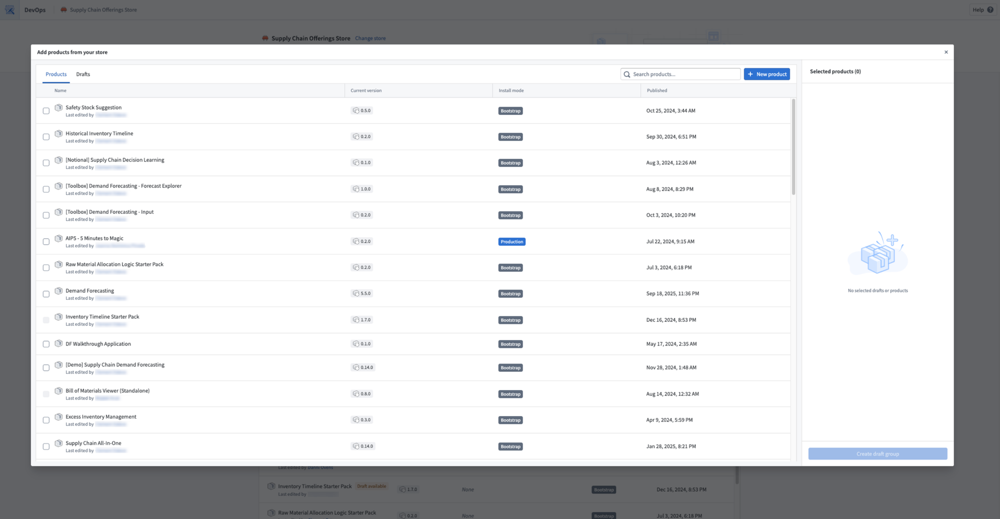
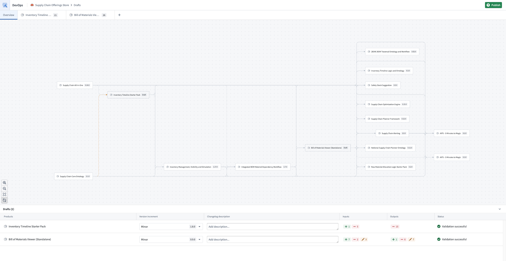
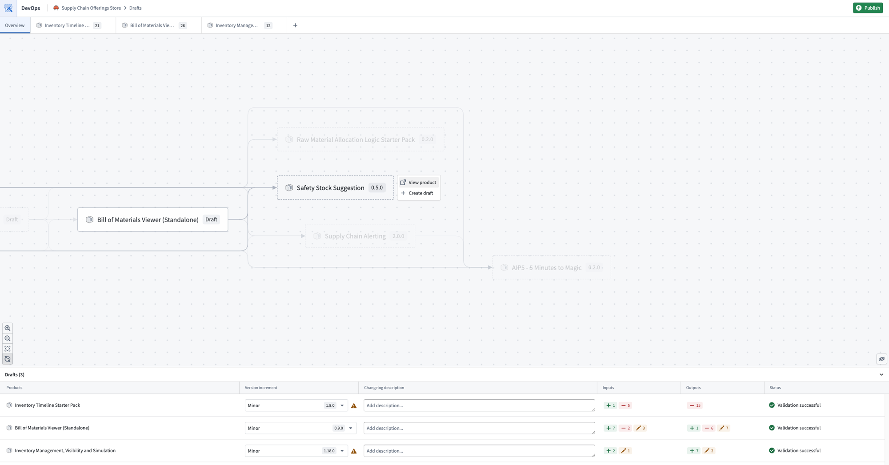
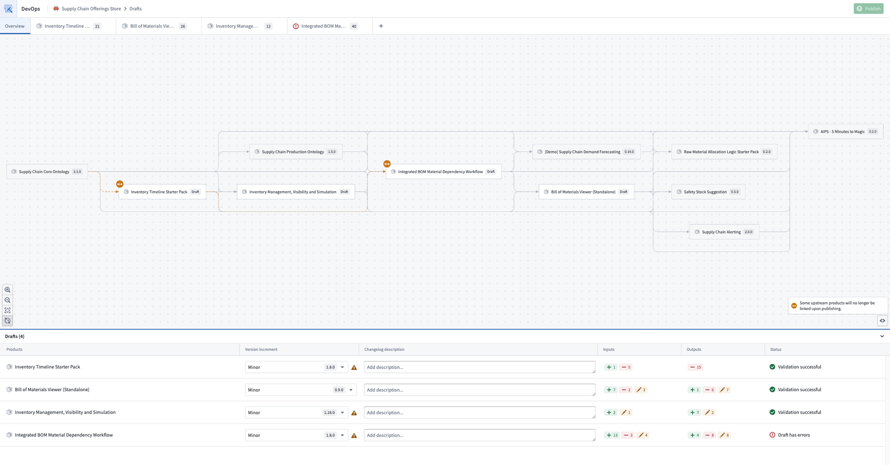
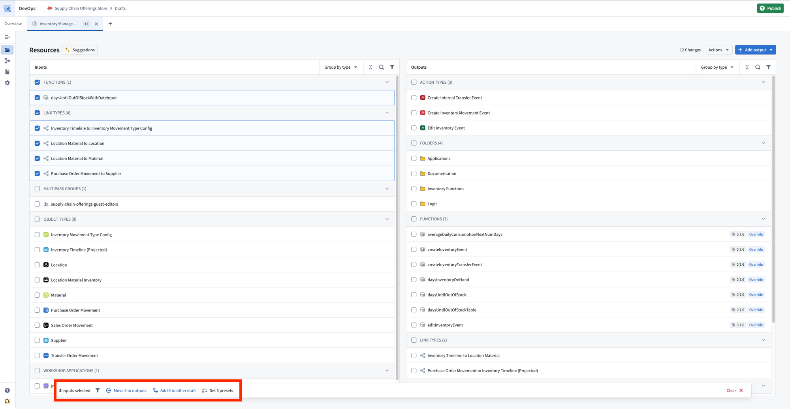
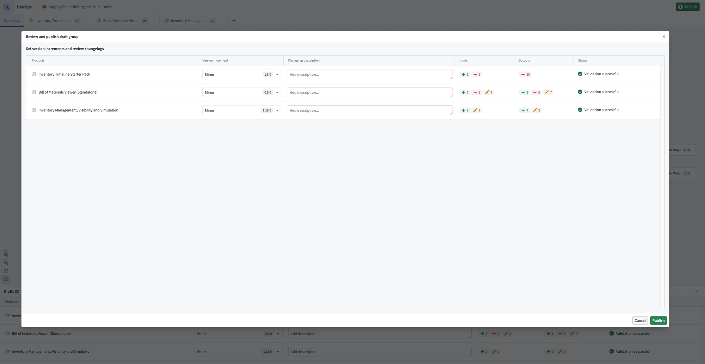

<!-- source: https://palantir.com/docs/foundry/foundry-devops/package-multiple-products/ · mirrored 2026-09-06 from Palantir Foundry docs -->

# Package multiple products

In Foundry DevOps, a draft can contain multiple products that are packaged at the same time. When a draft contains multiple products, DevOps guarantees that [linked products](/docs/foundry/marketplace/linked-products/) are calculated in the correct dependency order, eliminating the need to manually sequence packaging.

## Create a draft with multiple products

To begin, navigate to your store and select **Create new group**.

Select existing products that require a new version, or create new products. You can also move existing drafts from other groups into the new draft group.

Each product in the draft can be configured independently with its own outputs, inputs, and settings. Refer to [Create a product](/docs/foundry/foundry-devops/create-products/) for more details.

## Linked products graph

The **Overview** page of a draft displays a graph of the products in the current draft alongside their upstream and downstream linked product dependencies.

When a draft contains multiple products, DevOps automatically resolves dependencies between them. Linked products are packaged in the correct order so that upstream products are processed before downstream products that depend on them. This eliminates the need to manually determine and sequence packaging to resolve cross-product dependencies.

You can also use the graph as an entry point to add or remove products from the current draft.

The graph also displays warnings when linked product relationships are broken. These can often be resolved by adding the affected product to the current draft and resolving any missing inputs or outputs.

## Move input to output of another draft

It is possible to move the inputs of one draft to another draft within the draft group. This is helpful if you want the inputs of one product to be fulfilled by the outputs of an upstream linked product. Select one or more inputs and choose **Add {N} to other draft** from the toolbar at the bottom of your screen.

## Publish

Once you are satisfied with the products in your draft, select **Publish**. DevOps publishes the products in dependency order, ensuring that linked products are available before any products that depend on them.

