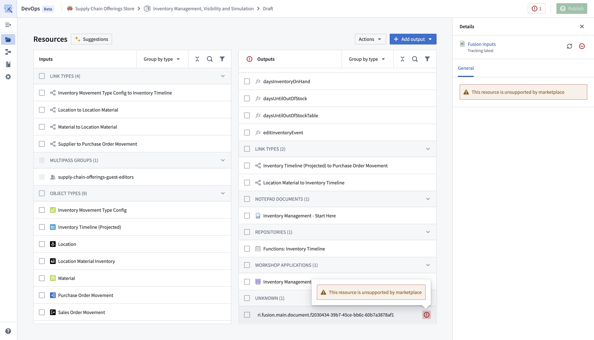

<!-- source: https://palantir.com/docs/foundry/foundry-devops/supported-resources/ · mirrored 2026-09-06 from Palantir Foundry docs -->

# Supported resources

The vast majority of Foundry resource types can be included as outputs when [creating a product](/docs/foundry/foundry-devops/create-products/).

For packaging constraints and details specific to each resource type, refer to the resource's Marketplace documentation. For example, see the Marketplace documentation for [Action types](/docs/foundry/action-types/marketplace-action-types/) or [Automations](/docs/foundry/automate/marketplace-automate/).

## Unsupported resources

If a resource is unsupported, the resource will show in the draft with an error. Unsupported resources must be removed from the draft before publishing. All unsupported resources can be removed by using the **Actions** dropdown and selecting **Drop all failed to package**.

A non-exhaustive list of unsupported resources is below:

* [Data Connection sources](/docs/foundry/data-connection/core-concepts/#sources)
* [Code Workbook workbooks](/docs/foundry/code-workbook/core-concepts/#workbooks)
* [Fusion sheets](/docs/foundry/fusion/sheets-overview/)
