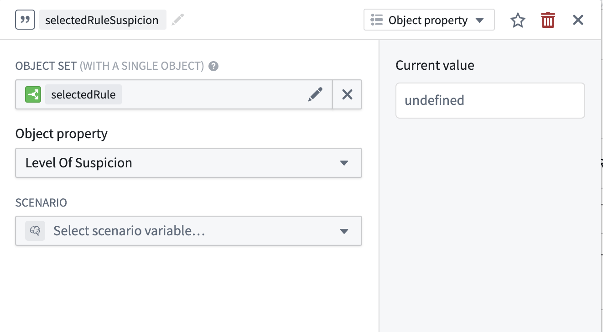
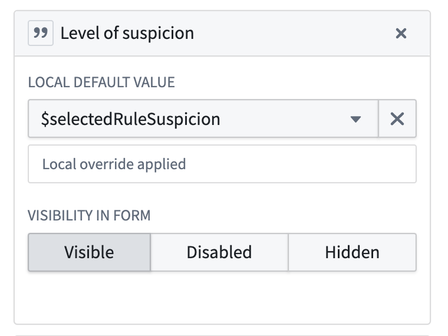
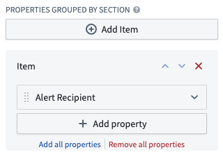

<!-- source: https://palantir.com/docs/foundry/foundry-rules/add-a-custom-property/ · mirrored 2026-08-14 from Palantir Foundry docs -->

# Add a custom property

A common customization in Foundry Rules is adding custom properties to your rule and proposal objects. Custom properties can let you track additional metadata beyond the default configuration. To add a custom property, follow these steps:

1. In the Ontology Manager, add the property (e.g. `severity`) to the rule object.

:::callout{theme="neutral"}
Object properties must be backed by a column in the input dataset.

In the case of an empty, auto-generated input dataset, edit the schema directly in the **Details** tab by copying and modifying an existing column definition.

For rules coming from an existing pipeline, add the new columns in a transform.
:::

2. Add corresponding `current_<PROPERTY>` and `new_<PROPERTY>` properties (e.g. `current_severity` and `new_severity`) to the proposal object.
3. Annotate the `current_<PROPERTY>` proposal object property with the type class `foundry-rules.property-diff-for:new_<PROPERTY>` (e.g. `foundry-rules.property-diff-for:new_severity`).

:::callout{theme="neutral"}
Type classes are characterized by a *kind* and a *name*, written out as `kind.name`. In the case of `foundry-rules.property-diff-for:new_<PROPERTY>`, the kind is `foundry-rules` and the name is `property-diff-for:new_<PROPERTY>`.
:::

4. Edit every action type in the Foundry Rules setup which modifies or creates a rule or proposal object by adding a parameter of the new custom property. Follow the example of another similar property such as *rule\_name* to see the required additions.

5. In the Workshop application, add a Workshop variable that takes the custom property of the selected rule. You can do this by defining a new objectProperty variable with the existing `selectedRule` variable as the object set input.

    

   Set this Workshop variable as the default value for the "Create a proposal to edit rule" Action in the Rule Editor's configuration sidebar.

    

6. If the proposal widget is not displaying diffs correctly, follow these steps:

   * In the Workshop app, add the `new_<PROPERTY>` property to **Properties grouped by section** in the Proposal Reviewer widget configuration. It is not necessary to select the "current" value here.
   * If desired, edit the property name to remove the ”new“ prefix.
   * Add the `foundry-rules.property-diff-for:ID_OF_NEW_PROPERTY` type class to the **current** property of the **proposal object**.

       
