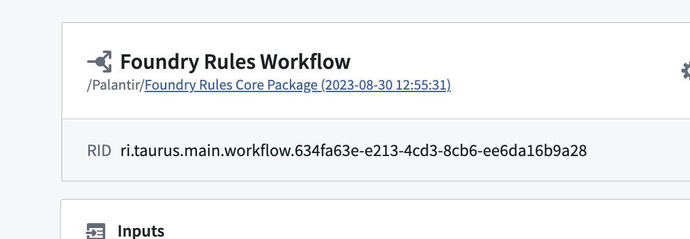
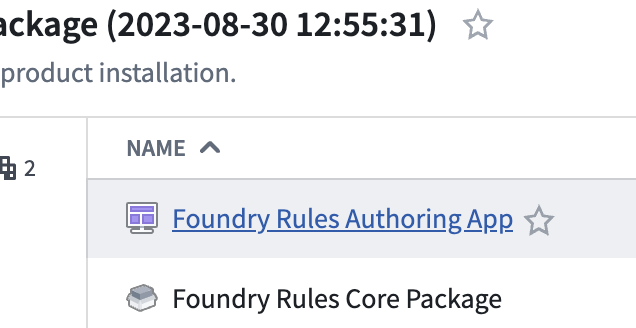
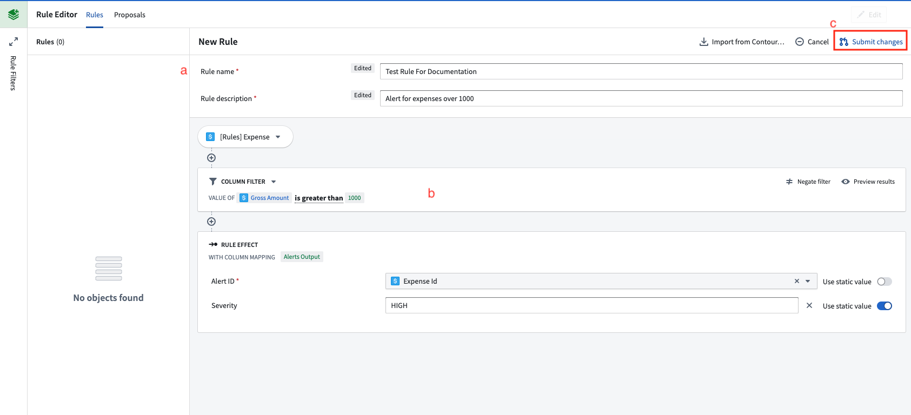
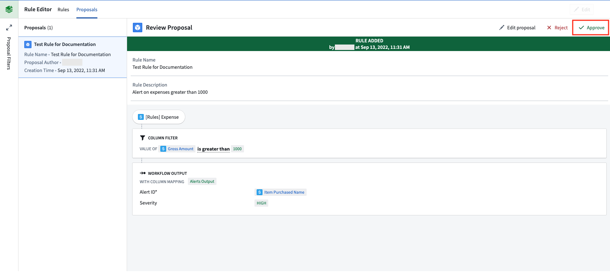
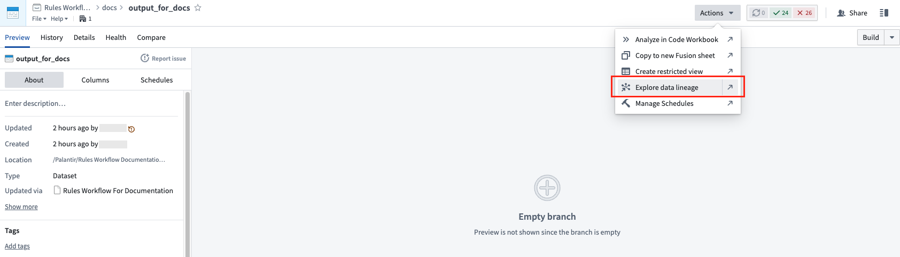
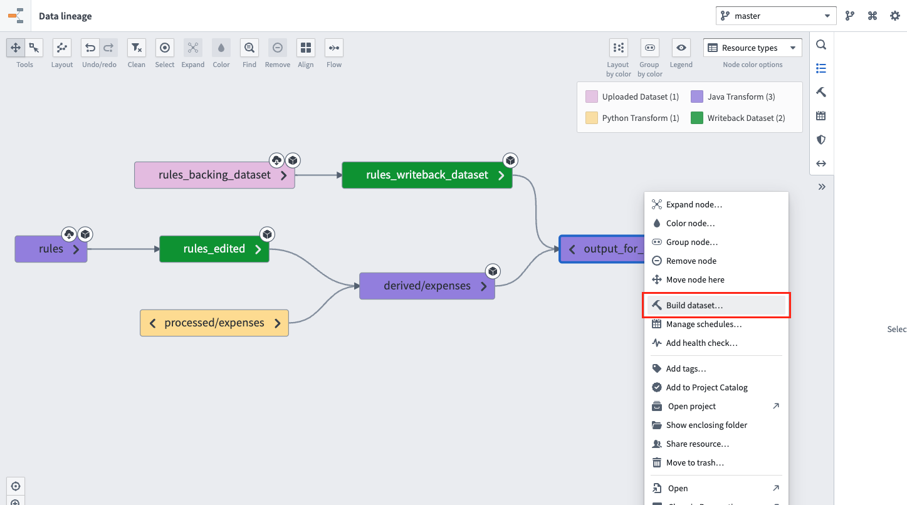

<!-- source: https://palantir.com/docs/foundry/foundry-rules/author-and-run-a-rule/ · mirrored 2026-08-14 from Palantir Foundry docs -->

# Author and run a rule

The following steps will guide you through the process of authoring and running a rule in a Workshop application.

1. **Find the Workshop Rule application:** From the workflow configuration screen, select the folder and choose the Workshop application.   
      
      

2. **Author a rule:** Within the Workshop application created in the previous step, click the **Create New** button to begin creating a rule.
   * (a) Fill out the form at the top of the rule with a name, description, and other information.
   * (b) Author logic that you want the rule to execute. For example, this could be a simple filter.
   * (c) Click **Submit changes** to create a proposal for this new rule.   
        

3. **Approve the proposal:** Within the **Proposals** tab of the Workshop application, select the newly created proposal on the left side.
   * Select **Approve** to activate it as a rule.   
        

4. **Build the rule writeback and rules output datasets:** Navigate to the output dataset that was created while [configuring the workflow](/docs/foundry/foundry-rules/configure-workflow/).
   * Choose **Actions**, then **Explore data lineage** to view the input datasets.   
        

   * Select both the rules writeback dataset (d) and the output dataset (e).

   * Right-click with both datasets selected and choose **Build**.   
        

   * Once the build has completed, the output dataset will contain the results of your new rule. In the future, these two datasets can be placed on a [schedule](/docs/foundry/data-lineage/manage-schedules/) to keep the outputs up to date.
