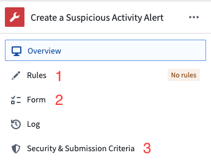

<!-- source: https://palantir.com/docs/foundry/foundry-rules/configure-rule-actions/ · mirrored 2026-08-22 from Palantir Foundry docs -->

# Configure rule Actions

:::callout{theme="warning"}
Prior to July 2022, Foundry Rules (previously known as Taurus) used Foundry Actions as rule outputs. This section is only relevant if you deployed Foundry Rules prior to July 2022.
:::

Rule Actions are a means within Foundry Rules to enforce an output schema on a rule's output. This is accomplished by using Foundry Actions as the mechanism for specifying the column names and types. A rule Action is a Foundry Action that will be used in Foundry Rules.

The Action in the screenshot above is only [used within the transform](/docs/foundry/foundry-rules/configure-transforms-pipeline/#rule-action-datasets) and will not be run on its own. It is convenient to have no Action rules configured for the Action (**1** in the screenshot above) so if the Action were to be run, it would have no effect.

The parameters of the Action will be presented to end users in the Foundry Rules Workshop application and made available to map to columns output by the rule logic (**2** in the screenshot above).

* The parameter types will be used to enforce the correct column types. For example, if a date type parameter is used, then only date and timestamp type columns will be available to map to this parameter. Furthermore, if the parameter ID matches a column name or an object property ID from your rule, it will be used to pre-fill the parameter with this column/property.
* Any parameters that are marked as required will also be required in the Foundry Rules Workshop application. Similarly, optional parameters may be left blank with no column mapped to them, which is equivalent to providing the `null` value to the parameter.
* The parameter names will be used as labels in the Foundry Rules Workshop application, and the parameter IDs will be used as the column names in [the resulting dataset in the transform](/docs/foundry/foundry-rules/configure-transforms-pipeline/#rule-action-datasets).
* In addition to the parameter IDs, the output dataset will also contain a `taurus_rule_id` column to indicate the rule ID of the rule the row originated from.

Defining **Submission Criteria** (**3**) is a requirement for saving an Action. The most common submission criterion for rule actions is checking that the **Current User** belongs to a user group with permissions to edit the Foundry Rules workflow. This validation will be applied when editing a rule in the Foundry Rules App.
