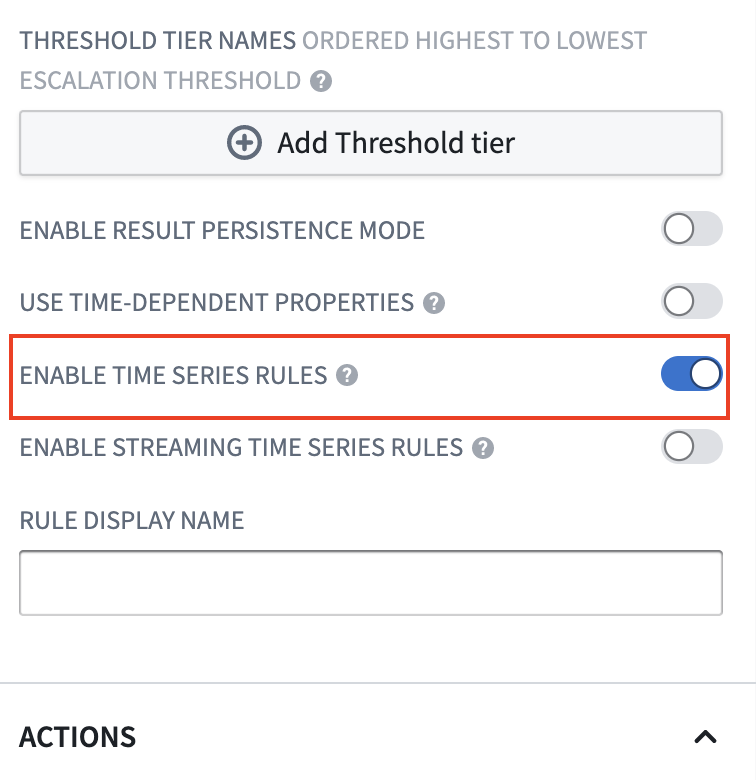
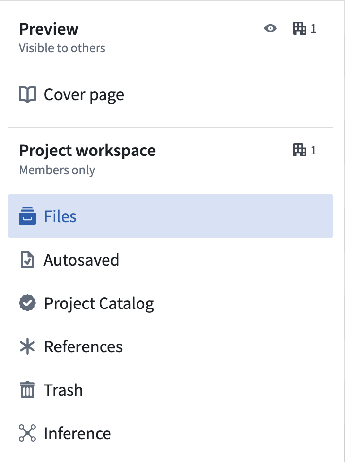
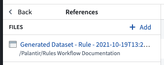

<!-- source: https://palantir.com/docs/foundry/foundry-rules/configure-timeseries-foundry-rules/ · mirrored 2026-08-22 from Palantir Foundry docs -->

# Configure time series

:::callout{theme="neutral"}
Prior to July 2022, Foundry Rules (previously known as Taurus) required users to create their own transform to run Foundry Rules. This section is only relevant if you deployed Foundry Rules prior to July 2022.
:::

:::callout{theme="neutral"}
These instructions assume time series have already been set up in your platform. Learn more about [using time series in Foundry](/docs/foundry/time-series/time-series-usage/).
:::

If you are creating a new workflow, follow the steps to [deploy Foundry Rules](/docs/foundry/foundry-rules/deploy-foundry-rules/). If you deployed Foundry Rules prior to July 2022, the additional steps described below are required to enable time series support.

## Workshop application

There are two steps to start writing time series rules in the Workshop application:

1. The **Enable time series rules** configuration in the Rule Editor must be turned on. To navigate to this, edit your Workshop module, click on the Rule Editor widget, and find the option labeled **Enable time series rules**.

    

2. To create time series rules, the source object must be the root object type. Add all the root object types you require to the set of **Permitted object types**. All objects added here will also need to be added to the transforms pipeline.

## Transforms pipeline

Foundry rules are run as part of a transform. Ensure you have already followed the instructions to set up [the pipeline](/docs/foundry/foundry-rules/configure-transforms-pipeline/).

## Additional inputs

This section provides the permissions to access time series metadata. For time series rules to run, you must add more items to the additional inputs:

* For each time series sync that backs the time series data, add the sync RID using `.addTimeseriesSyncRids`.
* For each tick dataset used in the times series syncs above, add the RID of the tick datasets using `.addBackingDatasetRids`. These are the datasets containing the actual time series data.
* Add the RID of the root and sensor object using `.addObjectRids`.
* Add the RID of the relation between the root and sensor object using `.addLinkRids`.

### Example

```java
 @AdditionalInputs
    public static Set<InputSpec> additionalInputs = ImmutableOntologyInputs.builder()
        .addObjectRids("ri.ontology.main.object-type.adc4f61c-7ddd-4be2-9ade-a3a0483e63e4") // root object
        .addObjectRids("ri.ontology.main.object-type.98f40fe0-d36f-4fcc-b36c-dc3824be17b5") // sensor object
        .ontologyBranchRid("ri.ontology.main.branch.00000000-0000-0000-0000-000000000000")
        .ontologyRid("ri.ontology.main.ontology.00000000-0000-0000-0000-000000000000")

         // Time series inputs
        .addLinkRids("ri.ontology.main.relation.6e82c6be-2a9a-42be-9cf0-c84a706b4101") // root object <-> sensor Object
        .addTimeseriesSyncRids("ri.time-series-catalog.main.sync.8023a1b6-bae0-4dbf-8df5-9a879d8e0be0") // time series sync
        .addBackingDatasetRids("ri.foundry.main.dataset.7041bedc-c475-46f6-81b6-8b989f099447") // ticks dataset
        .addBackingDatasetRids("ri.foundry.main.dataset.7ee6741c-ea3d-48aa-9ba3-ec43b2ce42e4") // sensor object backing dataset
        .build()
        .getInputSpecs();
```

### Project references

It is also necessary to import the root object type, the sensor object type, and the relation between them into the Project using the **Ontology Imports** helper within the **Settings** tab of the [Code Repository](/docs/foundry/code-repositories/ontology-imports/).


Additionally, if the time series sync or the ticks dataset that backs it are not in the same Project as the transform, then these must also be [imported](/docs/foundry/compass/move-and-share-resources/) into the Project using the **Project References** section of the Project view.




