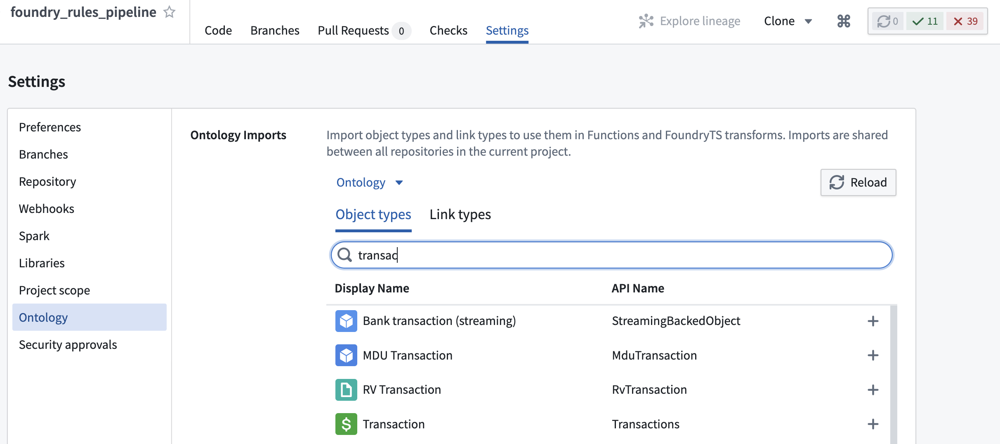
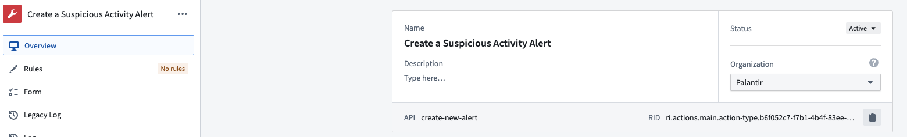

<!-- source: https://palantir.com/docs/foundry/foundry-rules/configure-transforms-pipeline/ · mirrored 2026-08-22 from Palantir Foundry docs -->

# Configure transforms pipeline

:::callout{theme="warning"}
Prior to July 2022, Foundry Rules (previously known as Taurus) required users to create their own transform to run Foundry Rules. This section is only relevant if you deployed Foundry Rules prior to July 2022.
:::

Once rules have been [written and reviewed in the Workshop application](/docs/foundry/foundry-rules/author-and-run-a-rule/), the encoded logic is applied as part of a transform. This section explains the various components of the transform and how to configure them for your use case. The majority of the transform is configured by default via the default deployment; however, extensions to the workflow may require additional steps.

## Example transform

After [deploying the Foundry Rules transform](/docs/foundry/foundry-rules/deploy-workflow/), the transform will look similar to the example below:

```java
public final class FoundryRulesTransformExample {
    // In addition to replacing the RIDs below, you will also need to import the relevant object types
    // and relations into the Project using the "Ontology" section of the 'Settings' tab above
    @AdditionalInputs
    public static Set<InputSpec> additionalInputs = ImmutableOntologyInputs.builder()
            .addObjectRids("ri.ontology.main.object-type.4168ed49-00...") // employee
            // .addLinkRids("...") // add all referenced relations
            .ontologyRid("ri.ontology.main.ontology.00000000-0000-0000-0000-000000000000")
            .ontologyBranchRid("ri.ontology.main.branch.00000000-0000-0000-0000-000000000000")
            .build()
            .getInputSpecs();

    @Compute
    public void compute(
            @Input("ri.foundry.main.dataset.0000...") FoundryInput source_object_backing_dataset,
            @Input("ri.foundry.main.dataset.0000...") FoundryInput rules_input,
            @Output("ri.foundry.main.dataset.0000...") FoundryOutput outcome_output,
            @Output("REPLACE WITH PATH TO WRITE STATUS DATASET TO") FoundryOutput rule_status_output,
            TransformContext transformContext) {

        Dataset<Row> source = source_object_backing_dataset.asDataFrame().read();
        Dataset<Row> rulesDataset = rules_input.asDataFrame().read();

        // Configuring the Taurus Rule Runner
        Args ruleRunnerArgs = new TaurusRuleRunner.Args.Builder()
                .rules(new Rules.Builder()
                        .logicColumnName("RuleLogic")
                        .ruleIdColumnName("RuleId")
                        .dataset(rulesDataset)
                        .build())
                // Put all sources used in Foundry Rules editor Workshop app here (for datasets the name here
                // must match the dataset name in the Foundry Rules app)
                .putSources(SourceReference.objectTypeId("employee"), source)
                // .putSources(SourceReference.dataset(DatasetName.of("name in Foundry Rules app")), dataset)
                // Required if you use many-many ontology join tables:
                // .manyToManyJoinTables(ImmutableMap.of(LinkTypeId.of("relation-id"), dataset))
                // set to true to ensure the rule execution output matches the rule editor widget's preview (this flag is false by default)
                // .shouldMatchContourExecutionBehavior(true)
                .context(transformContext)
                .build();

        // Run the rules using Spark (lazily evaluated)
        RuleEffects ruleEffects = TaurusRuleRunner.runRules(ruleRunnerArgs);

        // Get the results from all the rules that use the specified actions
        Dataset<Row> outcomes = ruleEffects.actionReadyMergedDataset(
            ActionTypeRid.valueOf("ri.actions.main.action-type.b6f052c7-f7b1-4b4f-83ee-f81d9e854114"));
        outcome_output.getDataFrameWriter(outcomes).write();

        rule_status_output.getDataFrameWriter(ruleEffects.statusDataset()).write();
    }
}
```

***

## Using `@AdditionalInputs` to add Ontology inputs

```java
@AdditionalInputs
public static Set<InputSpec> additionalInputs = ImmutableOntologyInputs.builder()
        .addObjectRids("ri.ontology.main.object-type.4168ed49-00...") // employee
        // .addLinkRids("...") // add all referenced relations
        .ontologyRid("ri.ontology.main.ontology.00000000-0000-0000-0000-000000000000")
        .ontologyBranchRid("ri.ontology.main.branch.00000000-0000-0000-0000-000000000000")
        .build()
        .getInputSpecs();
```

You can use `@AdditionalInputs` to provide the permissions to access metadata about the object types used in Foundry Rules. Any object types configured for use in the Foundry Rules Workshop application must be added here. The first object type RID will be filled out by default, but any additional objects added as part of the [deploy workflow template](/docs/foundry/foundry-rules/deploy-workflow/) section must be added as additional `.addObjectRids()` entries.

In addition, any *relations* that will be used in the Workshop application must be added here as a `.addLinkRids()` entry. The RIDs can be obtained from the [Ontology Manager](/docs/foundry/ontology-manager/overview/) using the object type and relation pages, respectively.

After adding these entries, it is also necessary to import the object types and relations into the Project using the **Ontology Imports** helper within the **Settings** tab of the Code Repository.



## Input and output datasets

```java
@Compute
public void compute(
        @Input("ri.foundry.main.dataset.0000...") FoundryInput source_object_backing_dataset,
        @Input("ri.foundry.main.dataset.0000...") FoundryInput rules_input,
        @Output("ri.foundry.main.dataset.0000...") FoundryOutput outcome_output,
        @Output("REPLACE WITH PATH TO WRITE STATUS DATASET TO") FoundryOutput rule_status_output,
```

This section provides the data for all the [inputs](/docs/foundry/foundry-rules/rule-logic/#inputs) used by the Foundry rules in your application. This includes the backing datasets for any objects and many-to-many join tables used in Foundry rules. By default, several of these will be pre-filled.

However, any additional objects or dataset added in while [deploying the workflow template](/docs/foundry/foundry-rules/deploy-workflow/) must be added as new `@Input` entries here. These datasets will be required later as part of [TaurusRuleRunner.Args](#foundry-rules-rule-runner).

Additionally, you must provide a path for the output of `rule_status_output`. This dataset contains details of any rules that did not run successfully and is a useful debugging tool.

## Foundry Rules rule runner

```java
// Configuring the Foundry Rules rule runner
Args ruleRunnerArgs = new TaurusRuleRunner.Args.Builder()
        .rules(new Rules.Builder()
                .logicColumnName("RuleLogic")
                .ruleIdColumnName("RuleId")
                .dataset(rulesDataset)
                .build())
        // Put all sources used in Foundry Rules editor Workshop app here (for datasets the name here must
        // match the dataset name in the Foundry Rules application)
        .putSources(SourceReference.objectTypeId("employee"), source)
        // .putSources(SourceReference.dataset(DatasetName.of("name in Foundry Rules app")), dataset)
        // Required if you use many-many ontology join tables:
        // .manyToManyJoinTables(ImmutableMap.of(LinkTypeId.of("relation-id"), dataset))
        // set to true to ensure the rule execution output matches the rule editor widget's preview (this flag is false by default)
        // .shouldMatchContourExecutionBehavior(true)
        .context(transformContext)
        .build();
```

This section configures the rule runner (`TaurusRuleRunner`) that will ultimately run the Foundry rules provided in the `rulesDataset`. This section is also mostly pre-configured by default, but, as described in [Input and Output Datasets](#input-and-output-datasets), any extra [inputs](/docs/foundry/foundry-rules/rule-logic/#inputs) must be registered with the `TaurusRuleRunner` by adding additional `.putSources()` entries. Additionally, any many-to-many join tables used between objects configured with Foundry rules must be registered here using `.manyToManyJoinTables()` as shown in the example above.

## Rule Action datasets

```java
RuleEffects ruleEffects = TaurusRuleRunner.runRules(ruleRunnerArgs);

Dataset<Row> outcomes = ruleEffects.actionReadyMergedDataset(
    ActionTypeRid.valueOf("ri.actions.main.action-type.b6f052c7-f7b1-4b4f-83ee-f81d9e854114"));
outcome_output.getDataFrameWriter(outcomes).write();
```

**Rule Actions** act as a common output schema for a collection of Foundry rules. Having run all rules using `.runRules()`, it is possible to get all result rows for a particular rule Action by calling `.actionReadyMergedDataset()` with the **Action type RID** of the required Action. This RID can be found in the Action type view of the [Ontology Manager](/docs/foundry/ontology-manager/overview/).



The dataset returned can be written to an output of the transform as shown in the above example. This dataset will contain one column per Action parameter of the Action, plus a `Foundry Rules_rule_id` column containing the ID of the rule that the row originated from.

Additional **rule Actions** added to the Workshop app can be included here by copying the example, then replacing the Action type RID and adding a new output dataset, as described in the [Input and Output Datasets](#input-and-output-datasets) section.

:::callout{theme="neutral"}
If you encounter any errors when running the transform or CI checks, review the [troubleshooting reference](/docs/foundry/foundry-rules/common-issues/).
:::

### Reference implementation

If configured by your Palantir representative, there may be an available reference implementation of the above transform. Search for the `Business Rules with Rules Workflow` folder or navigate to the **Foundry Training and Resources** Project, then to **Reference Examples → Application Development in Workshop → Business Rules with Rules Workflow**.

Here, you will find a template Workflow application and transform pipeline implemented on top of the example aviation Ontology.
