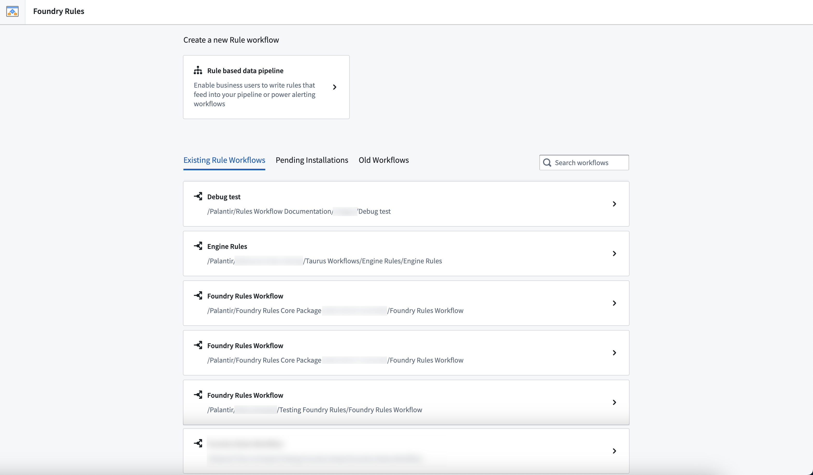
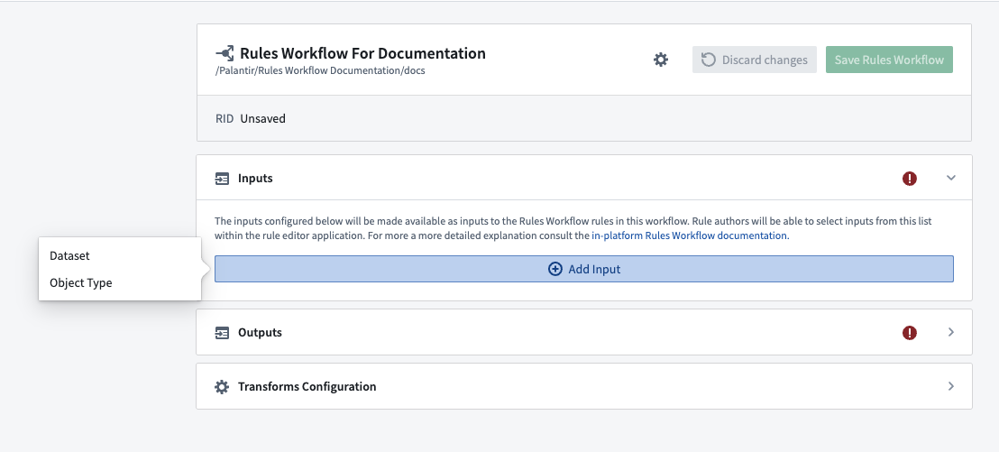
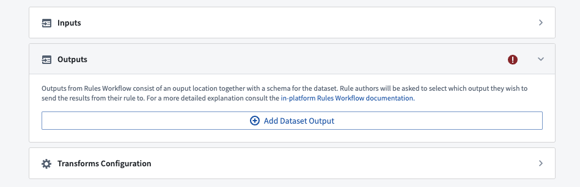
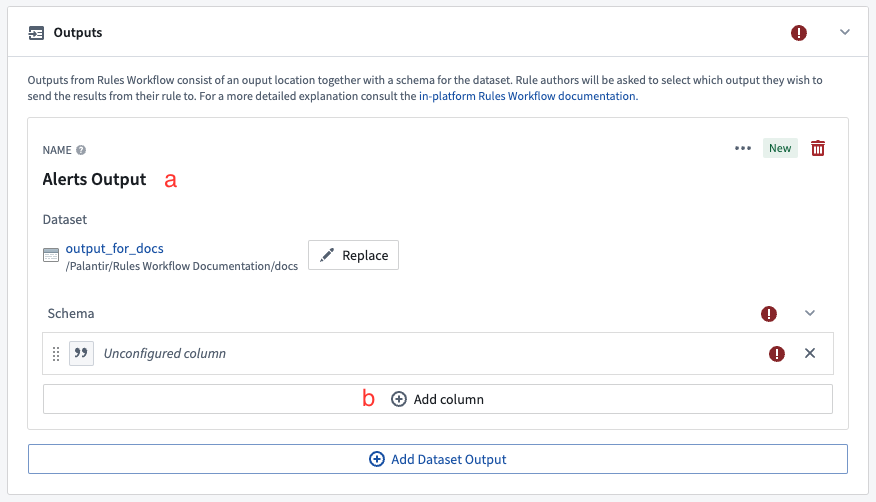
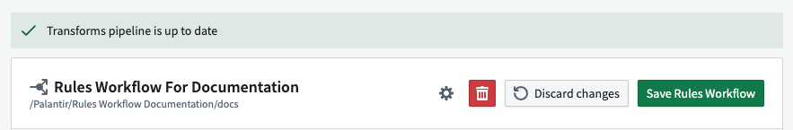
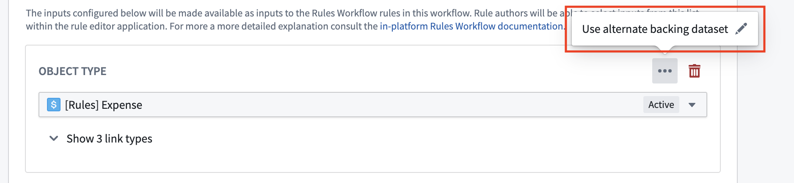

<!-- source: https://palantir.com/docs/foundry/foundry-rules/configure-workflow/ · mirrored 2026-08-14 from Palantir Foundry docs -->

# Configure workflow

Once you finish [deploying the workflow template](/docs/foundry/foundry-rules/deploy-workflow/), the following steps will guide you through the process of [configuring your workflow](/docs/foundry/foundry-rules/foundry-rules-workflow-configuration/).

1. **Access existing rule:** From the Foundry Rules home page, choose from a list of existing rules by selecting the item. Alternatively, you may also navigate and select it from its respective project found in **Files**.   
      

2. **Add workflow inputs:** With the rule in view, select the **Add Input** button to add an object or dataset input to the workflow. This will become usable as an input to the rule authored in the next section.
   * You can add as many inputs here as you wish, but all workflows must contain at least one input.
   * When adding object type inputs, the link types section will appear below each object type. Any links selected will become usable in the [Rules Management application](/docs/foundry/foundry-rules/workshop-application/) for joining together different objects.   
        

:::callout{theme="neutral"}
Objects backed by a restricted view cannot be used as inputs directly. Instead, configure the dataset which backs the restricted view as an [alternate backing dataset](/docs/foundry/foundry-rules/configure-workflow/#alternate-backing-datasets).
:::

3. **Add workflow outputs:** In the third section of the editor, click **Add Dataset Output** and provide a name and location for the dataset where the rule results will be output.   
      

   * Provide a name for the output that will be displayed to rule authors in the **Rules Management application** (a).
   * Click **Add column** to add at least one column to the output (b). Give this column a name to be used in the dataset and a display name to show to rule authors in the rules application. You can configure the type of column and determine whether it is required to provide this column when authoring a rule. Learn more about [permitted and default output values](/docs/foundry/foundry-rules/permitted-and-default-output-values/).
   * Add a column for each piece of information you wish to capture from the results of your rule. For example, an alerting workflow may have columns for `Alert ID`, `Severity`, and `Assignee` as well as a column to capture an identifier for the object that triggered the alert (e.g. `Machine ID`).   
        

4. **Save the workflow:** In the top right of the configuration editor, click the save button.
   * After saving the workflow, you should see a green banner appear at the top of the editor, signifying that the [transforms pipeline](/docs/foundry/foundry-rules/foundry-rules-workflow-configuration/#rule-execution) has been created successfully.   
        

After completing the above steps, learn how to [author and run a rule](/docs/foundry/foundry-rules/author-and-run-a-rule/).

## Advanced configurations

### Alternate backing datasets

You can configure an object input with an alternate backing dataset. This means your rules are evaluated against the supplied alternate backing dataset instead of the writeback (or backing) dataset configured in the Ontology.

This is useful when:

* Writing rules on restricted view-backed objects
* Running rules on a subset of the Object's backing data   
  

  
