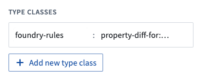

<!-- source: https://palantir.com/docs/foundry/foundry-rules/configure-workshop-app/ · mirrored 2026-08-22 from Palantir Foundry docs -->

# Configure Workshop application

:::callout{theme="warning"}
Prior to July 2022, Foundry Rules (previously known as Taurus) required users to provide extra configuration in the Workshop Application. This section is only relevant if you deployed Foundry Rules prior to July 2022.
:::

After [deploying the rules workflow template](/docs/foundry/foundry-rules/deploy-workflow/), follow these steps to configure the Rules Workshop application:

*All screenshots use notional data.*

1. **Configure inputs:** In the Workshop module generated by deploying the workflow template, select the **Rule Editor** widget in the **Rules** tab.

   * The set of **Permitted object types** will by default contain the selected **source** object from the workflow template. However, to make additional object types available within Foundry Rules, select on the object set variable and then select **Combine with another object set**.
   * If you wish to add datasets in addition to objects, select the **Add Dataset** button, and then enter the input dataset RID and a display name, which will later be used to reference the input dataset in the pipeline.
   * Any additional objects or datasets added here will also need to be added to the transforms pipeline later as part of [configuring the transforms pipeline](/docs/foundry/foundry-rules/configure-transforms-pipeline/).

    

2. **Add rule Actions:** If a rule Action was configured while [deploying the workflow template](/docs/foundry/foundry-rules/deploy-workflow/), then there will already be one rule Action configured. To add additional rule Actions, first create them in the Ontology Manager and then add them by clicking **Add Rule actions**.

    

   Learn more about [configuring rule Actions](/docs/foundry/foundry-rules/configure-rule-actions/)

3. **Enable optional features:** To customize the functionality of Foundry Rules, several options are available in the Rule Editor widget configuration in the Workshop app. Toggle these options to either enable or disable advanced features, as described in the [optional features](/docs/foundry/foundry-rules/enable-optional-features/) documentation.

4. **Configure diffing when viewing proposals:** To get the proposal widget to display diffs correctly, add the following type classes to the relevant **proposal object** properties. These type classes are added to properties of the **object type** rather than to any **Action parameters**.

   * For every property that you want to display in the Proposal Reviewer widget, add a `foundry-rules.property-diff-for:ID_OF_NEW_PROPERTY` type class to the **current** property.
   * For example, suppose the property `new_rule_name` on the proposal object represents the new value for the rule name, and the property `current_rule_name` on the proposal object represents the old value. The `current_rule_name` property should be annotated with `foundry-rules.property-diff-for:new_rule_name`.

    

After completing the above steps, learn how to [configure the transforms pipeline](/docs/foundry/foundry-rules/configure-transforms-pipeline/) you created to suit your workflow.
