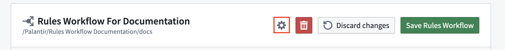
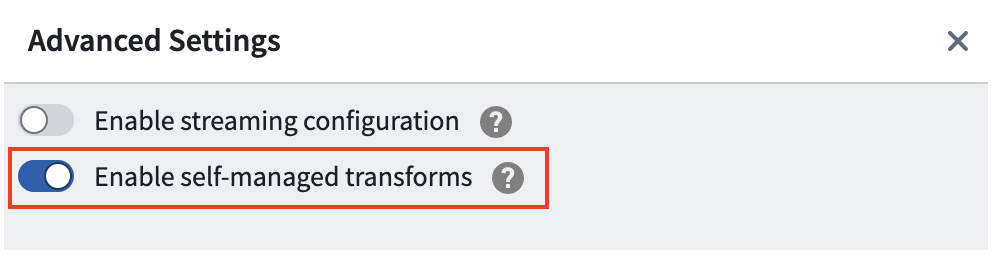
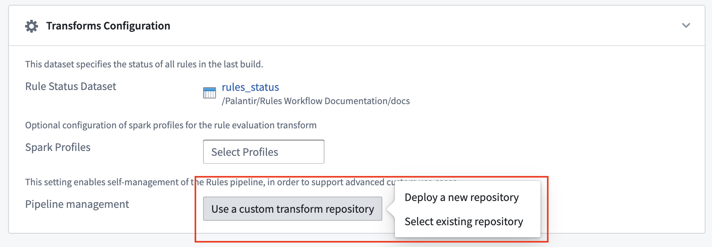

<!-- source: https://palantir.com/docs/foundry/foundry-rules/customize-foundry-rules-pipeline/ · mirrored 2026-08-14 from Palantir Foundry docs -->

# Customize your Foundry Rules pipeline

:::callout{theme="warning"}
Customizing your Foundry Rules pipeline is an advanced feature intended for experienced Foundry pipeline authors. This customization can result in increased implementation and maintenance burden for workflow administrators.
:::

Foundry Rules does not require users to write any pipeline logic out of the box. However, some use cases warrant customizing the Foundry Rules pipeline in order to achieve an outcome that is otherwise not possible.

## Use cases

Customizing your Foundry Rules pipeline can provide a number of potential benefits, including:

* Granular control over how and when different rule subsets are run.
* The ability to pre-process Foundry Rules inputs before running the rule logic.
* The ability to run Foundry Rules inside an [incremental transform](/docs/foundry/transforms-python/incremental-overview/). This requires the rule logic to be compatible with incremental data.

:::callout{theme="neutral"}
Post-processing of Foundry Rules outputs (such as adding columns) can be achieved with a dedicated downstream transform. We do not recommend customizing the Foundry Rules pipeline solely for post-processing of Foundry Rules outputs.
:::

## Instructions

:::callout{theme="neutral"}
Custom pipelines are currently not supported for streaming workflows.
:::

You can deploy your own custom Foundry Rules pipeline by enabling self-managed transforms, choosing a custom transform repository, saving the Foundry Rules workflow, and then generating and saving the Foundry Rules pipeline code to the selected repository. To do so, follow the instructions below:

1. Click on the gear icon to open the advanced settings menu.

   

2. Enable the **Enable self-managed transforms** option.

   

3. Click on **Use a custom transform repository** in the **Transforms Configuration** section. You can either **Deploy a new repository** (recommended) or choose **Select existing repository** to find and select your chosen repository.

   

4. Save your Foundry Rules workflow.

5. Generate and copy your Foundry Rules pipeline code by clicking **Generate**, and then clicking **copy**.

   

6. If you previously chose an existing repository, create a file named `FoundryRulesTransform` that lives inside the `rules.transforms` directory and paste the copied code in. If a newly deployed repository was chosen in step 3, find “FoundryRulesTransform” and paste in the code.
