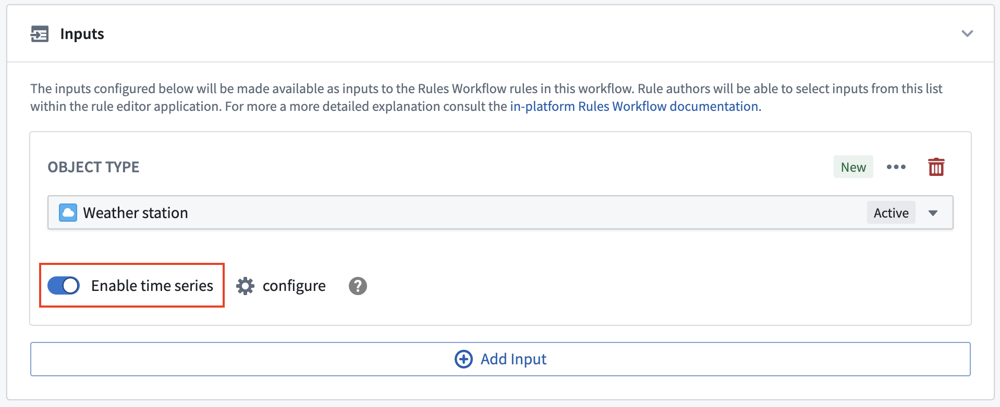
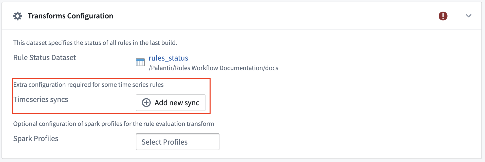

<!-- source: https://palantir.com/docs/foundry/foundry-rules/deploy-timeseries-foundry-rules/ · mirrored 2026-08-22 from Palantir Foundry docs -->

# Deploy time series Foundry Rules

:::callout{theme="neutral"}
These instructions assume time series have already been set up in your platform. Learn more about [using time series in Foundry](/docs/foundry/time-series/time-series-usage/).
:::

To enable time series features in Foundry Rules, first follow the steps to [deploy Foundry Rules](/docs/foundry/foundry-rules/deploy-foundry-rules/). Once you deploy Foundry Rules, the steps described below are required to enable time series support:

1. To create time series rules, one of the workflow inputs must be a time series root object type. For all of the input object types that you wish to write time series rules on, toggle the **Enable time series** switch on.   
      

2. If your time series data has been set up using [time series properties](/docs/foundry/time-series/time-series-setup/), then there are no additional configuration steps required and you can begin authoring time series based rules. However, if your time series data has been configured using measures, you must complete the following steps:

* On toggling the **enable time series** switch, a dialog will open prompting you to select the link from the **Series object type** to the **Root object type**.
* Then, in the transform configuration section, you must add *all* [time series syncs](/docs/foundry/time-series/time-series-syncs/) that back these measures.   
     
