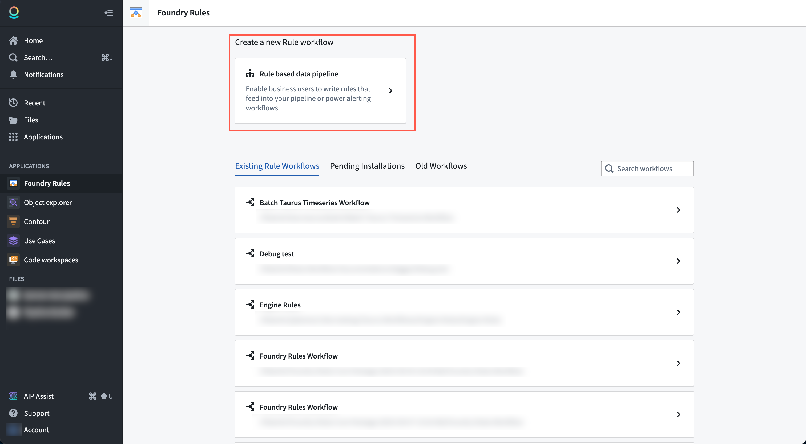
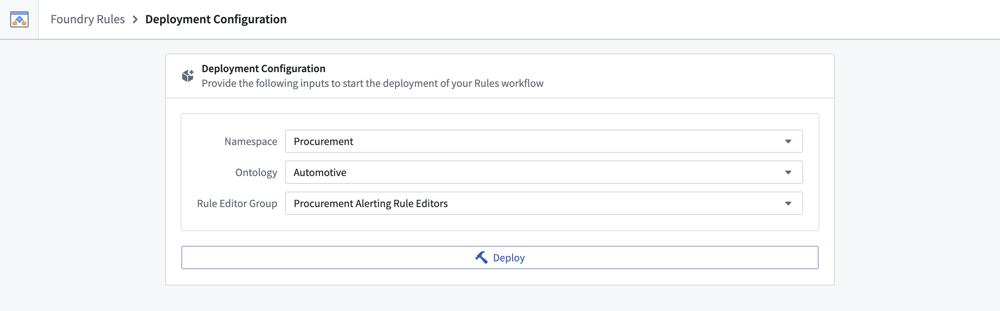
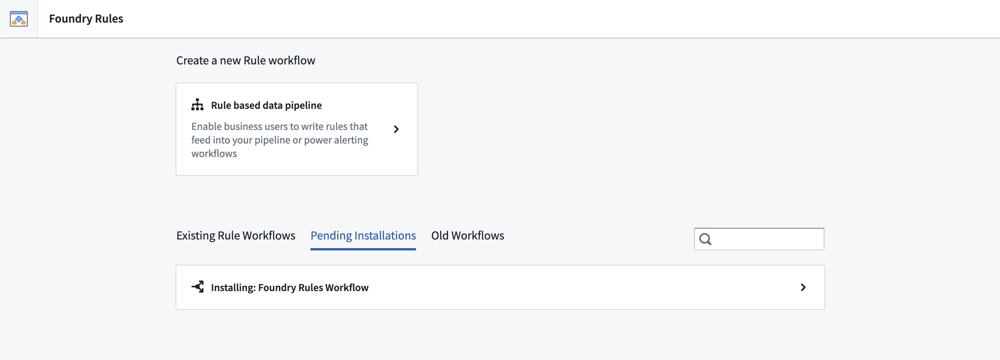
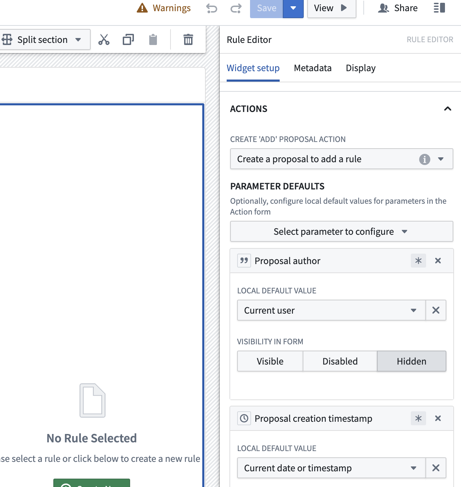
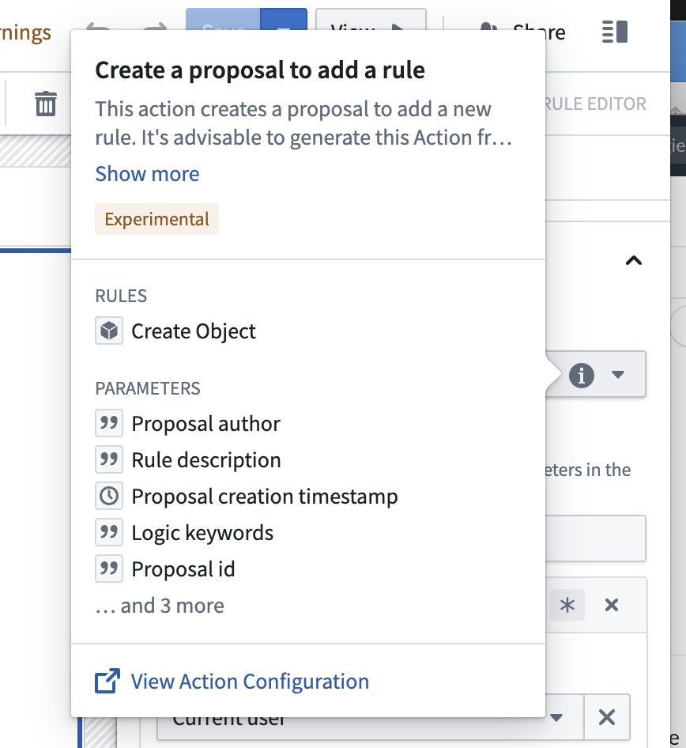

<!-- source: https://palantir.com/docs/foundry/foundry-rules/deploy-workflow/ · mirrored 2026-08-14 from Palantir Foundry docs -->

# Deploy workflow

You can deploy a new Foundry Rules workflow from within the Rules application. From the application, generate the [required objects](/docs/foundry/foundry-rules/object-model/) and Actions for your workflow.

1. **Deploy a new Rules workflow:** Find and select the Foundry Rules application in the sidebar, then select **Rule-based data pipeline**.   
      

2. **Provide configuration:** The application will create a new project for you that includes the relevant backing datasets, Foundry Rules workflow, and Workshop application resource.   
      

   * Choose the relevant [space](/docs/foundry/security/orgs-and-spaces/).
   * Choose the relevant [Ontology](/docs/foundry/ontology/overview/). If you have multiple Ontologies, select the Ontology that contains all the object types on which you would like to define your rules.
   * The Rule editor group is used for the submission criteria of the actions. Users in this group are able to create proposals to add, edit, delete rules, and also, to decide on proposals. This configuration is meant as a starting point as you can configure the submission criteria on the rule actions later. To change the submission criteria on the action types, review the [FAQ](#faq).

3. **Deploy:** Once the fields have been completed, select **Deploy**. The deploy process takes about two to three minutes in the background during which you can safely navigate away. Pending and completed installations can be found on the main page under **Pending installations** or **Existing Rule Workflows**. All workflows have the default name "Foundry Rules Workflow" and a timestamp in the list of existing workflows. You may rename the workflow by renaming the corresponding resource in your project folder.   
      

After completing the above steps, learn how to [configure the workflow](/docs/foundry/foundry-rules/configure-workflow/).

## FAQ

### How do I change the submission criteria on the action types?

To update your submission criteria on the action types, navigate to the Workshop application, select **Edit**. Then, review the Rule Editor configuration panel on the right as shown below.

Then, hover your cursor over the "i" icon inline with the **Create add proposal action**'s "Create a proposal to add a rule" dropdown option.

From the new pop up, select **View Action Configuration**.

From here, you will be able to change the [submission criteria](/docs/foundry/action-types/submission-criteria/).
