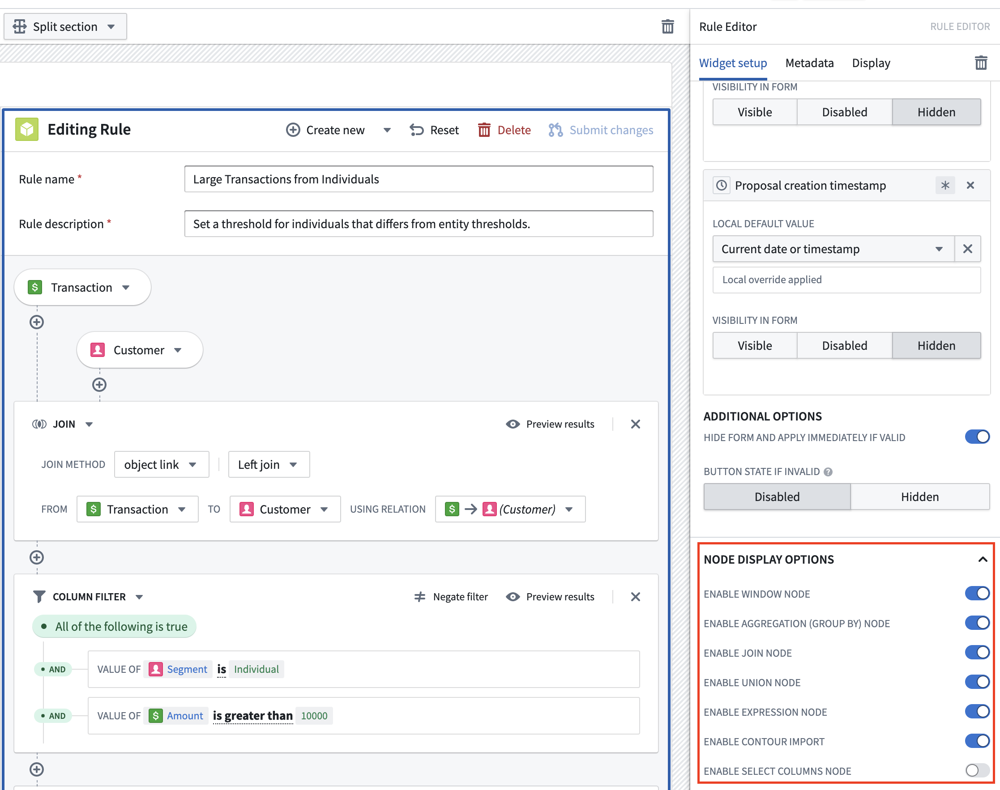

<!-- source: https://palantir.com/docs/foundry/foundry-rules/enable-optional-features/ · mirrored 2026-08-22 from Palantir Foundry docs -->

# Enable optional features

Optional features can be enabled or disabled by editing the configuration of the Rule Editor widget within your [Rules Workshop application](/docs/foundry/foundry-rules/workshop-application/), as shown in the screenshot below.

There are a range of optional logic boards that can be enabled or disabled for Foundry Rules:

* **Window board:** Supports [Window functions ↗](https://spark.apache.org/docs/latest/sql-ref-syntax-qry-select-window.html).
* **Aggregation board:** Computes aggregates over grouped columns.
* **Join board:** Joins additional datasets or objects.
* **Expression board:** Executes arbitrary expressions for adding columns or filtering.
* **Select columns board:** Selects a subset of columns to carry forward to the next logic board.
* **Union board:** Unions additional datasets or objects.

Additionally, there is an option to enable or disable importing rules from Contour.

* **Contour import:** Imports and converts logic stored in a [Contour analysis](/docs/foundry/contour/core-concepts/) to a rule.

Finally, Foundry Rules supports writing rules directly on top of time series data.

* **Time series:** Add [time series boards](/docs/foundry/foundry-rules/timeseries-concepts/#add-timeseries-board) which can manipulate time series directly as part of a rule.
