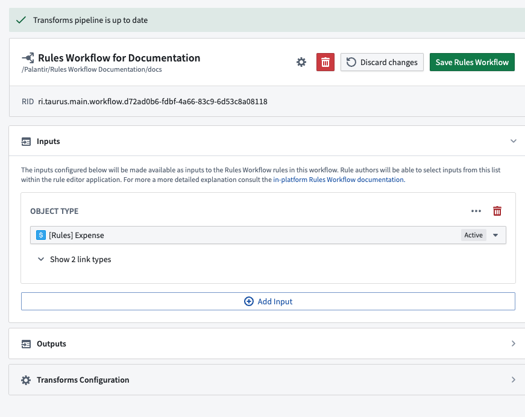
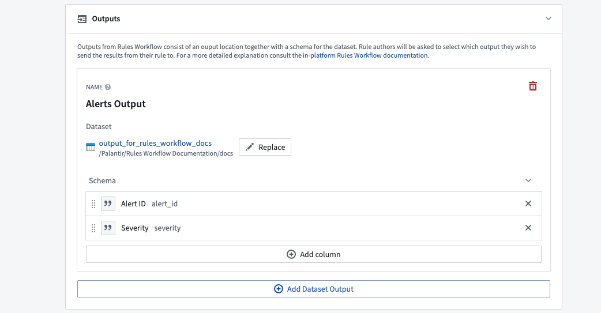
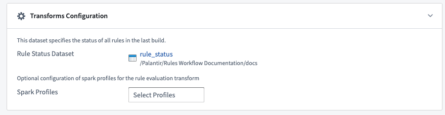
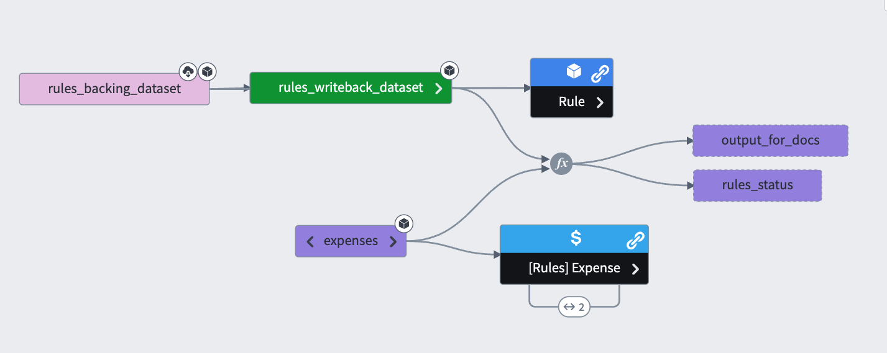

<!-- source: https://palantir.com/docs/foundry/foundry-rules/foundry-rules-workflow-configuration/ · mirrored 2026-08-22 from Palantir Foundry docs -->

# Foundry Rules workflow configuration

The **workflow configuration editor** is used when making changes to how the entire Foundry Rules workflow is configured; for example, when adding new [inputs](/docs/foundry/foundry-rules/rule-logic/#inputs) so that they may be used by rule authors, or when modifying [workflow outputs](#workflow-outputs). The workflow configuration editor can be accessed from the [Ontology Manager](/docs/foundry/ontology-manager/overview/) once a Foundry Rules workflow has been [deployed](/docs/foundry/foundry-rules/deploy-foundry-rules/). The Foundry Rules workflow is tied to a Project and shows as a resource in your Project folder. This controls permissions to the workflow configuration and allows users to rename, move, or delete the workflow.

## Workflow inputs

As explained in the [rule logic inputs](/docs/foundry/foundry-rules/rule-logic/#inputs) section, the **Inputs** pane of the configuration editor is where workflow owners may add additional inputs for use by rule authors. When adding object inputs, the owner may also select which associated link types they wish to make available.

## Workflow outputs

Workflow outputs specify the destination and format for the output of all the Foundry rules in the workflow. Each output corresponds to a different **Foundry dataset** which, when built, will contain the results from all Foundry rules that reference it. Within each output, the name and type of the output columns can be configured. You can also restrict what values the output column [permits and takes as default](/docs/foundry/foundry-rules/permitted-and-default-output-values/).

## Transform configuration

This section contains additional information for configuring the **Transform** that generates the results of the Foundry rules. It includes the location of the rule status dataset as well as any **Spark profiles** applied to the transform. This section represents advanced configuration and can be ignored when first setting up a Foundry Rules workflow.

## Rule execution

The Foundry Rules workflow configuration also generates a transforms pipeline to apply the rules. The transforms pipeline is where the rules take effect; for instance, by creating alerts or categorizing/tagging data. The [Data Lineage](/docs/foundry/data-lineage/overview/) graph below outlines an example Foundry Rules pipeline; the exact structure of a pipeline depends on the use case and may vary significantly based on need and circumstance.

The pipeline takes the datasets backing the [workflow inputs](#workflow-inputs) together with the writeback dataset of rules and applies these rules to the inputs. It then populates the output datasets specified by the [workflow outputs](#workflow-outputs) with the rows output by the rules.
